Introduction
============

Overview
--------

Databricks Sirens is a flexible and extensible automated extract,
transform and load (ETL) pipeline and analytics engine designed to
simplify the process of collecting security related data into the
Lakehouse. The engine is designed to ingest and normalize data sources
in response to configuration files and without the need for the end user
to write notebook code. It also provides a security detections
repository for security operations, and threat hunting based on the
normalized datasets it generates.

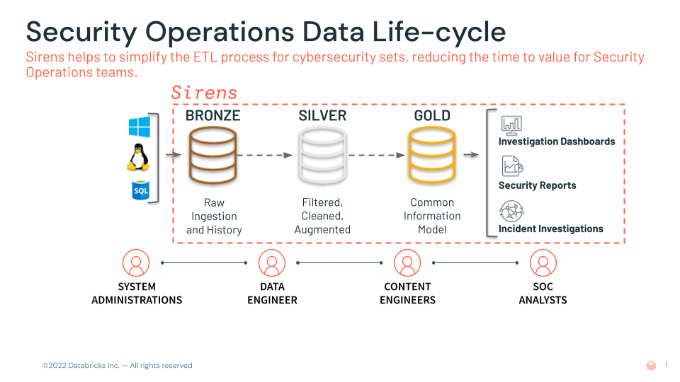

**Figure 1.**\ *Sirens automated capabilities within the Databricks
Medallion architecture*

Installation
============

Sirens is designed to be configured and built locally on a laptop. You
edit the log source configuration files directly, choose whether Sirens
will build Delta Live Tables or Streaming notebooks (or a mix), and use
the command line interface (CLI) to automatically generate the code.

Once generated, you can choose to either manage your installation using
Terraform, or by using source code control by pushing to your deployment
branch and connecting to the
repo using the `Databricks Git
integration <https://docs.databricks.com/repos/set-up-git-integration.html>`__.
Further information can be found in the `deployment
section <#deployment>`__.

You will need to install the Sirens wheel file provided to you.

Minimum Requirements
--------------------

Sirens makes use of many of the latest features available. Below are the requirements to run Sirens on a workspace

- Ability to create clusters with the latest version of Spark and Databricks runtimes DBR 11.1+ (spark 3.3.0+).
- Python 3.9+ with the python alias pointing to python3 (for local machine)
- Access to an Organization or private GitHub to fork Sirens into
- `Databricks Repos <https://docs.databricks.com/repos/>`__ and files in repos enabled on the workspace
- Developer PAT token to the organization / personal Sirens repo (for workspace access to Repo)
- Databricks clusters using instance profiles or service principals for data access if not using unity catalog
- Databricks service principal / PAT token (if using terraform to deploy/manage the installation)
- DBSQL product set enabled for Sirens Dashboards

Deployment
----------

Sirens generates small atomic notebooks designed to execute a single
stage of the overall pipeline. (Ingest, Parse, Transform) for each log
source you have configured.

Depending on your organizational requirements, you can deploy and manage sirens in a couple of ways;

#. Using Databricks Repos to connect to your forked version and manually creating jobs.
#. Using Terraform to build and deploy Sirens automatically
#. Using automated Sirens deployment script (also uses Terraform to build)

The sections below show how to do each one.

.. _overview-1:

Using Databricks Repos
~~~~~~~~~~~~~~~~~~~~~~

The general philosophy is to (1) ensure that all configurations are not
exposed publicly, (2) manage all configurations and deploy notebooks as
code using git processes for version control, and (3) use git as the
common platform to deploy sirens to multiple workspaces in multiple
clouds and regions. It is crucial that the actual deployed notebooks are
versioned controlled to facilitate operational debugging and
troubleshooting.

**The sirens deployment has the following high level steps;**

1. Fork the repository into your own private repository, and clone it locally

2. Install the provided Sirens wheel and the necessary development requirements

3. Amend the system configuration file (sirens.config)

4. Configure individual log ingestion connectors and locations in the `log_sources` path

5. Validate the configuration using the CLI option ‘validate’ command

6. Generate the notebooks using the sirens CLI ‘generate_notebooks’ command

7. Add the output from the `deploy/*` directory and push to a deployment branch of your private repository

8.  Connect Databricks to the private repository

9.  Add notebooks to workflows & schedule execution

**This section outlines how to deploy Sirens to a single cluster on Databricks**

Depending on your own environment, you may choose to use your local IDE
(VSCode), or terminal to complete the following tasks.

Workflow
~~~~~~~~

.. _section-1:

|image1|
~~~~~~~~

|

**1 - Fork Repository**

a) Fork the Sirens repo in your organization’s github/gitlab (henceforth my-sirens repo)
   & set the upstream to the original Sirens repo
   (|image2|\ `Fork a repo - GitHub
   Docs <https://docs.github.com/en/get-started/quickstart/fork-a-repo>`__
   ).

== ========
\  |image3|
== ========

b) Clone the my-sirens repo to your laptop or development environment

== ========
\  |image4|
== ========

c) Create a Python virtual environment and install dependencies

.. code-block:: sh

   python3 -m venv .
   source bin/activate
   pip3 install ../path/to/databricks_sirens-0.4.0-py3-none-any.whl
   pip3 install -r requirements_dev.txt

d) Create a deployment branch deploy_v1

== ========
\  |image5|
== ========

|

**2 - Configure the System File**

Sirens has one configuration file *(sirens.config)* that governs
the default behavior of the system, which needs to be amended to suit your
needs. See `configuration files <#global-configuration-files>`__ section
for detailed information on specific key/value pairs.

.. note::

   Minimal configuration: ensure you amend the following keys;

   * target_database
   * scratch_dir
   * notebook_type
   * enable relevant [input:xxx] stanzas to generate ETL notebooks

   scratch_dir should mirror your target_database for consistency.

Edit the file from the top-level sirens directory.

a) Minimally ensure the [default] section matches the desired notebook
   type, and that the default database name is applicable to your
   installation.

== ========
\  |image6|
== ========

b) In addition to the log source configuration file (discussed next),
   Sirens will build notebooks for each input section that is listed
   and enabled in sirens.config. Ensure ‘enabled’ is set to ‘true’
   for each of the log sources you require notebooks for.

== ========
\  |image7|
== ========

|

**3 - Configure Individual Log Source(s)**

Each log source has its own directory and configuration file
*(inputs.yaml)* that controls how to connect to the raw data, and how to
parse and transform it into normalized fields. See the `configuration
files <#global-configuration-files>`__ section for detailed information
on the available key/value configuration options.

All input sources are held under the ‘log_sources’ directory, followed
by the source of the data (typically the event vendor), followed by the
sourcetype (typically log type).

You may choose whether to configure individual inputs before deployment
or once the repository is deployed and connected to Databricks, since
you can use the repo feature to update and commit changes.

== ========
\  |image8|
== ========

Minimally for file based inputs you will need to configure the rawPath
key to point to the location of your raw data. If you want to change
which connector to use or the options then see the `configuration
files <#global-configuration-files>`__ section.

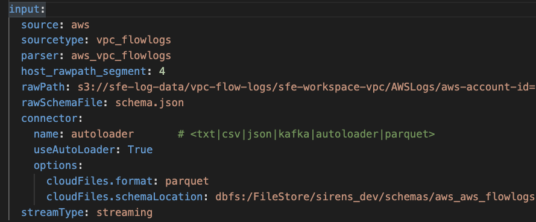

**Example aws flow_logs configuration, held in
log_sources/aws/flow_logs/inputs.yaml**

For inputs using an API key, store the key in a
`Databricks Secret <https://docs.databricks.com/security/secrets/index.html>`__,
then reference the scope and key in the inputs.yaml file.

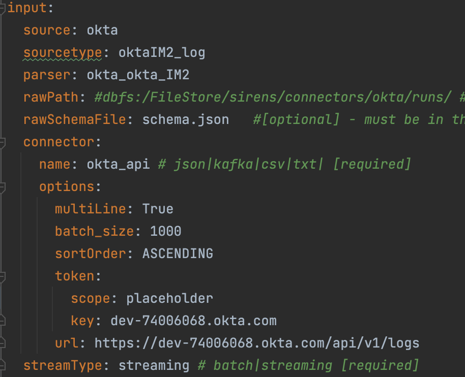

**Example okta configuration, held in
log_sources/okta/oktaIM2_log/inputs.yaml**

Once you make changes to the inputs configuration file(s), you can use
the ‘validate’ CLI option in sirens to check your configuration.

.. code-block:: sh

   sirens validate -t inputs

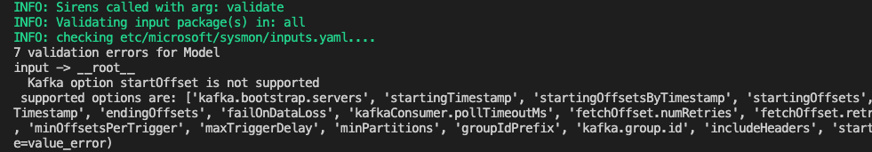

|

**4 - Generate Notebooks**

The default location for notebooks is under the ‘deploy’ directory. Use
the Sirens CLI option *generate_notebooks* to build them.

The *generate_notebooks* command first discovers enabled inputs in the
‘sirens.config’ file and then reads the log source configuration file
*(inputs.yaml)* and generates the notebooks in the correct language
ready for workflow deployment.

.. code-block:: sh

   sirens generate_notebooks

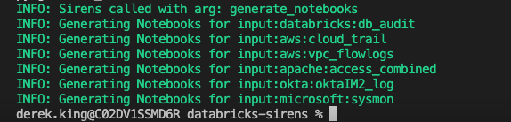

|

**5 - Commit & Push**

Commit the config files and generated notebooks to the deploy_v1 branch
and push to the my-sirens repo

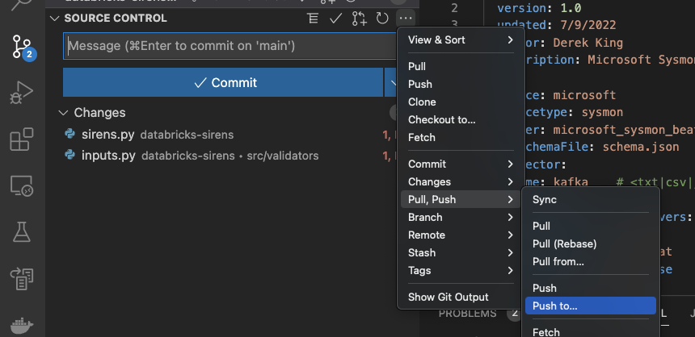

Or using terminal

.. code-block:: sh

   git push origin deploy_v1

|

**6 - Connect Databricks to the Repository**

Sirens is best run using Databricks repos (with files in repos enabled).
Ensure both features are enabled in the admin console, and connect to
the repository.

Once connected, ensure you switch to the deploy_v1 branch created in
step 6.

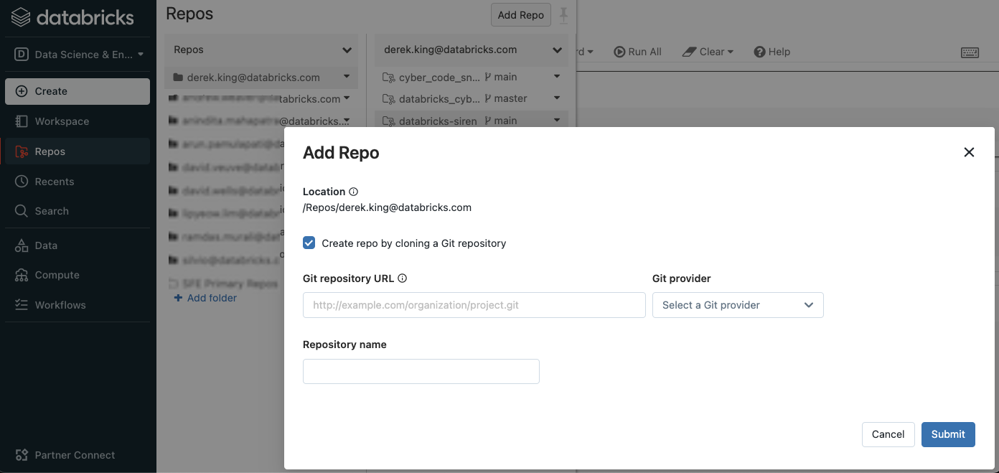

|

**7 - Deploy Notebooks**

Notebooks are found in the *‘deploy’* directory of the connected
repository, and by default are grouped by log source. How and where you
deploy notebooks depends on whether you configured delta notebooks or
delta live table notebooks. The following sections outline both.

|

**7.1 - Cluster Permissions**

Note that you will need to ensure whatever cluster(s) you deploy
notebooks to will require access to the underlying log source(s),
using your preferred data access policy (unity catalog, instance profiles etc).

|

**7.2 - Delta Structured Streaming**

If you are deploying delta notebooks, create a workflow multi-task job
for each ingest source.

..

   Workflows -> Jobs -> Create Job

|

a. Enter a name for the pipeline. (Source_Sourcetype is a good identity)

b. Enter a task name. The first task (notebook) is the ingest task.

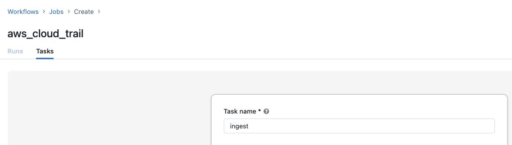

c. Select the ingest notebook for the log source, from the Repos folder

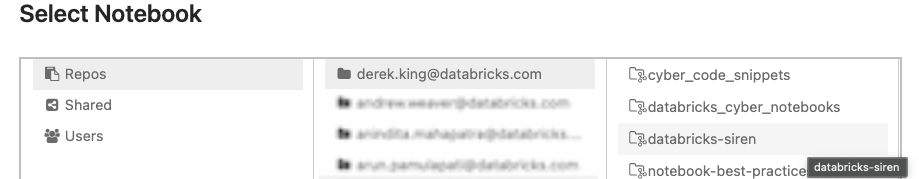

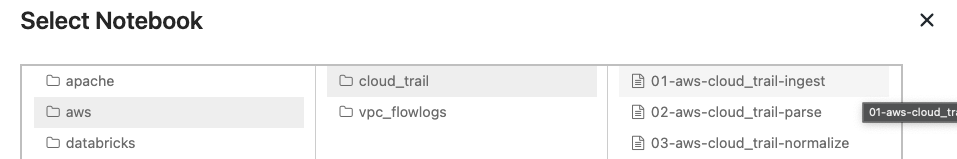

d. Choose the cluster, and add the database, source, and sourcetype parameters.

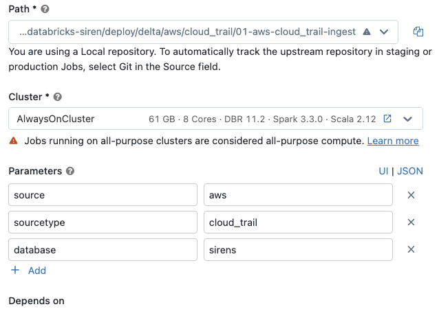

e. Next add the ‘\ *parse*\ ’ notebook as a new dependent task to ‘\ *ingest*\ ’ by repeating the steps in 4. Ensuring you add the
   database, source, and sourcetype parameters

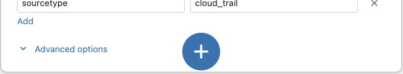

|

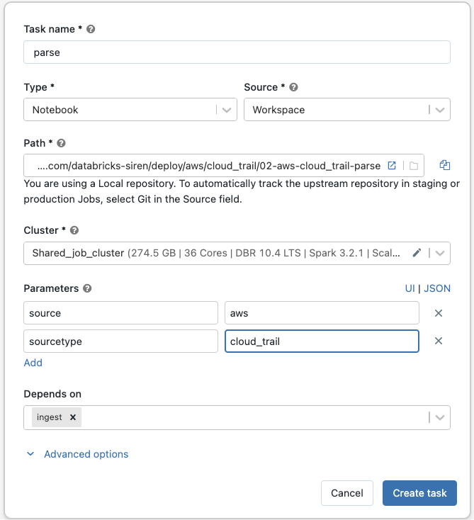

f. Repeat the previous step and add the ‘normalize’ notebook as a dependent task of the parse task.

g. Add tags to identify the type of jobs and the log sources being processed by the pipeline.

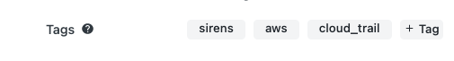

h. Schedule the pipeline as per your requirements

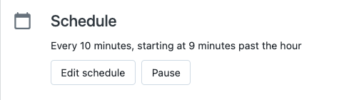

9. Add the Sirens wheel as a dependent library

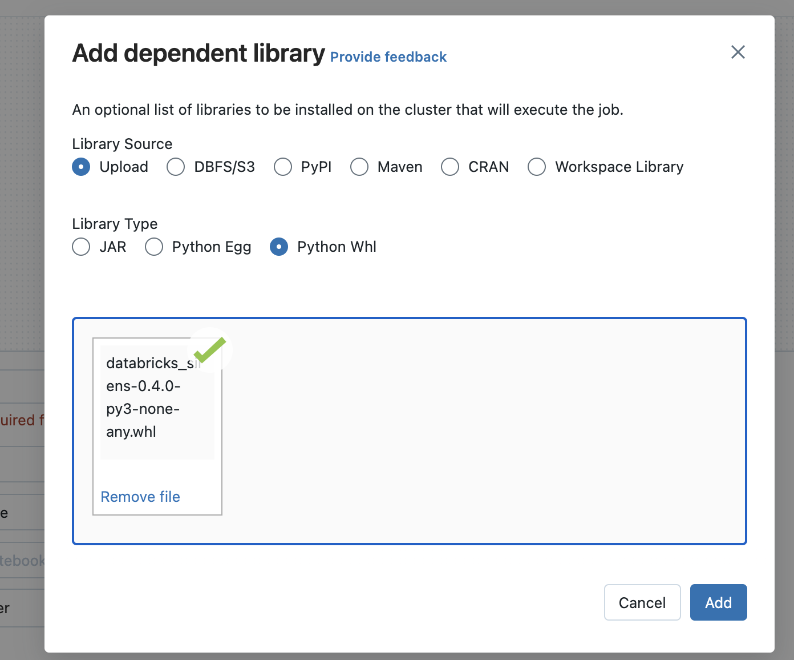

You should now have a pipeline multi-task job that looks similar to the
following;

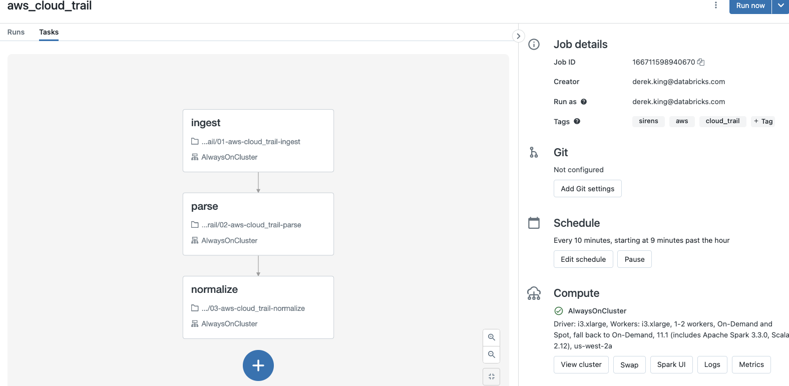

Repeat these steps for each pipeline (log ingest) you want to consume.

|

**7.3 - Delta Live Tables**

.. warning::

   Delta Live Tables may **not** be appropriate for all Cyber
   production use cases. Please see `Delta Live Tables
   limitations <#delta-live-tables-1>`__ before you configure your
   pipeline.

.. tip::

   Deploying delta live table pipelines is a similar process to delta structured streaming, with a few exceptions.

1. If you choose to normalize log sources into a common information model format (the default for Sirens), then all log sources must
   be configured into a single pipeline. (see `Delta Live Tables limitations <#delta-live-tables-1>`__ section)

2. You need to upload the Sirens wheel package to storage or Workspace files so that DLT can install it

..

   Workflows -> Delta Live Tables -> Create Pipeline

1. Enter the name for the pipeline, and add the notebook(s) for each log source to be processed.

+---+------------------------------------------------------------+---+
|   |    .. image:: images/media/image34.png                     |   |
|   |       :width: 3.79688in                                    |   |
|   |       :height: 4.22745in                                   |   |
+---+------------------------------------------------------------+---+

.. warning::
   2. A current feature/limitation of Delta Live Tables, is that only a single query may define a streaming
   live table. This has implications for cyber use cases and is the reason why a single large pipeline must be
   defined. A single notebook is responsible for defining common information model tables that union all log
   sources in a streaming table. (see `Delta Live Tables limitations <#delta-live-tables-1>`__ for more information).

.. note::

   If you have use cases that do not require a single normalized table, you may skip this step.

In the deploy directory, navigate to the ‘standardize’ directory, and add the 04-standardize notebook to the pipeline.

+---+------------------------------------------------------------+---+
|   |    .. image:: images/media/image15.png                     |   |
|   |       :width: 4.82813in                                    |   |
|   |       :height: 2.95655in                                   |   |
+---+------------------------------------------------------------+---+

4. Configure the Advanced section

* Set sirens.home to the top level repo directory (/Workspace/Repos/<username>/databricks-sirens)
* Set sirens_wheel to the location of the wheel file (/Workspace/Repos/<username>/databricks-sirens/databricks_sirens-0.4.0-py3-none-any.whl)

== =========
\  |image13|
== =========

1. Add the target database

== =========
\  |image38|
== =========

6. Set the pipeline mode to triggered

== =========
\  |image14|
== =========

7. Schedule the pipeline

== =========
\  |image15|
== =========

|

**8 - Read sirens.config from outside Repos**

There are cases when the sirens.config and log sources are deployed outside of Repos.
They can be imported to a folder in your workspace. In this scenario, the Sirens framework needs to know
where the configuration files are located.

To specify locations of the sirens.config, a user needs to set an environment variable SIRENS_CONFIG.
The variable will point to the full path of the sirens.config file: e.g.
SIRENS_CONFIG=/Workspace/Users/user@databricks.com/deploy/config
Refers to `this document<https://docs.databricks.com/en/clusters/configure.html#environment-variables>` to set up envirnemnt varaibles in a cluster.

**9 - Configure retention policy**

Retention policy defines how long data will be stored in a specific table or database or system. When the retention period expires, the data will be deleted from the table during maintenance.

A retention policy can be defined in sirens.config on three levels:
[retention_policy] is on system level - define nothing else and it applies to all tables
[retention_policy:bronze] is on stage level - more specific than system level and applies to all bronze tables
[retention_policy:bronze:tablename] - most specific - applies only to that table.
e.g. The following policy defines that data older than 1 year will be purged for all tables. The date column is `_event_date`.

.. code-block:: sh

   [retention_policy]
   duration = 1 years
   column = _event_date

The following policy is on stage level:

.. code-block:: sh

   [retention_policy:your_db_name]
   duration = 6 months
   column = _event_date

The following policy is on table level:

.. code-block:: sh

   [retention_policy:your_db_name:your_table_name]
   duration = 4 weeks
   column = _event_date

The duration can be specified in years, months, weeks, days, hours, minutes.

----

Using Terraform
~~~~~~~~~~~~~~~

When configuring, deploying and managing many workloads, manual deployment can take a
long time. You can choose to use terraform to bridge the gap and configure a workspace
with ETL jobs, and optionally continue to manage via terraform.

For details on how authentication is handled for Terraform, please see `here<https://registry.terraform.io/providers/databricks/databricks/latest/docs#authentication>`.

*The workflow to deploy using terraform is:*

1. If not already configured, install the Databricks CLI and configure with an access token.

2. To have the workspace connect to the sirens repository, you need to authorize an access
token on the git repository, and provide the details as environment variables.

3. Configure your sirens.config file to include details of any job cluster definitions.

.. warning::

   Limitation: Current Sirens uses a local backend only. Should you want to add a remote backend
   follow the instructions in the `terraform documentation<https://developer.hashicorp.com/terraform/language/state/remote>`__.

|

Databricks Workspace Access Token
^^^^^^^^^^^^^^^^^^^^^^^^^^^^^^^^^

You must firstly configure an `access token<https://docs.databricks.com/administration-guide/access-control/tokens.html>`__
within the target workspace, and configure your local Databricks CLI

**Open a terminal window:**

.. code-block:: sh

   pip install databricks-cli
   databricks configure --token

|

Authorize Workspace Access to Repository
^^^^^^^^^^^^^^^^^^^^^^^^^^^^^^^^^^^^^^^^

Sirens uses `Databricks Repos<https://docs.databricks.com/repos/index.html>`__ to access configurations
(such as log sources, detection pipelines),and therefore we need to create an access
token within source code control to allow the workspace access,followed by exporting the
connection information as environment variables.

1. Create & Authorize PAT on GitHub (or other supported source code control).
2. Export environment variables

|

Create Git PAT token
~~~~~~~~~~~~~~~~~~~~

Follow the appropriate guidelines with your source code control provider to create and authorize the token. GitHub details are here, but you can use any source code control supported by the databricks API. (subject to change, but currently are gitHub, bitbucketCloud, gitLab, azureDevOpsServices, gitHubEnterprise, bitbucketServer, gitLabEnterpriseEdition and awsCodeCommit)

**Open a terminal window:**

.. code-block:: sh

   export TF_VAR_git_pat_token=<TOKEN FROM GITHUB>

Configure sirens.config
~~~~~~~~~~~~~~~~~~~~~~~

To deploy via terraform we give Sirens information about the workspace, and cluster
attributes by configuring the Workspace & Clusters section of ‘sirens.config’.

.. note::

   To see all key/value pairs, see the `sirens.config.spec <#sirens.config.spec>`__ section.

1. Configure the source control for repos.

.. code-block:: sh

   [deploy]
   git_url = <your Git repo URL>

2. Configure a [workspace:<workspace_name>] stanza.

.. note::

   The name used within the workspace stanza is used to reference this configuration in
   all other sections.

.. code-block:: sh

   [workspace:sfe]
   cloud_service_provider = aws

1. Add a [jobcluster:xxx] stanza and configure its properties.

.. tip::

   You can configure and reference multiple job cluster specifications, along with different
   properties for autoscaling, spark options and compute attributes.

.. code-block:: sh

   [jobcluster:jobcluster_1]
   default = true
   workspace = sfe
   compute_attributes = aws_attributes
   spark_conf_options = spark_opts_1
   min_workers = 2
   max_workers = 6

**This example defines a jobcluster (referenced as ‘jobcluster_1), with the following properties;**

* the default (in the absence of a spec in the [inputs:xxx] stanza) job cluster to be used for all jobs
* Will be instantiated into the ‘sfe’ workspace
* configures compute attributes defined in the [compute_attributes:aws_attributes] stanza
* configures spark options attributes defined in the [spark_conf_options:spark_opts_1] stanza
* Will autoscale cluster nodes from a minimum of 2 workers to a maximum of 6

4. Add any required compute attributes to the cluster

.. tip::

   You can define any compute attributes supported for the cluster type as defined in the `clusters API <https://docs.databricks.com/dev-tools/api/latest/clusters.html#clusterawsattributes>`__.

.. code-block:: sh

   [compute_attributes:aws_attributes]
   instance_profile_arn = arn:aws:iam::755921339999:instance-profile/profile_with_data_access

5. Add any spark configuration options required for the cluster

.. code-block:: sh

   [spark_conf_options:spark_opts_1]
   spark.databricks.io.cache.enabled = true
   spark.databricks.io.cache.maxDiskUsage = "50g"
   spark.databricks.io.cache.maxMetaDataCache = "1g"

6. Configure an input to use the jobcluster

.. note::

   Any input that does not define a specific job cluster, will firstly look for a [job:cluster]
   stanza with default=true or else will default to a basic job cluster as a best effort.

.. code-block:: sh

   [input:aws:cloudtrail]
   enabled = true
   source = aws
   sourcetype = cloudtrail
   jobcluster = jobcluster_1
   schedule = 0 0 13 * * ?

This cloudtrail input will be executed on the jobcluster_1 jobcluster specification.

7. Configure DBSQL warehouse id

For customers with DBSQL enabled (premium & above), sirens dashboards can be imported
to the SQL warehouse. Either create a SQL warehouse or reference an existing warehouse id.

.. note::

   To find the id of an existing sql warehouse, in the workspace navigate to
   ‘SQL’ -> ‘SQL Warehouses’ -> click the warehouse to deploy dashboards to.
   The ID is on the overview tab next to the name of the warehouse.

.. code-block:: sh

   [deploy]
   sql_warehouse_id = 3f0c53cc34ad24fc

7. Build and Deploy

Once you have configuration files as you need, execute the following steps.

.. code-block:: sh

   sirens validate -t inputs
   sirens generate_notebooks
   sirens build
   sirens plan
   sirens deploy

Operating
---------

The following section outlines some of the common tasks related to the
pipelines.

Starting a Log Source Pipeline
~~~~~~~~~~~~~~~~~~~~~~~~~~~~~~

To manually start a pipeline, go to workflows, and then simply
schedule data collection (see `configuration <#configuration>`__
section). For terraform managed deployments, inputs should be scheduled,
and therefore any changes managed locally, followed by a ‘sirens build’ and
‘sirens deploy’ command.

Stopping a Log Source Pipeline
~~~~~~~~~~~~~~~~~~~~~~~~~~~~~~

How you stop a pipeline depends on whether you use jobs or Delta Live
Tables pipelines, and if you are manually managing the environment, or managing via terraform.
If you want to remove the log source from future deployments, be sure to disable
the input in the system configuration file. *(sirens.config)*.

Terraform Managed
^^^^^^^^^^^^^^^^^

Once the input has been disabled in sirens.config execute ‘sirens build’
then ‘sirens plan’ followed by ‘sirens deploy’

Delta Jobs
^^^^^^^^^^

..

   Workflows -> Jobs -> <pipeline>

   .. image:: images/media/image14.png
      :width: 6.5in
      :height: 2.41667in

.. tip::
   To stop a pipeline, use the pause button on the schedule navigation menu.

Delta Live Tables
^^^^^^^^^^^^^^^^^

Stopping a log source in delta live tables requires that you remove the
notebooks from the pipeline.

.. warning::
   Removing notebooks from Delta Live Tables is a breaking change, meaning
   pipelines will need to be reprocessed from the beginning. See `Delta
   Live Tables <#known-limitations>`__ limitations.

..

   Workflows -> Jobs -> Delta Live Tables -> <pipeline> -> settings

   .. image:: images/media/image13.png
      :width: 4.65591in
      :height: 4.47396in

Config Change Workflow
~~~~~~~~~~~~~~~~~~~~~~

Adding/Removing a data source, a detection query. Note that you will
manage the config files and generated notebooks as code using standard
git processes.

1. Edit the config files to incorporate the change. (You are free to use a separate branch if you like)

2. Run `sirens generate_notebook` to generate the notebooks (the generated files will reside
in the deploy folder).

3. Commit the config files and generated notebooks to the deploy_v1 branch and push to the my-sirens repo

4. Navigate to the my-sirens repo in each of your Databricks workspace and “pull” the branch deploy_v1 for the latest changes

5. Restart the DLT pipeline jobs if you are using DLT pipeline jobs in continuous processing mode, so that the
latest notebooks will be picked up. Batch or scheduled jobs should pick up the latest notebooks automatically on the
next scheduled run. (Needs validation)

Updating Sirens
~~~~~~~~~~~~~~~

After you have forked and deployed sirens, there will be times when a
new version of sirens is released and you want to upgrade to the new
version. The following steps walk you through the upgrade process assuming
you have not made substantial changes to the source code or the
template files AND you do want to upgrade to that new version.

1. Fetch the version of Sirens you want using the appropriate git commands (|image17|\ `Syncing a fork - GitHub Docs <https://docs.github.com/en/pull-requests/collaborating-with-pull-requests/working-with-forks/syncing-a-fork>`__).
   This will update my-sirens repo (main branch) with the latest changes.

2. Rebase/merge to the deploy_v1 branch or create a new branch as needed.

3. Repeat steps in the “Git Workflow” section to generate notebooks and deploy to Databricks workspace.

Recovering from errors
~~~~~~~~~~~~~~~~~~~~~~

Error recovery depends on the product set you are using and the type of
error that has occurred. Broadly, errors fall into the following
categories;

   -  Transient Errors

   -  Configuration Errors

   -  Errors following configuration change

.. tip::

   Where possible you should always attempt to retry the pipeline or select
   tables for refresh as Delta will handle checkpoints and ensure exactly
   once processing.

.. warning::

   If you use batch mode for log sources, take care to not duplicate data
   into downstream tables during an error recovery operation.

|

**The following table outlines the recovery strategies for each failure category**

+----------------+----------------+-----------------+----------------+
| **Product      | **Transient    | **Configuration | **Errors post  |
| Set**          | Errors**       | Errors**        | configuration  |
|                |                |                 | change**       |
+================+================+=================+================+
| **Delta**      | Repair Job     | Change Config   | Checkpoint     |
|                | (UI)           | and ‘Repair     | manipulation / |
|                |                | Job’            | Ad-Hoc         |
|                |                |                 | notebook to    |
|                |                |                 | change/fix     |
|                |                |                 | tables         |
+----------------+----------------+-----------------+----------------+
| **Delta Live   | Select Tables  | Change config,  | Likely full    |
| Tables**       | for Refresh    | rebuild         | pipeline       |
|                | (UI)           | library,        | reprocessing   |
|                |                | redeploy to     |                |
|                |                | FileStore/tmp,  |                |
|                |                | and refresh     |                |
|                |                | failed tables   |                |
+----------------+----------------+-----------------+----------------+

See `Query
Recovery <https://docs.databricks.com/structured-streaming/query-recovery.html>`__
for more information.

----

Using Automated Sirens Deployer
-------------------------------

You can use the automated Sirens deployer which follows similar steps to the above options
but automates most of the sirens deployment steps, including the terraform validate, build, plan and deploy.
This is the quickest and easiest way to deploy sirens in your databricks workspace.

Requirements
~~~~~~~~~~~~
   - A Databricks Personal Access Token (PAT) with appropriate permissions to modify configurations and run jobs
   - Access to the sirens git repo and Git PAT (as per info in the section above)
   - Python 3.11.9 installed (newer versions could have some dependency issues)

Deployment Steps
~~~~~~~~~~~~~~~~

1. Setup Sirens repository:

   Fork the sirens git repo to your personal github account and clone the fork to your local machine.

.. code-block:: sh

   git clone <your-fork-url>
   cd <repo-name>

2. Run the Deployment Script

.. code-block:: sh

   ./sirens.sh

.. note::

   If you see an error while installing requirements like setuptools, make sure you have the 
   correct version of python installed (3.11.9), if not, update the python installation and re-run ./sirens.sh 

.. code-block:: sh

   python3 --version

3. Configure Deployment (User Prompts):
   
   Once the script finshes installing the required tools, it will prompt you to enter the 
   following information one by one as follows:

   a. Databricks Workspace Hostname: <worksapce URL> (eg, https://db-demo-prod.cloud.databricks.com/)

   b. Databricks PAT Token (Ensure it is active and valid)

   c. Target Database Name (This should be in database.schema format)

   d. SQL Warehouse ID: You can either choose an active sql warehouse compute from the prompted list
      or enter the specific ID you can find the warehouse ID which will be displayed 
      in the UI, either in the list of warehouses or when you click on the specific warehouse.

   e. Git Repository Details (Git URL, repo name, Git username, Git PAT)

   f. Cloud Provider (AWS/Azure/GCP)

   g. Cluster Configuration (Min/Max worker nodes)

   h. Input Source Selection (apache:access_combined for sample data)
      Note: You should press “spacebar” to choose the input source(s), then press enter to next step

      .. image:: images/media/image41.png

   g. Ensure the deployment is finished as in the screenshot below:
   
      .. image:: images/media/image42.png
     

4. Validate Deployment:

    Login to the databricks workspace:
 
   - Check the repository: Navigate to Databricks Repos and confirm that the repository is published.
      
    .. image:: images/media/image43.png

   - Check Workflows → Next, navigate to workflows and ensure the deployed jobs, named “apache_access_combined” 
   (there be a job for each of the input [source:sourcetype] that was enabled, in this case apache:access_combined).

   .. image:: images/media/image44.png
   
   - Run the Job(s): Next, run this job manually by clicking “Run Now”

   .. image:: images/media/image45.png

.. Tip(Known-Bug)::

   Initial job run can fail while running "ingest.py". Currently, this is a known bug. 
   To workaround it, comment out the enrichments section under “transforms”, “bronze” 
   under the directory - 'log_sources/apache/access_combined/inputs.yaml'

   - Once the job successfully runs, data will be written to target_database.schema as 
   selected while configuring in the steps above.

    .. image:: images/media/image46.png
      

Data Ingestion
==============

You can ingest any data of any format into Sirens. You can choose from
the list of supported connectors and pass the required options or using
the plugin architecture, you may extend Sirens and include your own
connector logic.

Data is passed around the Sirens pipeline using DataFrames. Each part of
the pipeline is responsible for receiving well defined inputs, and
producing well defined outputs.

Pre Configured Log Sources
--------------------------

Sirens currently has connectors and parsers to ingest the following log sources:

   -  Akamai WAF via cribl

   -  Apache Web Server Logs

   -  AWS Cloudtrail Logs

   -  AWS VPC Flow Logs

   -  Bluecoat ProxySG Logs

   - Cloudflare HTTPReq logs

   -  `Corelight logs <https://github.com/corelight/ecs-logstash-mappings>`__

   -  CrowdStrike Falcon EDR logs

   -  Databricks Audit Logs

   -  Linux Auditd (enriched format)

   -  Microsoft Sysmon forwarded to Kafka, via Elastic beats

   -  `Netflow logs <https://www.cisco.com/c/en/us/td/docs/net_mgmt/netflow_collection_engine/3-6/user/guide/format.html>`__

   -  OKTA system log (using the OKTA API connector)

   -  PaloAlto traffic Logs

   -  Zeek Logs

   -  `Zscaler Secure Private Access (ZPA) logs <https://help.zscaler.com/zpa/understanding-log-stream-content-format>`__

.. note::

   More log sources are being added over-time.

Sirens is designed to be easily extensible. You may include your own log
source definitions, collectors and parsers, and contribute the
configuration definitions back to the community using the contributing
guidelines.

See `Developers <#developers-guide>`__ Guide.

Ingestion Connectors
--------------------

Connector responsibilities are to read raw data either with schema
inference or by using an optional file in the log_source directory
called ‘\ *schema.json’*. The raw DataFrame is passed onto the log
source parser, which is responsible for downstream processing.

Sirens supports a number of connectors out of the box. You define the
connector to use for each log source and any spark supported options
required to read the raw data. See the `developer <#developers-guide>`__
guide to learn how to extend Sirens with your own connector.

.. tip::
   To configure the connector for a log_source, edit the inputs.yaml file
   found under 'log_sources/<source>/<sourcetype>' and ensure it is enabled
   in the sirens.config [input:] stanza

.. tip::
   To create a new connector configuration, create the <source>/<sourcetype>
   directory structure and add the relevant inputs.yaml file here. Then enable
   building of the notebooks by enabling (or creating) the [input:] stanza in
   `sirens.config <#sirens.config.spec>`__

Connector Examples
------------------

Kafka
~~~~~

To use the Kafka connector, configure the **connector -> name** to be
‘kafka’ and use the ‘options’ section to pass information such as
serverIP, topic information and offsets. See the `spark
guide <https://spark.apache.org/docs/latest/structured-streaming-kafka-integration.html>`__
for all configuration options.

Streaming latest events
^^^^^^^^^^^^^^^^^^^^^^^
.. code-block:: yaml
   :caption: Streaming latest events

   input:
     source: microsoft
     sourcetype: sysmon
     parser: microsoft_sysmon_beats_kafka
     rawSchemaFile: schema.json
     connector:
       name: kafka
       options:
         kafka.bootstrap.servers: 10.0.194.186:9094
         startOffset: latest
         subscribe: winlogbeat
         failOnDataLoss: false
     streamType: streaming

Batch process earliest events
^^^^^^^^^^^^^^^^^^^^^^^^^^^^^
.. code-block:: yaml

   input:
     source: microsoft
     sourcetype: sysmon
     parser: microsoft_sysmon_beats_kafka
     rawSchemaFile: schema.json
     connector:
       name: kafka
       options:
         kafka.bootstrap.servers: 10.0.194.186:9094
         startOffset: earliest
         subscribe: winlogbeat
         failOnDataLoss: false
     streamType: batch

Cloud Storage
~~~~~~~~~~~~~

You can connect to any cloud storage locations by using the URI of the
data, and read in any of the supported formats. Additionally, make use
of Databricks AutoLoader capability to read data.

Batch process multiline JSON from S3 bucket
^^^^^^^^^^^^^^^^^^^^^^^^^^^^^^^^^^^^^^^^^^^

Example batch mode and an input schema, to read multiLine json

.. code-block:: yaml

   input:
     source: aws
     sourcetype: cloud_trail
     parser: aws_cloud_trail
     rawPath: s3://deking-cyberops/CyberOps/ingest_sources/aws/cloud_trail/
     rawSchemaFile: schema.json
     connector:
       name: json
       options:
       multiLine: True
     streamType: batch

Streaming JSON using autoloader w/ schema hints
^^^^^^^^^^^^^^^^^^^^^^^^^^^^^^^^^^^^^^^^^^^^^^^

.. code-block:: yaml

   input:
     source: aws
     sourcetype: cloud_trail
     parser: aws_cloud_trail
     rawPath: s3://deking-cyberops/ingest_sources/aws/cloud_trail/
     connector:
       name: autoloader
       options:
         cloudFiles.format: json
         cloudFiles.schemaLocation: dbfs:/FileStore/sirens/schemas/aws_cloud_trail
         cloudFiles.schemaHints: schema_hints
     streamType: streaming

CSV
~~~

Use the csv connector by specifying ‘csv’ as the connector name. See the
`spark
csv <https://spark.apache.org/docs/latest/sql-data-sources-csv.html>`__
options for configuration options.

Streaming CSV file
^^^^^^^^^^^^^^^^^^

.. code-block:: yaml

   input:
     source: microsoft
     sourcetype: ad_entities
     parser: csv_parser
     rawPath: s3://deking-cyberops/CyberOps/microsoft/ad_entities/
     host: dc01
     connector:
       name: csv
     streamType: streaming

Batch CSV w/ header columns
^^^^^^^^^^^^^^^^^^^^^^^^^^^

.. code-block:: yaml

   input:
     source: microsoft
     sourcetype: ad_entities
     parser: csv_parser
     rawPath: s3://deking-cyberops/CyberOps/microsoft/ad_entities/
     host: dc01
     connector:
       name: csv
       options:
         sep: ','
         header: true
     streamType: batch

Okta API
~~~~~~~~

The Okta API connector is used to collect system logs into Sirens. You
use it by specifying ‘okta_api’ as the connector name. See example
configuration below.

Streaming Okta system log API
^^^^^^^^^^^^^^^^^^^^^^^^^^^^^

.. code-block:: yaml

   input:
     source: okta
     sourcetype: oktaIM2_log
     parser: okta_okta_IM2
     rawSchemaFile: schema.json
     connector:
       name: okta_api
       options:
         multiLine: True
         token:
           scope: sirens
           key: okta_api
         backfill: 30
         url: https://dev-22222222.okta.com/api/v1/logs
   streamType: streaming # batch|streaming [required]

Batch Okta system log API
^^^^^^^^^^^^^^^^^^^^^^^^^

.. code-block:: yaml

   input:
     source: okta
     sourcetype: oktaIM2_log
     parser: okta_okta_IM2
     rawSchemaFile: schema.json
     connector:
       name: okta_api
       options:
         multiLine: True
         token:
           scope: sirens
           key: okta_api
         backfill: 30
         url: https://dev-22222222.okta.com/api/v1/logs
     streamType: batch # batch|streaming [required]

Json
~~~~

Use the json connector by specifying ‘json’ as the connector name. See
the `spark
json <https://spark.apache.org/docs/latest/sql-data-sources-json.html>`__
options for more information.

Batch JSON w/ multiline
^^^^^^^^^^^^^^^^^^^^^^^

.. code-block:: yaml

   input:
     source: aws
     sourcetype: cloud_trail
     parser: aws_cloud_trail
     rawPath: s3://deking-cyberops/CyberOps/ingest_sources/aws/cloud_trail/
     rawSchemaFile: schema.json
     connector:
       name: json
       options:
         multiLine: True
     streamType: batch

Streaming JSON w/ multiline
^^^^^^^^^^^^^^^^^^^^^^^^^^^
.. code-block:: yaml

   input:
     source: aws
     sourcetype: vpc_flowlogs
     parser: aws_vpc_flowlogs
     host_rawpath_segment: 4
     rawPath: s3://log-data/vpc-flow-logs/aws-region=us-west-2/
     rawSchemaFile: schema.json
     connector:
       name: json
       options:
         multiLine: True
     streamType: streaming

Streaming JSON using generic JSON parser
^^^^^^^^^^^^^^^^^^^^^^^^^^^^^^^^^^^^^^^^

.. code-block:: yaml

   input:
     source: cloudflare
     sourcetype: httpreq
     parser: generic_json
     rawPath: s3://deking-cyberops/CyberOps/ingest_sources/cloudflare/httprequests/
     rawSchemaFile: schema.json
     connector:
       name: json
     streamType: streaming
   transforms:
     bronze:
       meta:
         timestamp_column: EdgeStartTimestamp
         host_column: ZoneName
     silver:
       meta:
         use_snake_case: true # bulk rename columns to snake case
         aliases: # provide alternative names explicitly
           WAFSQLiAttackScore: waf_sqli_attack_score
           WAFRCEAttackScore: waf_rce_attack_score
           WAFXSSAttackScore: waf_xss_attack_score
           SecurityRuleIDs: security_rule_ids

Streaming text using generic text parser
^^^^^^^^^^^^^^^^^^^^^^^^^^^^^^^^^^^^^^^^

.. code-block:: yaml

   input:
     source: apache
     sourcetype: access_combined
     parser: generic_text
     rawPath: /apache/access_combined/samples/
     connector:
       name: txt
     streamType: streaming
   transforms:
     bronze:
       meta:
         timestamp_column: value
         timestamp_regex: '(\w+\s+\d+\s+\d+\s+\d+:\d+:\d+)'
         timestamp_regex_group: 0
         timestamp_format: 'MMM dd yyyy HH:mm:ss'
         host_column: value
         host_regex: '(\w+\s+\d+\s+\d+\s+\d+:\d+:\d+)\s+(\w+)'
         host_regex_group: 2
     silver:
       meta:
         input_filter: "not starts_with(value, '#')"
         source_column_name: value
         source_column_regex: >
           ^([\d.]+) (\S+) (\S+) \[.+] "(\w+) (\S+) .+" (\d{3}) (\d+) "(.+)" "(.+)"?$
         mappings:
           - name: host
             index: 1
           - name: user
             index: 2
           - name: method
             index: 4
           - name: path
             index: 5
           - name: code
             index: 6
             type: integer
           - name: size
             index: 7
             type: long
           - name: referer
             index: 8
           - name: agent
             index: 9
         post_transforms:
           - name: query_parameters
             action: add
             expression: transform(split(parse_url(path, "QUERY"), "&"), x -> url_decode(x))

Text
~~~~

Use the text based connector by specifying ‘txt’ for the connector name.
See the `spark
text <https://spark.apache.org/docs/latest/sql-data-sources-text.html>`__
options and `general file
source <https://spark.apache.org/docs/latest/sql-data-sources-generic-options.html>`__
options for more information.

Batch text
^^^^^^^^^^
.. code-block:: yaml

   input:
     source: apache
     sourcetype: access_combined
     parser: apache_access_combined
     rawPath: s3://deking-cyberops/ingest_sources/apache/access_combined/
     host: linux_web_1
     connector:
       name: txt
     streamType: batch

Parquet
~~~~~~~

Use the parquet connector to connect to parquet formatted files. See the
`spark
parquet <https://spark.apache.org/docs/latest/sql-data-sources-parquet.html>`__
options for configuration information.

Streaming parquet file
^^^^^^^^^^^^^^^^^^^^^^

.. code-block:: yaml

   input:
     source: aws
     sourcetype: vpc_flowlogs
     parser: aws_vpc_flowlogs
     host_rawpath_segment: 4
     rawPath: s3://log-data/vpc-flow-logs/aws-region=us-west-2/
     rawSchemaFile: schema.json
     connector:
       name: parquet
     streamType: streaming

Schemas
=======
Database names for bronze, silver and normalized layers can be defined under schemas. The catalog to use can be defined as part of database name. 
Schemas can be defined on a global level in sirens.config:

.. code:: bash

   [schemas]
   bronze = catalog.bronze_db
   silver = catalog.silver_db
   normalized = catalog.normalized_db

The database names and checkpoints can be defined per log source in inputs.yaml:

.. code:: yaml

   schemas:
   bronze: 
      name: catalog.bronze_db
      checkpointLocation: dbfs:/path/zscaler_bronze
   silver: 
      name: catalog.silver_db
      checkpointLocation: dbfs:/path/zscaler_silver
   normalized: 
      name: catalog.normalized_db
      checkpointLocation: dbfs:/path/zscaler_normalized

When getting the targetDatabase from a DataSource object, if target_database parameter is provided in the DataSource constructor,
then the target_database is returned; else if db_layer (bronze, silver and normalized) is provided, then the corresponding database 
in the inputs.yaml is returned; if database name is not specified in the scehams of inputs.yaml, the corresponding database in the sirens.config
is returned; if database name is not defined in either inputs.yaml and sirens.config, then databaseName is returned as the target database name.

A db_layer (bronze, silver or normalized) need to be specified to read the corresponding checkpoint location from inputs.yaml.

.. code:: python
   
   
   delta_writer = connectors.Writer('writeDelta', spark, dataSourceObj, db_layer="silver")

The checkpoint location will override the global scratch_dir.

if the schema level checkpoint_location is defined for each database in schemas section of inputs.yaml, a table checkpoint location
will be <db_checkpoint_location>/<table name>/_checkpoints;
otherwise, the scratch dir defined in global sirens.config will be used as 
<scratch_dir>/<checkpoints>/<source>/<sourcetype>/<database>/<table name>

The checkpointLocation defined with different schema will enable users to store their checkpoints with their table location, 
instead of a centralized scratch_dir. It is useful when a log_source has its own bucket or storage account.

Enrichments
===========
Enrichments augment and enrich dataframes with additional information looked up from either another delta table or a csv file. You
can define enrichments at a system level which can be used by all content packs, or at the content pack level used only by that pack.
Calling the enrichment is done within the data pipeline using inputs.yaml or using the enrichment function with notebooks.

Enrichments process can load lookup data as a broadcast variable in the spark session and register Pandas UDFs to access the broadcast dictionary.
The registered UDFs can be utilized in creating the CIM mapping and dataframe normalization.

Use Cases
---------
Some use cases for enrichments are;

- Augment pipelines with HR data, DHCP attribution, network information and others
- Defining allow / disallow lists for alerts & detections
- Threat intel lookups / hits

Precedence
----------
Sirens allows you to define enrichments at either a system wide level, or a local content pack. Definitions within the system level
may be used by any content pack allowing a ‘define once’ execute from any approach. Definitions within an individual content pack
should be executed only for that specific log source.

Sirens will first look for enrichment definitions within the system level, followed by the local content pack. If found in the local
pack, it will prefer this.

Pipeline enrichments may have multiple enrichments configured, and will be executed in the same order as they are created in the
inputs.yaml file.

.. tip::

   Enrichment within a pipeline will be executed **AFTER** any transformations at that stage. Therefore when defining
   an enrichment, be sure to use column(s) that exist after any transformations.

Configuring
-----------
To configure an enrichment, it must first be defined within an enrichments.yaml file within either;

|

- the system level directory (conf/enrichments)
- within a specific content pack (log_sources/<source>/<sourcetype>).

|

File based enrichment csv files must be located in the **`enrichments/data`** directory, either at system level or content pack level.

.. code-block:: sh

   Example:

   conf/enrichments/data/iana.csv

   or

   log_sources/<source>/<sourcetype>/enrichments/data/iana.csv

.. tip::

   * Enrichments must have a unique name assigned to them

Example csv file enrichment
~~~~~~~~~~~~~~~~~~~~~~~~~~~

The following definition is called `iana_ports`, uses a csv file located in the `data` directory, and left joins on the column
`port` (required in both sides of the join).

.. code-block:: yaml

  - name: iana_ports
    file: iana_services_to_ports
    source_column: port

|

Example delta table enrichment
~~~~~~~~~~~~~~~~~~~~~~~~~~~~~~

The following definition is called `iana_ports`, uses a delta table called `iana_enrichment` and left joins `port == tcp_port`,
where `tcp_port` is the matching column in the enrichment table

.. code-block:: yaml
   :emphasize-lines: 3,4

   - name: iana_ports
     table: iana_enrichment
     source_column: port
     target_column: tcp_port

|

Example broadcasting and registering UDFs
~~~~~~~~~~~~~~~~~~~~~~~~~~~~~~~~~~~~~~~~~

It is possible to register UDFs by calling the register_udfs method on the Enrichment class.
The Pandas UDFs need to be defined as a method of the Proccessors class at pipeline/processors.py.
To load a CSV file to a dictionary and then broadcast, refers to the CSV enrichment session above.
The join_type needs to be `udf`. The source_column contains the keys and target_column the values of the loaded dictionary.

.. code-block:: yaml
   :emphasize-lines: 3,4,5

   - name: lookup_test
     file: lookup_test
     source_column: Sub_Status
     target_column: signature
     join_type: udf

|

To use the UDFs, define the transformation in the inputs.yaml as follows. The Keywords is the column to enrich and 'lookup_test' is the name value of the lookup defined in enrichments.yaml.
.. code-block:: yaml

   - event_sub_type:
     action: add
     type: expression
     value: lookup_value_udf(Keywords, lookup_test)

|

Example pre filtering enrichment tables
~~~~~~~~~~~~~~~~~~~~~~~~~~~~~~~~~~~~~~~

It is possible to prefilter an enrichment table using the `prefilter` key.

Prefiltering may be done to reduce the size of large lookups before joining, or executing logic for things like time-based lookups.

.. code-block:: yaml
   :emphasize-lines: 6

   - name: iana_ports
     table: iana_enrichment
     source_column: port
     target_column: tcp_port
     filters:
       prefilter: tcp_port <= 1024

|

Example post filtering enriched tables
~~~~~~~~~~~~~~~~~~~~~~~~~~~~~~~~~~~~~~

It is possible to post filter an enriched table using the `postfilter` key.

Post filtering is useful in scenarios such as returning enriched dataframes containing only hits from threat intel lookups, or
selecting only allowed / disallowed entries from a list for detection logic.

.. code-block:: yaml
   :emphasize-lines: 6

   - name: iana_ports
     table: iana_enrichment
     source_column: port
     target_column: tcp_port
     filters:
       postfilter: is_allowed == 'true'

|

Example multiple column match
~~~~~~~~~~~~~~~~~~~~~~~~~~~~~

The following example uses a comma separated list to specify the join can only occur on rows where both `tcp_port` and `protocol`
match the enrichment table

.. code-block:: yaml
   :emphasize-lines: 3

   - name: iana_ports
     table: iana_enrichment
     source_column: tcp_port, protocol

|

Example non left join
~~~~~~~~~~~~~~~~~~~~~

By default Sirens executes left joins, but it is possible to define any join type supported by pyspark.

.. code-block:: yaml
   :emphasize-lines: 2

   - name: iana_ports
     join_type: inner
     table: iana_enrichment
     source_column: tcp_port, protocol

|

Example selecting columns from enrichment table
~~~~~~~~~~~~~~~~~~~~~~~~~~~~~~~~~~~~~~~~~~~~~~~

By default sirens returns enrichments with all columns from the enrichment table. You may specify a subset using the `output_columns` key.

.. code-block:: yaml
   :emphasize-lines: 6

   - name: iana_ports
     table: iana_enrichment
     source_column: port
     target_column: tcp_port
     filters:
       output_columns: service, description

|

Example multiple enrichment definitions
~~~~~~~~~~~~~~~~~~~~~~~~~~~~~~~~~~~~~~~

You can define multiple enrichments in `enrichments.yaml` and execute them accordingly.

.. code-block:: yaml
   :emphasize-lines: 1,7

   - name: iana_ports
     table: iana_enrichment
     source_column: port
     target_column: tcp_port
     filters:
       output_columns: service, description
   - name: hr_data
     table: hr_enrichment
     source_column: user_name
     filters:
       output_columns: department, cost_center, direct_reports

|

Executing
---------
Once defined, the enrichment can then be executed within a pipeline by calling within the inputs.yaml file, or by importing the sirens
functions module and executing the enrichment function.

In a pipeline
~~~~~~~~~~~~~

.. code-block:: yaml
   :emphasize-lines: 5,6,7

   silver:
     event_type:
      - target_table: web
        filter: _sourcetype == "access_combined"
        enrichments:
          - iana_protocols                   # refers to name key in enrichments.yaml
          - another_enrichment
        fields:
         - event_message:

Using sirens functions
~~~~~~~~~~~~~~~~~~~~~~
It is possible to enrich a dataframe within notebooks when executing threat hunts or other ad-hoc tasks by importing the
`sirens.functions`.

.. code-block:: python

   from databricks.sirens import functions as sirens
   df = (some left dataframe)
   df = sirens.add_enrichment(left_df=df, enrichment="iana", dataSourceObj=dataSourceObj)

enrichments.yaml.spec
---------------------

.. code-block:: yaml

    - name: <string>
    # required
    # specifies the unique name to execute this enrichment

    join_type: <left | right | inner | outer | udf>
    # optional
    # specifies a DataFrame join type
    # default left

    broadcast: <true | false>
    # optional
    # specifies if the enrichment dataframe should be broadcast. This should be handled fine by
    # spark in the majority of cases. Use carefully to avoid OOM errors
    # default false

    table: <catalogue.database.table>
    # optional (but either table or file must be specified)
    # specifies the delta table to be used as the enrichment source
    # specify either <table | file> keys, depending on whether the enrichment is a delta table
    # or a csv file
    # not compatible with 'file' key

    file: <file_name>
    # optional (but either table or file must be specified)
    # specifies the name of the csv file to use (without .csv) as the enrichment source
    # file must be present in the conf/enrichments/data directory or the local content pack
    # enrichments/data directory
    # specify either <table | file> keys, depending on whether the enrichment is a delta table
    # or a csv file
    # not compatible with 'file' key

    source_column: <ColumnName>, <ColumnName>
    # required
    # specifies the column(s) to be used on the left side (main DataFrame)
    # multiple columns can be specified using comma separated columns
    # if target_column is not specified then this column is used on the right side (enrichment table)

    target_column: <ColumnName>
    # optional
    # if defined used as the right side (enrichment table) column for join criteria
    # used when the enrichment column match is not the same as the main DataFrame
    # i.e source_column == target_column

    join_expr: <sql_expression>
    # optional
    # experimental
    # define complex SQL expression as the join criteria
    # not compatible with source_column and/or target_column

    prefilter: <sql_expression>
    # optional
    # sql expression to select rows from enrichment table before a join match is attempted
    # uses predicate pushdown to limit the size of large enrichment tables/files

    postfilter: <sql_expression>
    # optional
    # sql expression to select rows after the join criteria

    output_columns: <ColumnName>,<ColumnName>
    # optional
    # comma separated columns in the enrichment table to augment the main DataFrame with

Transformations
===============

You use the **‘transforms’ -> ‘silver’** key to manage the
normalization process. The goal of the normalization process is to
filter and transform events from the log source into common information
model based tables for efficient enterprise wide search capability.

To apply transformation logic you define the **target_table**, and a
filter using a SQL expression for the events of interest. Then apply
transformations on a column-by-column basis.

You apply transformations by specifying the target column, an action,
and either an existing source column or a valid SQL expression. You can
specify multiple target_tables, filters and column transformations.

**Column based transformation actions;**

-  rename source column to target column, using the
      **'rename'** action

-  copy a source column to a target column with new name using the
      **'alias'** action

-  copy a source column to a target column with the same name using the
      **'copys'** action

-  create a new column as either a literal value, or using a SQL
      expression, using the **'add'** action

Preconfigured Sources
---------------------

.. note::
   If you are using a log source that is part of the sirens repo, then
   transformations have already been configured. However, changes made to
   the connector or parsing logic, may mean you need to make adjustments to
   suit your needs.

Examples
~~~~~~~~

Define target table with event filter
^^^^^^^^^^^^^^^^^^^^^^^^^^^^^^^^^^^^^

The following example demonstrates filtering for authentication events
using the *‘filter’* key and applying them to the target_table
*‘authentication’*.

The ‘\ *fields*\ ’ key explicitly includes the target_fields into the
resulting table. To ensure default fields are included you must add them
using the ‘\ *alias*\ ’ action, or is required using the ‘\ *rename*\ ’
action.

.. code-block:: yaml
   :emphasize-lines: 9,11

   transforms:
     bronze:
         meta:
            timestamp_column: record.eventTime
            timestamp_regex:
            timestamp_format: "yyyy-MM-dd'T'HH:mm:ss'Z'"
     silver:
         event_type:
           - target_table: authentication
             name: console_logins
             filter: eventName == "ConsoleLogin" or "additionalEventData.MFAUsed" == "Yes"
             fields:
               - _event_date:
                  action: copy
               - target_user_name:
                  action: add
                  type: expression
                  value: coalesce(userName, userIdentity.userName,  substring_index(userIdentity.arn, ':', -1))
               - dvc:
                  action: alias
                  value: dvc_hostname

Add column using a literal value
^^^^^^^^^^^^^^^^^^^^^^^^^^^^^^^^

In the following example, the column event_type will be added with the
value ‘network_session’

.. code-block:: yaml

   - event_type:
      action: add
      type: literal
      value: network_session

Add column using a SQL expression
^^^^^^^^^^^^^^^^^^^^^^^^^^^^^^^^^

You can use any valid SQL expression to create new transformation
columns.

In this example the new column *event_result* will have either the value
‘\ *success*\ ’ or ‘\ *failure*\ ’.

.. code-block:: yaml

   - event_result:
      action: add
      type: expression
      value: case when (log_status == "OK") then "success" else "failure" end

In this example, the new column *‘network_duration’* will be created
using existing columns *‘end’* and *‘start’*

.. code-block:: yaml

   - network_duration:
      action: add
      type: expression
      value: (end - start)*1000

Add column as alias
^^^^^^^^^^^^^^^^^^^

In this example the new column *‘total_packets’* will be aliased from
existing column *‘packets’*

.. code-block:: yaml

   - total_packets:
      action: alias
      value: packets

Aggregation Tables
==================

Aggregation allows you to calculate streaming and batch aggregate statistics, such as min, max, average, count, sum
over the incoming ETL pipelines, optionally using time based windowing functionality to calculate over bucketed time windows.
When called within the pipeline, a delta table will be appended to, or overwritten depending on the configuration.

You can define aggregations at a system level which can be used by any content pack, or at the content pack level used only by that pack.

Calling the aggregation is done within the data pipeline using inputs.yaml or using the aggregation function within a notebook.

Use Cases
---------

**Some use cases for aggregated statistics are;**

* Summarizing network traffic over-time, to roll up conversations into a sum of bytes send and received by host, or reduce packet level data into conversations
* Creating a summary of activities taken by a user
* Aggregating events into time windows, (ex. count by hour, or by day) for detections or historical reporting

Configuring
-----------

Aggregate table configurations are classed as *gold* level transformations are stored in *aggregations.yaml* file and are uniquely
named with the *- name* parameter. You refer to the aggregation by configuring the gold transformation.
You can call as many aggregations as required by your pipeline. Aggregations will be processed in the order they have been defined in.

.. note::

   Aggregations support both streaming and batch aggregation, care needs to be taken to configure the correct `save_mode` to ensure
   tables are written correctly. See the `Spark Streaming <https://spark.apache.org/docs/latest/structured-streaming-programming-guide.html#operations-on-streaming-dataframesdatasets>`_ guide for supported operations.

Aggregation can also be done in a detection pipeline. In this case, source and destination tables are not needed. A dataframe will be passed in and aggregated. 
The aggregated dataframe will be the output for detection. Save mode is also not needed to specify. A warning message will be printed out if save mode 
is specified for this use case.

Source and Destination
~~~~~~~~~~~~~~~~~~~~~~
Configure both the source and destination table names for aggregate tables. This is especially useful if your ETL pipeline
generates multiple silver tables, or you want to aggregate from other tables within the pipeline, such as bronze level tables.

Aggregation functions
~~~~~~~~~~~~~~~~~~~~~
Specify any number of pyspark functions (`sum`, `avg`, `count()`, `collect_set()` ) as aggregation arguments as detailed below.

Grouping data
~~~~~~~~~~~~~
Group data using any column in the dataframe. Without a groupby argument, the resulting table will be a single row
(assuming no time window), or a single row per time bucket if a `window_duration` has been specified.

Save Mode
~~~~~~~~~
Sirens supports append and complete modes. Complete mode **overwrites** any existing table and is best used in batch mode.
Append mode can be used for either, but comes with a few caveats for streaming dataframes.

In streaming mode there are a number of operations that are not supported due to the semantics of streaming dataframes.
As such, append mode must have defined `wait_for_late_data` and a `window_duration` configured. In addition, streaming append
mode tables cannot have an orderBy clause applied.

If target_table is not specified, the input and output will be dataframes. Save Mode is not needed in this case. A warning message will be given,
if Save Mode is specified for dataframe output.

Notebook / ad-hoc aggregation functions
~~~~~~~~~~~~~~~~~~~~~~~~~~~~~~~~~~~~~~~
An aggregate may also be called within a notebook by name, using the saved_aggregate() function. See Functions :ref:`Functions Section` section
for more information.

Examples
~~~~~~~~
The following are examples of *aggregations.yaml* files that define how and what to aggregate within an ETL pipeline.
Calling the aggregation is done using *inputs.yaml* gold level transformations.

.. tip::

   inputs.yaml

.. code-block:: yaml
   :emphasize-lines: 6-9

   transforms:
      bronze:
	      <clipped>
      silver:
	      <clipped>
      gold:
         aggregate:
           - apache_events_per_hour   # refers to unique named agg in aggregate.yaml
           - apache_uploads_per_day   # refers to unique named agg in aggregate.yaml

Simple count without event time windowing
^^^^^^^^^^^^^^^^^^^^^^^^^^^^^^^^^^^^^^^^^
Return a single row table counting the events by columns `source` and `sourcetype`.

.. code-block:: yaml
   :emphasize-lines: 4

   - name: apache_events_per_hour
     source_table: web
     target_table: access_combined_complete_agg
     groupby: _source, _sourcetype
     aggregation_name: events_count_by_sourcetype
     save_mode: complete

Complete mode with tumbling windows
^^^^^^^^^^^^^^^^^^^^^^^^^^^^^^^^^^^
Use the `window_duration` key to create an event time based aggregation as a non overlapping tumbling window.

.. code-block:: yaml
   :emphasize-lines: 4

   - name: apache_events_per_hour
     source_table: web
     target_table: access_combined_tumbling_window
     window_duration: 1 hour
     groupby: _source, _sourcetype
     aggregation_name: events_over_tumbling_window
     save_mode: complete

Complete mode with sliding windows
^^^^^^^^^^^^^^^^^^^^^^^^^^^^^^^^^^
Use the `sliding_duration` with `window_duration` to create overlapping sliding counts.

.. code-block:: yaml
   :emphasize-lines: 4-5

   - name: apache_events_per_hour
     source_table: web
     target_table: access_combined_sliding_window
     window_duration: 1 hour
     sliding_duration: 5 minutes
     groupby: _source, _sourcetype
     aggregation_name: events_over_5min_sliding_window
     save_mode: complete

Streaming append mode over tumbling event time windows
^^^^^^^^^^^^^^^^^^^^^^^^^^^^^^^^^^^^^^^^^^^^^^^^^^^^^^
Use `wait_for_late_data`, `window_duration` and `save_mode` to append statistics to a table.

.. code-block:: yaml
   :emphasize-lines: 4-5,8

    - name: apache_events_per_hour
     source_table: web
     target_table: access_combined_per_hour
     window_duration: 1 hour
     wait_for_late_data: 1 minute
     groupby: _source, _sourcetype
     aggregation_name: events_per_hour
     save_mode: append

Streaming append mode over sliding windows
^^^^^^^^^^^^^^^^^^^^^^^^^^^^^^^^^^^^^^^^^^
Use `wait_for_late_data`, `window_duration` and `save_mode` with the addition of `sliding_duration` to append overlapping statistics to a table.

.. code-block:: yaml
   :emphasize-lines: 4-6,9

   - name: apache_events_per_hour
     source_table: web
     target_table: access_combined_per_hour
     window_duration: 1 hour
     wait_for_late_data: 1 minute
     sliding_duration: 15 minutes
     groupby: _source, _sourcetype
     aggregation_name: events_per_hour
     save_mode: append

Calculate min, max, avg, sum of bytes per sending host
^^^^^^^^^^^^^^^^^^^^^^^^^^^^^^^^^^^^^^^^^^^^^^^^^^^^^^
Use agg_columns to specify the required aggregation functions

.. code-block:: yaml
   :emphasize-lines: 6

   - name: palo-alto-per-src-by-hour
     source_table: web
     target_table: hourly_network_stats_by_host
     window_duration: 1 hour
     wait_for_late_data: 1 minute
     agg_columns: min(bytes) AS min, max(bytes) AS max, avg(bytes) AS avg, sum(bytes) AS bytes
     groupby: sourcetype, src_ip
     aggregation_name: events_per_hour
     save_mode: append

Aggregations.yaml.spec
~~~~~~~~~~~~~~~~~~~~~~

.. code-block:: yaml

   - name: <string>
   # required
   # a unique name for the aggregation. This string is used in inputs.yaml to identify
   # the correct aggregation

   source_table: <string>
   # required
   # the source delta table to read to create this aggregation.

   target_table: <string>
   # required
   # the target delta table to write this aggregation to

   stream_type: < [ batch | streaming ] >
   # optional
   # depending on the save_mode of the aggregation, the source table need to be read as either
   # batch or streaming. If not specified the default is to use the stream_mode defined in the
   # `inputs.yaml` from where its being called from

   save_mode: < [ complete | append ] >
   # required
   # complete is used to overwrite delta tables with the current computed aggregation. Append
   # mode can be used to add statistics to existing aggregation tables.
   # when using append mode, as few rules need to be applied. The ‘wait_for_late_data’
   # (structured streaming watermarking/state management) key must exist. A ‘window_duration’
   # key must exist to bucket events into time slots. Optionally apply ‘sliding_window’ and
   # ‘start_time’. (see those later).

   filter: < SQL filter expression >
   # optional
   # If specified the incoming dataframe will have this filter applied BEFORE an aggregation
   # is computed

   agg_columns: < agg_function, agg_function, … >
   # optional
   # a comma separated list of aggregations to apply. If not specified the default is to return
   # a single row as ‘count(‘*’)
   # example: min(bytes) AS min, avg(bytes) AS avg, max(bytes) AS max, sum(bytes) AS sum, count(‘*’) AS count

   groupby: < col1,col2 >
   # optional
   # a comma separated list of columns to groupby. If not specified a single row of agg_columns
   # will be returned. When specified `agg_columns` will be split by groupby cols.

   aggregation_name: <string>
   # optional
   # a string to be included with each row written to the aggregation table.
   # example: per_hour_stats

   window_duration: <1 hour>
   # optional
   # if specified aggregations will be calculated over time windows (tumbling windows).
   # This is required if you want to use append as the save_mode.
   # See `Spark Guide <https://spark.apache.org/docs/latest/structured-streaming-programming-guide.html#window-operations-on-event-time>`_. for more information.

   wait_for_late_data: <1 minute>
   # optional
   # when specified sirens will use event time watermarking. If using window_duration to calculate
   # event time windowed aggregations and you want to append to a table over time, this key is REQUIRED.
   # See `Spark Guide <https://spark.apache.org/docs/latest/structured-streaming-programming-guide.html#window-operations-on-event-time>`_. for more information.

   sliding_duration: < 5 minutes >
   # optional
   # calculate statistics over a sliding window of duration. If specified, you must also use `window_duration`.
   # sliding_duration must be less than window_duration.
   # See `SparkGuide <https://spark.apache.org/docs/latest/structured-streaming-programming-guide.html#window-operations-on-event-time>`_. for more information.

   start_time: < 15 minutes >
   # optional
   # the time offset to start window intervals. For example, to have hourly tumbling windows that
   # start 15 minutes past the hour (12:15-13:15), provide start_time as ‘15 minutes’.
   # See `pyspark window function <https://spark.apache.org/docs/3.1.1/api/python/reference/api/pyspark.sql.functions.window.html#pyspark.sql.functions.window>`_. for more information

   time_column: <string>
   # optional
   # By default, Sirens will use the default _event_time column to calculate time windowed
   # aggregations.
   # If your data has not been ingested using a Sirens parser, then specify the event time column name here.

Aggregation definition per detection
^^^^^^^^^^^^^^^^^^^^^^^^^^^^^^^^^^^^
Sometimes aggregation needs to be performed for individual detections. 
To define an aggregation for a detection, the aggregation definition file needs to be defined
under <deploy_dir>/detections/aggregations/<source>/<pipeline_name>.yaml.

For example, if the detection is defined at deploy/detections/pipelines/silver_table/detector1.yaml,
the aggregation for the detection will need to be defined at deploy/detections/aggregations/silver_tabel/detector1.yaml.

Global Configuration files
==========================

There are two main types of configuration files that Sirens operates on;
the top-level Sirens system level file *(sirens.config)*, and per log
source input configurations *(inputs.yaml)*. Both are outlined below.

Sirens.config
-------------

This is the top level configuration file that controls global elements
such as notebook language, notebook product set for creating notebooks,
default directories and database to use, along with log source
definitions which define what, and if a notebook will be generated for a
specific log source.

Each log source you want to ingest through sirens, must be defined as an
input. The input refers to a configuration that has been configured in
the *log_sources* directory.

To support customizing the configurations, users can put customized config files under
the custom folder, e.g. 'log_sources/microsoft/wineventssecurity/custom/inputs.yaml'. The default
config files can be put under the default folder, e.g. 'log_sources/microsoft/wineventssecurity/default/inputs.yaml'. 
If both custom and default folder exist, Sirens will read from the custom folder. 
If neither of them exists, Sirens will read from log_sources.
The same logic applies for the *conf* directory.

sirens.config.spec
------------------

.. tip::
   **Global Configuration File**

.. code-block:: sh

   [global]
   input_config_dir = log_sources
   # species the default location for datasource input packages

   template_dir = templates
   # specifies the default location for jinja template files used to build detections and notebooks

   detection_dir = detections
   # specifies the default location to discover detection yaml configuration files used to build notebooks

   conf_dir = conf
   # specifies the default location for configuration files

   hunting_notebooks_dir = notebooks/threat_hunting
   # specifies the default location for threat hunting notebooks

   response_notebooks_dir = notebooks/playbooks
   # specifies the default location for response playbooks

   threat_intel_coll_notebooks_dir = notebooks/threat_intelligence/collectors
   # specifies the default location for threat intelligence collectors

   threat_intel_ingest_notebooks_dir = notebooks/threat_intelligence/normalize
   # specifies the default location for threat intelligence normalizers

   logging_level = INFO
   # species the logging level to use for sirens (future use)

   [default]
   target_database = <sirens>
   # species the database name to write ETL notebooks delta tables to
   # for Unity Catalog can be in the format of <catalog>.<schema>

   scratch_dir = </Volumes/default/sirens>
   # specifies the default location to use for operational data, such as delta checkpoints, schemas, api runs
   # If using Unity Catalog you should set this to a Volume path

   sirens_lib = <lib/databricks_sirens-0.6.0-py3-none-any.whl | latest>
   # optional
   # which wheel file to configure in jobs with Terraform, relative path in the local repo or the literal value "latest"
   # default to latest

   notebook_language = python
   # specifies the default notebook language

   notebook_type = < dlt | delta >
   # specifies the type of pipeline notebook to write
   # use delta for both structured streaming ingest, and batch processing

   [schemas]
   bronze = bronze_db
   silver = silver_db
   normalized = normalized_db

   [detections]
   default_template = detection_template_v1.txt
   # specifies the detection template to use when building detections

   deploy_dir = deploy/detections
   # specifies the default location to write detection notebooks to

   [deploy]
   profile_name = <DEFAULT>
   # optional
   # Databricks CLI profile name used to authenticate for Terraform

   deploy_dir = deploy
   # specifies the default location to write generated notebooks to

   groupby = source
   # specifies the order to write generated notebooks into the deploy_dir. Either grouped by source or by collection/transformation stage (ingest/parse/normalize)

   sql_warehouse_id = <39adxxxxxxxxxxxx>
   # optional
   # the SQL warehouse Sirens dashboards will be configured to run on, used for Terraform deployments

   git_url = <Git repo url>
   # The Git URL which to clone the workspace Repo from, required for Terraform deployments
   # Can also be specified as TF_VAR_git_url environment variable
   # optional

   git_repo_name = <databricks-sirens-deploy>
   # optional
   # Name to use for the workspace Repo in Terraform deployments, defaults to the name from git_url
   # Can also be specified as TF_VAR_git_repo_name environment variable
   
   [workspace:<name>]
   cloud_service_provider = <aws | gcp | azure >
   # optional
   # for Terraform deployments, the provider the workspace resides in

   [jobcluster:<name>]
   default = <true | false>
   # optional
   # specifies if this job cluster to be used to execute jobs is the default
   # if multiple ‘default’ jobclusters exist, sirens will use the first one found

   workspace = <name>
   # required
   # specifies a workspace configured in the [workspace:<name>] stanza

   compute_attributes = <name>
   # optional
   # Specified a set of cloud provider specific attributes to be used in the cluster as defined
   # in [compute_attributes:<name>] stanza

   spark_conf_options = <name>
   # optional
   # Specifies a set of spark options to be used in the cluster as defined in [spark_conf_options:<name>]
   # stanza

   min_workers = <int>
   # optional
   # cluster autoscale minimum workers

   max_workers = <int>
   # optional
   # cluster autoscale maximum workers

The following block shows the available options for sirens schemas

.. tip::

   **schema:<threat_intel|threat_hunt|risk>**

   Specifies the schema and options for Sirens components

.. code-block:: sh

   [schema:threat_intel]
   # specifies the schema for threat intelligence components
   schema = sirens_intelligence
   # optional
   # specifies the schema to use for threat intelligence collection

   intel_table = intelligence
   # optional
   # final enriched table to write threat intelligence to

   maxmind_db_location = conf/threat_intelligence/data
   # location of the maxmind database files

   [schema:threat_hunt]
   schema = sirens
   # optional
   # specifies the schema for threat hunt components

   index_table = threathunt_index
   # optional
   # specifies the table to write threat hunt index to

   results_table = threathunt_results
   # optional
   # specifies the table to write threat hunt results to

   [schema:risk]
   # specifies the schema for risk components
   schema = sirens
   risk_table = risk

The following shows the available options for threat_collection

.. tip::

   **threat_intel:<threat_intel_source_name>**

   Must match the source_name defined in the intel.yaml file.

.. code-block:: sh

   [threat_intel:<intel_source_name>]

   enabled=true
   # required
   # specifies whether threat intelligence collection is enabled

   jobcluster = threat_intelligence_ingest
   # optional
   # specifies the job cluster to use for threat intelligence collection
   
   schedule = 0 0 0 ? * * *
   # required
   # specifies the quartz cron schedule for threat intelligence collection

The following shows the available options for threat hunt configuration

.. tip::

   **threat_hunt:<hunt_name>**

   Must match the hunt:name defined in the hunt.yaml file.

.. code-block:: sh

   [threat_hunt:<hunt_name>]

   enabled = true
   # required
   # specifies whether threat hunting is enabled

   jobcluster = threat_hunt
   # optional
   # specifies the job cluster to use for threat hunting

   schedule = 0 0 0 ? * * *
   # required
   # specifies the quartz cron schedule for threat hunting

The following table shows the available options for defining a log
source that sirens should build a notebook for.

.. tip::

   **input:<source:sourcetype>**

   Specifies the status of a datasource within sirens

.. code-block:: sh

   [input:<source>:<sourcetype>]
   # the source:sourcetype combination must also relate to a directory structure under input_config_dir

   enabled =  <true | false>
   # required
   # specifies whether notebooks for this source will be created or not

   source = <string>
   # optional
   # may be used to override the default source as specified in the stanza name.
   # Note the stanza <source>:<sourcetype> is still where sirens will look for configuration files

   sourcetype = <string>
   # optional
   # may be used to override the default sourcetype as specified in the stanza name.
   # Note the stanza <source>:<sourcetype> is still where sirens will look for configuration files

   notebook_type = < delta | dlt >
   # optional
   # if specified overrides the default notebook_type in the [default] stanza

   jobcluster = <name>
   # optional
   # a job cluster defined in the [jobcluster:<name>] stanza

   schedule = <quartz cron syntax>
   # optional
   # a quartz formatted cron schedule.
   # see <http://www.quartz-scheduler.org/documentation/quartz-2.3.0/tutorials/crontrigger.html>

The following table shows the available options for defining a detection pipeline that sirens
should build a notebook for.

.. _sirens_config_detection:

.. tip::

   **detection:<input_table>:<unique_name>**

   Specifies the status of a detection pipeline within sirens. DLT not supported for detections.

.. code-block:: sh

   [detection:<input_table>:<unique_name>]
   # the input_table:unique_name combination must also relate to a directory structure under the conf/detection/pipelines directory

   enabled =  <true | false>
   # required
   # specifies whether notebooks for this pipeline will be created or not

   input_table = <string>
   # required
   # This is the table that the detection pipeline will be built to ingest from

   jobcluster = <name>
   # optional
   # a job cluster defined in the [jobcluster:<name>] stanza

   schedule = <string>
   # optional
   # a quartz formatted cron schedule OR 'continuous' for streaming detections
   # see <http://www.quartz-scheduler.org/documentation/quartz-2.3.0/tutorials/crontrigger.html>

   processingTime = <int>
   # optional
   # If schedule = 'continuous', specifies the processing time in seconds for the streaming detection pipeline

The following table shows the available options for defining an alerts pipeline that sirens
should build a notebook for.

.. tip::

   **alerts:<input_table>**

   Specifies the status of the alerts pipeline within sirens. DLT not supported for alerts.

.. code-block:: sh

   [alerts:<input_table>]
   # the input_table must also relate to a directory structure under the detection deploy dir

   enabled =  <true | false>
   # required
   # specifies whether notebooks for this pipeline will be created or not

   input_table = <string>
   # required
   # This is the table that the detection pipeline will be built to ingest from

   jobcluster = <name>
   # optional
   # a job cluster defined in the [jobcluster:<name>] stanza

   schedule = <string>
   # optional
   # a quartz formatted cron schedule OR 'continuous' for streaming detections
   # see <http://www.quartz-scheduler.org/documentation/quartz-2.3.0/tutorials/crontrigger.html>

   processingTime = <int>
   # optional
   # If schedule = 'continuous', specifies the processing time in seconds for the streaming detection pipeline

.. _section-2:

Sirens.config example
---------------------

.. code-block:: sh

   [global]
   input_config_dir = log_sources
   template_dir = templates
   detection_dir = detections
   logging_level = INFO

   [default]
   target_database = sirens
   scratch_dir = FileStore/sirens
   notebook_language = python
   notebook_type = dlt

   [detections]
   default_template = detection_template_v1.txt
   deploy_dir = deploy/detections

   [deploy]
   deploy_dir = deploy
   groupby = source
   dashboard_dir = sirens_dashboards
   dbfs_upload_dir = /FileStore/sirens
   sql_warehouse_id = 39ad1b2373599999

   [workspace:sfe]
   hostname = xxx.cloud.databricks.com
   cloud_service_provider = aws

   [jobcluster:jobcluster_1]
   default = true
   workspace = sfe
   compute_attributes = aws_attributes
   spark_conf_options = spark_opts_1
   min_workers = 2
   max_workers = 6

   [jobcluster:threat_intelligence_ingest]
   workspace = default
   min_workers = 1
   max_workers = 2

   [jobcluster:detection_cluster]
   workspace = default
   min_workers = 1
   max_workers = 2

   [compute_attributes:aws_attributes]
   instance_profile_arn = arn:aws:iam::755921999999:instance-profile/profile-cloud-primary-role

   [spark_conf_options:spark_opts_1]
   spark.databricks.io.cache.enabled = true
   spark.databricks.io.cache.maxDiskUsage = "50g"
   spark.databricks.io.cache.maxMetaDataCache = "1g"

   ########################################
   # System Schemas                       #
   ########################################
   [schema:threat_intel]
   schema = sirens_intelligence
   intel_table = intelligence
   maxmind_db_location = conf/threat_intelligence/data

   [schema:threat_hunt]
   schema = sirens
   index_table = threathunt_index
   results_table = threathunt_results

   [schema:risk]
   schema = sirens
   risk_table = risk

   ########################################
   # Threat Intelligence Collection       #
   ########################################
   [threat_intel:intelligence]
   # DO NOT DISABLE IF ANY INTEL COLLECTION IS REQUIRED.
   enabled = true
   jobcluster = threat_intelligence_ingest
   schedule = 0 0 0 ? * * *

   [threat_intel:disposable-email-domains]
   enabled = true
   jobcluster = threat_intelligence_ingest
   schedule = 0 0 7 ? * * *

   ########################################
   # Threat Hunting Notebooks             #
   ########################################

   # <name of hunt as defined in hunt->name in conf
   ################################################

   [threat_hunt:HNT-TA0007-T1087-001-100-LSASS_Memory_Read_Access]
   enabled = false
   schedule = 0 0 01 * * ?

   ########################################
   #                                      #
   # INPUTs section                       #
   # enable / disable log sources below   #
   #                                      #
   ########################################

   [input:aws:cloud_trail]
   enabled = true

   [input:aws:vpc_flowlogs]
   enabled = true
   source = aws
   sourcetype = vpc_flowlogs

   [input:apache:access_combined]
   enabled = true
   sourcetype = access_combined
   source = apache

   [input:okta:oktaIM2_log]
   enabled = true
   source = okta
   sourcetype = okta_console
   notebook_type = structured_stream

    ########################################
    #                                      #
    # Detections section                   #
    # enable / disable detection pipelines #
    #                                      #
    ########################################

    [detections:aws_cloudtrail_silver:row_level_anomalies]
    enabled = true
    schedule = 0 0 01 * * ?
    jobcluster = detection_cluster

    ########################################
    #                                      #
    # Alerts section                       #
    # enable / disable alert pipelines     #
    #                                      #
    ########################################

    [alerts:notables]
    enabled = true
    schedule = continuous
    jobcluster = detection_cluster

Log Source Configuration
========================

The log source specific package configuration files exist under
the 'log_sources/<source>/<sourcetype>' directory. Files in this
directory control all elements of the data source, from ingest
connectors to normalization rules. The file controlling the datasource
is called '\ *inputs.yaml*\'.

Avoiding Plain Text Secrets in Configuration
--------------------------------------------

Databricks do not recommend storing secrets in the inputs definition. To avoid this,
we recommend you abstract the secrets away using the `databricks secrets API <https://docs.databricks.com/en/security/secrets/secrets.html>`_.
, and refer to them within the configuration. Sirens once it loads the
configuration file, it will notice the predicate '{{secrets/' then fetch and use the secrets as needed.

To specify a secret within 'inputs.yaml' use the following value format in any key;

.. code-block:: sh

   "{{secrets/scope/key}}"

.. tip::

   **Where:**

   - 'secrets' is a literal string and defines the type of secret sirens should fetch
   - 'scope' is the name of the scope your key is stored under
   - 'key' is the name of the key to use.

   **Example:**

   ``cloudFiles.awsSecretKey: "{{secrets/aws/cyber_bucket_key}}"``

   **Notes:**

   - The curly braces ARE required.
   - The braces MUST be enclosed in quotes to avoid YAML parsing errors.
   - 'secrets' is currently the only supported mechanism for storing sensitive information

Inputs.yaml
-----------

*'inputs.yaml'* controls how data is connected to, where and how it is
read, and the transformations that occur at each stage throughout the
medallion architecture. Only the keys required need to be within the
inputs.yaml file. There are three main sections or top-level keys for
which you make configurations.

-  config

-  input

-  transforms

inputs.yaml.spec
----------------

Each top level key, options and their usage are below.

.. tip::

   **config:**

   The config key specifies top level information about the config file
   and its history.

.. code-block:: yaml

   version: <string>
   # required
   # specifies the version of the inputs file

   updated: <date>
   # required
   # specifies the date up last version update

   author: <string>
   # required
   # specifies the original author of the input file

   description: <string>
   # required
   # a description that tells the reader what datasource this file is designed for

.. tip::

   **input:**

   The input key specifies the configuration used to connect to the raw
   data

.. code-block:: yaml

   source: <string>
   # required
   # specifies the original source of the data.
   # must match the package directory structure (ie. log_sources/<source>/<sourcetype>/inputs.yaml)

   sourcetype: <string>
   # required
   # specifies the sourcetype of the data
   # must match the package directory structure (ie log_sources/<source>/<sourcetype>/inputs.yaml)

   parser: <string>
   # required
   # specifies the parser (located in databricks/sirens/parsers) to use for bronze and silver transformations
   # specified without the .py file extension

   rawPath: <string>
   # optional
   # for file based inputs, the absolute directory path or absolute file path to the raw data

   rawSchemaFile: <string>
   # optional
   # a json formatted file of the input StructType
   # the .json file must exist in the same directory as inputs.yaml

   host: <string>
   # optional
   # a static hostname to apply to the metadata column dvc_hostname

   host_rawpath_segment: <int>
   # optional
   # when using rawPath use a specific segment of the path to apply to the metadata column dvc_hostname

.. tip::
   **input -> connector:**

   specify the input connector to use, and any spark options required

.. code-block:: yaml

   name: < json | kafka | csv | txt | autoloader | parquet | delta | okta_api >
   # required
   # specifies which spark or external connector to use for reading the raw data
   # under the hood will translate to spark.read.format('<name>') for spark inputs.
   # for autoloader, set cloudFiles.Format in the options
   # input connectors located in databricks/sirens/connectors
   # see developer guide for extensibility.

   options: <array>
   # optional
   # one option per line.
   # specifies any spark supported options for the chosen connector name
   # eg, for json formatted inputs - multiLine: True
   # other examples
      cloudFiles.Format: json
      cloudFiles.schemaEvolutionMode: addNewColumns
      cloudFiles.inferColumnTypes: true
      cloudFiles.schemaHints: schema_hints
      cloudFiles.awsSecretKey: {{secrets/aws/cyber_ingest_key}}

.. tip::
   **schemas**

   specify the database/schema name and checkpoint location for each medallion stage

.. code-block:: yaml

   bronze: 
     name: catalog.bronze_db
     checkpointLocation: cloud storage location for checkpoints for bronze stage (e.g. s3a, abfs, gs). 
     # For example this is a database location: access_combined_bronze abfs://container@storageaccount/sirens/access_combined_bronze/delta
     # The checkpoint location per table will be access_combined_bronze abfs://container@storageaccount/sirens/access_combined_bronze/delta/<table name>/_checkpoints
     # The table name and "_checkpoints" will be appended automatically to the checkpointLocation
   silver: 
     name: catalog.silver_db
     checkpointLocation: cloud storage location for checkpoints for silver stage (e.g. s3a, abfs, gs).
   normalized: 
     name: catalog.normalized_db
     checkpointLocation: cloud storage location for checkpoints for normalized stage (e.g. s3a, abfs, gs).

**The transforms key specifies what transformations occur at each medallion stage**

.. _section-3:

.. tip::

   **transforms -> bronze -> meta:**

   specifies keys used to extract and add metadata to incoming raw
   streams

.. code-block:: yaml

   host_column: <columnName>
   # optional
   # specify the column to be used for metadata column dvc_hostname
   # if not specified sirens will attempt to discover from the input host key, the host_rawPath_segment key or apply the ingest cluster name as a last resort

   host_regex: <valid regex>
   # optional
   # for sources where the hostname is not immediately present within a column specify a regex to extract the hostname

   host_regex_group: <number>
   # optional, default: 1
   # for sources where the hostname is not immediately present within a column specify a regex group number to extract the hostname

   timestamp_column: <columnName>
   # required
   # the column that should be used to extract the event timestamp. This column is used to further extract meta column _event_date, which is a required column to write the bronze delta table. _event_date is the default delta table partitionby field.

   timestamp_regex: <valid regex>
   # optional
   # for data sources that do not immediately present a single timestamp_column specify a valid regex to extract the timestamp from the record. Formats such as syslog, mostly log full lines and not column formatted data

   timestamp_regex_group: <number>
   # required with timestamp_regex
   # the number specifying regex group used to extract timestamp

   timestamp_format: <datetime formatted string>
   # required if timestamp_column_type isn't equal to timestamp
   # specify the format of the event timestamp either as it is presented in the timestamp_column or as it will be extracted using timestamp_regex
   #
   # example: "yyyy-MM-dd'T'HH:mm:ss'Z'"

   timestamp_column_type: <type specification>
   # optional, default: string
   # allows to specify data type for columns. I.e., we can convert timestamp directly if it's already correctly formatted timestamp.  Besides Spark data types, the special types are supported: ``long_milliseconds`` or ``double`` when timestamp is specified as milliseconds, and ``long_seconds`` for timestamp in seconds.  I.e., when column has value ``1712621105444``, then with ``long_milliseconds`` it will be converted into timestamp ``2024-04-09T00:05:05.444Z``.  Similarly, ``1712621105.444`` with ``double`` will give the same result, and ``1712621105`` with ``long_seconds`` will give ``2024-04-09T00:05:05Z``

.. _section-4:

.. tip::

   **transforms -> silver -> meta**

   The meta contains a map of configuration parameters that could be used by the toSilver method to perform data normalization.

.. code-block:: yaml

   use_snake_case: <boolean>
   # only used with generic_json parser
   # optional, default false
   # specifies if we should bulk rename columns to the snake_case (only )

   aliases: <map>
   # only used with generic_json parser
   # optional, empty map
   # the mapping of old to new column names, that may override use_snake_case or used separately

   source_column_name: <string>
   # only used with generic_text parser
   # required when generic_text is used
   # name of the source column to which regular expression will be applied

   source_column_regex: <string>
   # only used with generic_text parser
   # required when generic_text is used
   # regular expression

   mappings: list of objects
   # only used with generic_text parser
   # required when generic_text is used
   # specification of columns to be extracted. Each object consists of the following attributes:
   # name: (required) name of the column to create
   # index: (required) index of the capture group in the regular expression
   # type: (optional) type of the column - use valid Spark type name, like, integer, long, ...

   post_transforms: list of objects
   # only used with generic_text parser
   # optional when generic_text is used
   # allows to specify additional transformations after columns are extracted
   # each object consists of the following attributes:
   # action: action to perform - currently supported are ``add`` to add a new column, and ``drop`` to remove columns
   # columns: (required with ``drop`` action) - list of columns to remove
   # name: (required with ``add`` action) - name of the column to create (or replace existing one)
   # expression: (required with ``add`` action) - SQL expression that will be evaluated using ``expr``
   # type: (optional with ``add`` action) type of the column - use valid Spark type name, like, integer, long, ...

   input_filter: <string>
   # only used with generic_text parser
   # optional filter expression to apply to the input data before parsing

   remove_original_column: <boolean>
   # only used with generic_text parser
   # optional, default: true
   # defines if the original source column should be removed from the silver layer

.. tip::

   **transforms -> silver -> event_type**

   The event_type contains an array of event filters, target tables and
   field level transformations

.. code-block:: yaml

   target_table: <authentication | dns | dhcp | file | network | powershell | process | registry | scheduled_tasks | service | user_management | web>
   # required
   # specifies the destination tables for the supplied event filter
   # may also define an OCSF based table name

   name: <string>
   # required
   # the friendly name for the event filter

   filter: <sql expression>
   # required
   # the sql expression to filter events with before applying transformations
   # example: eventName == "ConsoleLogin" or "additionalEventData.MFAUsed" == "Yes"

   framework: <ocsf | cim>
   # optional
   # specifies the framework to use for the event_type (either databricks CIM or OCSF)
   # If not specified, will default to CIM
   # default: cim

.. _section-5:

.. tip::

   **transforms -> silver -> event_type -> fields**

   Specifies the field transformations to occur for the defined
   event_type

   .. warning::

      You must explicitly name every column to be promoted to the target
      table

.. code-block:: yaml

   fields:
   - <target_field>:
   # required
   # specify the target field generated using the action & value keys

   action: <add | alias | rename | copy>
   # required
   # specify how the target_field is to be created

   type: <literal | expression | struct>
   # optional
   # when creating new fields with <action: add> you may either specify a valid sql <expression> or <literal> value.

   value: <columnName | [literal | sql expression]>
   # required for all actions except 'copy'
   # depending on the <action> and <type> keys, <value> may represent an existing source columnName (for instance <rename> action), a literal string (for action: add, type: literal), or a valid sql expression (for action: add, type: expression).

   # examples
   - event_message:
      action: add
      type: literal
      value: success
   - target_url:
      action: alias
      value: additionalEventData.LoginTo

   # add an OCSF based struct field
   - cloud:
      action: add
      type: struct
   - cloud.provider:
      action: add
      type: literal
      value: AWS

Inputs.yaml example
-------------------

The following is an example aws cloudtrail input configuration file.

.. code-block:: yaml

   config:
     version: 1.0
     updated: 14/9/2022
     author: Derek King
     description: Databricks Audit Logs
   input:
     source: databricks
     sourcetype: db_audit
     parser: db_audit
     rawPath: s3://log-data/databricks-auditlogs/
     host: databricks
     connector:
      name: autoloader
      options:
      cloudFiles.format: json
      cloudFiles.includeExistingFiles: true
      cloudFiles.inferColumnTypes: true
      cloudFiles.schemaEvolutionMode: rescue
      cloudFiles.schemaHints: 'workspaceId long, requestParams map<string, string>, response struct<errorMessage: string, result: string, statusCode: bigint>'
      cloudFiles.schemaLocation: dbfs:/FileStore/sirens_dev/schemas/databricks_audit
     streamType: streaming
   transforms:
     bronze:
       meta:
         timestamp_column: "timestamp"
     silver:
      event_type:
      - target_table: authentication
        filter: (serviceName == "accounts" and (actionName == "login" or actionName == "gcpWorkspaceBrowserLogin" or actionName == "oidcBrowserLogin" or actionName == "logout")) OR (serviceName == "accounts" AND (actionName == "login" or actionName == "jwtLogin" or actionName == "logout" or actionName == "samlLogin" or actionName == "tokenLogin")) OR (serviceName == "genie" AND (actionName == "databricksAccess")) OR (serviceName == "ssh" and (actionName == "login" or actionName == "logout"))
        fields:
         - _event_date:
            action: alias
            value: _event_date
         - _event_time:
            action: alias
            value: _event_time
         - _sourcetype:
            action: alias
            value: _sourcetype
         - _source:
            action: alias
            value: _source
         - dvc_hostname:
            action: alias
            value: dvc_hostname
         - event_type:
            action: add
            type: expression
            value: case when actionName == "logout" then "Logout" else "Login" end
         - event_sub_type:
            action: alias
            value: serviceName
         - event_message:
            action: alias
            value: actionName
         - event_result:
            action: add
            type: literal
            value: Success
         - event_schema_file:
            action: add
            type: literal
            value: authentication
         - event_severity:
            action: add
            type: literal
            value: Informational
         - http_user_agent:
            action: alias
            value: userAgent
         - src:
            action: add
            type: expression
            value: coalesce(sourceIPAddress, email)
         - src_ip_addr:
            action: alias
            value: sourceIPAddress
         - dst:
            action: add
            type: expression
            value: case when auditLevel == "ACCOUNT_LEVEL" then "AccountsConsole" when serviceName == "ssh" then requestParams_instanceId_ when auditLevel == "WORKSPACE_LEVEL" then workspace end
         - target_app_name:
            action: add
            type: expression
            value: case when auditLevel == "ACCOUNT_LEVEL" then "Accounts Console" when serviceName == "ssh" then "Cluster Worker" when auditLevel == "WORKSPACE_LEVEL" then "Workspace" end
         - target_user_name:
            action: add
            type: expression
            value: case when (serviceName == "accounts" and (actionName == "login" or actionName == "jwtLogin" or actionName == "logout" or actionName == "samlLogin" or actionName = "tokenLogin")) then requestParams_user_ when serviceName == "ssh" then requestParams_userName_ when (serviceName == "genie" and actionName == "databricksAccess") then requestParams_user_ end
         - target_session_id:
            action: alias
            value: sessionId
         - logon_type:
            action: add
            type: expression
            value: case when serviceName == "genie" and actionName == "databricksAccess" then requestParams_authType_ when serviceName == "ssh" then "ssh" else "https" end
         - logon_method:
            action: add
            type: expression
            value: case when serviceName == "ssh" then "ssh" else "https" end
         - user:
            action: add
            type: expression
            value: case when (serviceName == "accounts" and (actionName == "login" or actionName == "jwtLogin" or actionName == "logout" or actionName == "samlLogin" or actionName = "tokenLogin")) then requestParams_user_ when serviceName == "ssh" then requestParams_userName_ when (serviceName == "genie" and actionName == "databricksAccess") then requestParams_user_ end
         - event_product:
            action: add
            type: literal
            value: databricks_audit
         - event_vendor:
            action: add
            type: literal
            value: databricks
      - target_table: user_management
        filter: (serviceName == "accountsManager" and (actionName == "updateAccount" or actionName == "changeAccountOwner" or actionName == "createCredentialsConfiguration")) OR (serviceName == "accounts" and (actionName == "add" or actionName == "addPrincipalToGroup" or actionName == "changePassword" or actionName == "createGroup" or actionName == "delete" or actionName == "removeAdmin" or actionName == "removeGroup" or actionName == "resetPassword" or actionName == "setAdmin")) OR (serviceName == "groups" and (actionName == "addPrincipalToGroup" or actionName == "createGroup"))
        fields:
         - _event_date:
            action: alias
            value: _event_date
         - _event_time:
            action: alias
            value: _event_time
         - _sourcetype:
            action: alias
            value: _sourcetype
         - _source:
            action: alias
            value: _source
         - dvc_hostname:
            action: alias
            value: dvc_hostname
         - event_type:
            action: add
            type: expression
            value: case when serviceName == "accounts" and (actionName == "add") then "User Created" when serviceName == "accounts" and (actionName == "delete") then "User Deleted" when serviceName == "accounts" and (actionName == "addPrincipalToGroup" or actionName == "changePassword" or actionName == "removeAdmin" or actionName == "resetPassword" or actionName == "setAdmin" ) then "User Modified" when (serviceName == "accounts" or serviceName == "groups") and (actionName == "createGroup") then "Group Created" when (serviceName == "accounts" or serviceName == "groups") and (actionName == "removeGroup") then "Group Deleted" else "User Modified" end
         - event_message:
            action: alias
            value: actionName
         - event_result:
            action: add
            type: literal
            value: Success
         - event_schema_file:
            action: add
            type: literal
            value: user_management
         - event_severity:
            action: add
            type: literal
            value: Informational
         - user:
            action: add
            type: expression
            value: coalesce(requestParams_user_, requestParams_user_name_, email)
         - event_product:
            action: add
            type: literal
            value: databricks_audit
         - event_vendor:
            action: add
            type: literal
            value: databricks
         - src_ip_addr:
            action: alias
            value: sourceIPAddress
         - target_user_type:
            action: add
            type: literal
            value: Regular
         - actor_user_name:
            action: add
            type: expression
            value: coalesce(requestParams_user_, requestParams_user_name_, email)
         - group_name:
            action: add
            type: expression
            value: case when serviceName == "accounts" and (actionName == "createGroup" or actionName == "removeGroup") then requestParams_targetGroupName_ end
         - src:
            action: add
            type: expression
            value: coalesce(requestParams_user_, requestParams_user_name_, email, sourceIPAddress, dvc_hostname)

Detections
==========

The detection pipelines are responsible for identifying events of interest, and posting them into a user defined alerts
table for further investigation and processing. Like with log source pipelines and alert pipelines, you must first
enable the pipeline in the `sirens.config` as shown below.

Enabling and Disabling
----------------------

You can enable/disable an alerts pipeline, specify which cluster it runs on, and if should run on a schedule or continuously.
All this is configured from the sirens.config file.

.. code-block:: sh

    [detections:<input_table>:<name>]
    enabled = true
    schedule = 0 0 01 * * ?
    processingTime = 10
    jobcluster = jobcluster_1

Configuring
-----------

Once you've enabled it above, you will configure the functionality of the detection pipeline in the
file: ‘conf/detection/pipelines/<source>/<source type>/<name>.yaml’. There, you can define rules to be applied as filters. When an event matches
the rule's filter, it will be processed and stored in the configured alerts table.

Example
~~~~~~~

.. code-block:: yaml

    name: aws_cloudtrail_silver_pipeline
    input_table: sirens.demo.aws_cloudtrail_silver
    output_table: sirens.demo.alerts
    rule_dir:
    enabled: true
    streamType: streaming
    dlt_read: false
    filter: _event_date > CURRENT_DATE - 1
    rules:
      - name: user_attaches_role_policy
        enabled: true

Transformations can be defined before detection in SQL statements. The SQL transformations will be utilized to create a dataframe,
against which the event detection will be running. When transformations are defined, input_table will not be needed and source tables
will be read from the transformations. With transformations, tables can be filtered, joined and aggregated before detections.

To define a transformation, a user needs to specify the tranformation name (e.g. join_network_with_processes) in the detection pipeline yaml file.
Then put the sql code at 'conf/detection/transformations/<source>/<source_type>/join_network_with_processes.yaml'.

If "{{input_table}}" is specified in the sql transformation, it will be replaced by the input_table specified in the detection pipeline.

Example
~~~~~~~

.. code-block:: yaml

    name: aws_cloudtrail_silver_pipeline
    output_table: sirens.demo.alerts
    rule_dir:
    enabled: true
    dlt_read: false
    filter: _event_date > CURRENT_DATE - 1
    rules:
      - name: user_attaches_role_policy
        enabled: true
    transformations: 
      file: join_network_with_processes

.. code-block:: yaml
   transformation: |
      SELECT
         user_id,
         process_id,
         protocol,
         length,
         domain,
         hostname
      FROM catalog.database.network_events
      WHERE protocol = 'TCP' AND length > 200

For one-off transformation, the sql code can be embedded in the detection pipeline:

.. code-block:: yaml

    name: aws_cloudtrail_silver_pipeline
    output_table: sirens.demo.alerts
    rule_dir:
    enabled: true
    dlt_read: false
    filter: _event_date > CURRENT_DATE - 1
    rules:
      - name: user_attaches_role_policy
        enabled: true
    transformations: 
      sql: |
        SELECT * FROM {{input_table}} WHERE _event_date > CURRENT_DATE - 1

Alerts
======

The alert processing pipeline is responsible for processing events that are identified by the detection
pipeline filters. The AlertHandler allows you to configure actions to be taken in response to alerts, such as sending
a message to a slack channel or email when a critical alert is detected.

Enabling and Disabling
----------------------

You can enable/disable an alerts pipeline, specify which cluster it runs on, and if should run on a schedule or continuously.
All this is configured from the sirens.config file.

.. code-block:: sh

    [alerts:alert_table_name]
    enabled = true
    schedule = 0 0 01 * * ?
    processingTime = 10
    jobcluster = jobcluster_2

Configuring
-----------

To configure a new alert, create or edit the file: ‘conf/alerts/alerts.yaml’. You can process any number of alerts
tables by name, and configure any number of filters and actions on each alerts table.

Example
-------

The example below processes the table ‘alerts’ and sends results to both a slack channel and pagerduty depending on
the severity of the alert.

.. code-block:: yaml

    - alert_table_name:                     # This is the name of the table the alerts pipeline will monitor
        description: Send Alerts to slack
        suppress: false
        conditions:
          - condition:
              name: all_alerts
              filter: severity == 'critical' or severity == 'high'
              timeout: 20
              destination_table: slack_sent_alerts  # optional
              action:
                module: slack
                request: post_message
                options:
                  channel: sirens-alerts
                  template: sirt
        scheduling:
          stream_type: streaming # or batch
          #cron_schedule: 0 30 * * *

Alerts.yaml specification
-------------------------

.. tip::
   ** - <table_name> **
   The top level array specifies the table name to apply alerts to

.. code:: yaml

   description: <string>
   # required
   # describes what the alert does

   conditions: <string>
   # required
   # a set of conditions and actions to apply to the table

.. tip::
   ** conditions **
   Define a set of conditions to apply to the specified table

.. code:: yaml

   conditions:
   # required
   # top level key to identify all conditions to apply to the table

   condition: <array>
   # required
   # top level array key

   name: <string>
   # required
   # a friendly name for this specific condition

   filter: <sql expression>
   # optional
   # the sql expression to filter events with before applying the alert action
   # example: severity == “critical” or severity == “high”

   destination_table: <deltaTable name>
   # optional
   # promote filtered events into a new table
   # example: sent_alerts

.. tip::
   ** - <table_name> -> conditions: -> condition -> action: **
   Define which alert action to apply to this condition

.. code:: yaml

   action:
   # optional
   # the action key is used to invoke the action framework to integrate with third party systems

   module: <string>
   # required
   # the name of the python module to use when processing the action. See actions.yaml for more information

   request: <string>
   # required
   # the name of the action the module should take
   # Example: the slack module/action uses the ‘post_message’ request

   timeout: <int>
   # optional
   # the number of seconds sirens should wait for the action to complete before timing out and reporting failure of the action

   options:
   # required
   # a list of configurable options to be passed to the action module
   # Example: slack action has two options - (channel & template)

Action Framework
================

The Sirens action framework allows Sirens to integrate with third party systems either as part of your notebooks in
real-time, or as part of the alerting framework to automate responses to alerts.

Action handlers are the code responsible for interacting with third party systems. You can call an action handler directly
from notebooks, or if configured as an alert action, the alert processor will call the action handler when a matching
alert is found in an alerts table..

Calling Action Handlers in Notebooks
------------------------------------

Action handlers can be imported from notebooks using; 

.. code-block:: python

   from databricks.sirens.actions.<module> import <ActionHandler>

   action = <ActionHandler>(<options>)

   action.<method>(<args>)

   # Discover the supported actions for a specific handler
   action.list_actions()

The following example demonstrates how to call the Splunk SOAR action handler from a notebook, by specifying
all arguments on the command line.

Example:
~~~~~~~~

.. code-block:: python

   from databricks.sirens.actions.splunk_soar import SoarAPI

   soar = SoarAPI(server="10.10.10.10", auth_token="xxx", verify_ssl=False)

   soar.list_actions()

   # Create a new container in Splunk SOAR, and forward the results of a dataframe as artifacts.
   container_id = soar.create_container(name="test_event", Status="Open")
   result = soar.add_artifacts(df, container_id)

Automating Action Handlers for Alerting actions
-----------------------------------------------

Alert actions allow you to automatically apply actions to alerts based on specific conditions.

As detections are processed, the alert processor will check the alerts table for any matching conditions, and apply the
action handler as defined in the alerts.yaml file. 

To automate the processing of alerts to third party systems, you must configure the alerts.yaml, and execute the alert
manager notebook to process the alerts table.

Configuring Alert Processing
============================
The alert processing is configured in `conf/alerts/alerts.yaml`. The alerts.yaml file contains a list of alerts tables to 
process, any filters and conditions to match and finally the action to take when a match is found.

1. Firstly ensure the ‘conf/actions/<action_module>/action.yaml’ is configured as per your needs.
2. Add the alert action to the alert by specifying the ‘action’ key.

Example:
--------

The following example processes the ‘alerts’ table for all events (no filter), and uses the slack ‘post_message’
handler to send messages to the ‘soc-alerts’ channel using the template ‘sirt’

   soar = SoarAPI(server="10.10.10.10", auth_token="xxx", verify_ssl=False)

   soar.list_actions()

   # Create a new container in Splunk SOAR, and forward the results of a dataframe as artifacts.
   container_id = soar.create_container(name="test_event", Status="Open")
   result = soar.add_artifacts(df, container_id)

Automating Action Handlers for Alerting actions
-----------------------------------------------

Alert actions allow you to automatically apply actions to alerts based on specific conditions.

As detections are processed, the alert processor will check the alerts table for any matching conditions, and apply the
action handler as defined in the alerts.yaml file. 

To automate the processing of alerts to third party systems, you must configure the alerts.yaml, and execute the alert
manager notebook to process the alerts table.

.. code:: yaml

   - alerts:
   name: process_alerts_table
   description: Send Alerts to slack
   suppress: false
   conditions:
     - condition:
         name: send_to_slack
         filter:
         timeout: 20
         destination_table: final_alerts # optional
         action:
           module: slack
           request: post_message
           options:
             channel: soc-alerts
             template: sirt

Executing the Alert Processor
-----------------------------

The alert processor does not run by default. To execute actions aginst the alerts table, call the following
code in a notebook, or as part of a detection pipeline. Optionally, schedule the notebook using workflows.

**Notebook Example:**

.. code-block:: python

   from databricks.sirens.alertmanager import AlertHandler

   alertObj = AlertHandler(database="sirens", tables=["alert_table"], since = "INTERVAL 2 days")
   alertObj.process_alerts()

Notification History
--------------------
Once the alert processor has run the alert action, the results will be captured in the notification_history table under
your Sirens configured database.

Finalizing Alert Processing
---------------------------
The notification_history table contains the results of the alert action. You can use this table to monitor the success or 
failure of alert processing. You can also configure a `destination_table` in the alerts.yaml file to promote the results
of the alert action to a new table for further processing.

Error Recovery
--------------
Connectivity with third party systems can and will go wrong. Sirens applies timeouts and retries as part of the
action.yaml which you can configure. However in the event of failure, the action column in notification_history
table will show the result. To reprocess these alerts create a temporary table, and call the alert_processor on that table.
It is not recommended to remove the checkpoints for an alert table that has alert actions configured against,
otherwise an alert flood to third party systems is highly likely, without a lot of care.

Configuring Action Handlers
===========================

The following sections describe how to configure the action handlers for the supported third party systems, 
and how to integrate them with the alerting framework.

See the Examples directory in Sirens notebooks for 

Webhooks
--------
The webhook module uses the requests library to send messages to a specified URL. You can define as many
webhook actions as required under `conf/actions/<webhook_connection>/action.yaml`.

**To configure the webhook action handler;**

   1. Configure ‘action.yaml’ to include the webhook URL
   2. Configure ‘alerts.yaml’ to define the rules for processing events, and add the alert action to the configuration..

Example
~~~~~~~

.. code-block:: yaml

   name: webhook.site
   connection:
      server: webhook.site/54eba1de-e79a-4b07-8c8f-bc696b20430f
      auth:
         username: "{{secrets/webhook.site/username}}"
         password: "{{secrets/webhook.site/password}}"
         secret: "{{secrets/scope/key}}"
      headers:
         Content-Type: application/json
         user-agent: "MyApp/1.0"
      ratelimit:
         max_calls: 10
         period_seconds: 60
      max_timeout: 10
      retries: 3
      verify_ssl: False

Slack
-----
The slack module uses the slack client API, chat_PostMessage action to send messages. You can define the template
you wish to use by specifying it in the ‘alerts.yaml’ definition. You may add new templates by including them as
jinja templates in the ‘conf/actions/slack’ directory.

**To configure the slack action handler;**

   1. Generate a token that has the appropriate capabilities. See `slack guide <https://api.slack.com/tutorials/tracks/getting-a-token>`__
   2. Create a `databricks secret scope <https://docs.databricks.com/security/secrets/index.html>`__ and add the token
   3. Configure ‘action.yaml’ to include the secret scope and key name
   4. Configure ‘alerts.yaml’ to define the rules for processing events, and add the alert action to the configuration..

Example
~~~~~~~

The below ‘conf/actions/slack/action.yaml’ file is configured to use the key ‘sirt-app’ that has been stored in
the ‘slack’ scope. The max_timeout is 10 seconds and will attempt 3 retries before returning a failed attempt.

.. code:: yaml

   name: slack
   connection:
   token:
      scope: slack
      key: sirt-app
   max_timeout: 10
   retries: 3

Now ensure the alert action is configured against the alert(s) of interest by using the ‘action’ key,
inside the condition array.

.. code:: yaml

   - alerts:
   name: process_alerts_table
   description: Send Alerts to slack
   conditions:
     - condition:
         name: send_to_slack
         filter:
         destination_table: final_alerts # optional
         action:
           module: slack
           request: post_message
           timeout: 20
           options:
             channel: apis
             template: sirt

Adding new templates
~~~~~~~~~~~~~~~~~~~~

Slack messaging allows users to create rich message text using templates. The siren's slack
action allows you to define the template you wish to use.

**To configure a new template**

1. Define the `template <https://api.slack.com/messaging/composing/layouts>`__ you wish to use
2. Add the template as a jinja template into conf/actions/slack ensuring the file extension is ‘.template.jinja’
3. Substitute the text with variable tags
4. Configure conf/alerts/alerts.yaml with the appropriate template name

Splunk SOAR
-----------

You can configure sending events to Splunk SOAR containers, and artifacts using the actions.yaml file found in
‘conf/actions/splunk_soar’ directory. You can dynamically define the mappings between your alert schema and REST API
fields using the container and artifacts keys. Out of the box, the default mapping is the Sirens alert schema.

**To configure the Splunk SOAR action handler;**

1. Generate a token that has the appropriate capabilities<https://docs.splunk.com/Documentation/SOAR/current/PlatformAPI/Using>
2. Create a databricks secret scope and add the token<https://docs.databricks.com/security/secrets/index.html>
3. Configure ‘action.yaml’ to include the secret scope and key name
4. Configure ‘alerts.yaml’ to define the rules for processing events, and add the alert action to the configuration..

Example:
~~~~~~~~

.. code-block:: yaml

   connection:
   server: <ip|FQDN>
   token:
      scope: <cyber_analytics_scope>
      key: <splunk_soar_token>
   ratelimit:
      max_calls: 100
      period_seconds: 86400
   max_timeout: 10
   retries: 3
   verify_ssl: False
   # splunkSoar_key -> DF.col mapping
   # lit(<VALUE>) for literal values to pass to SOAR
   container:
      NAME: name
      LABEL: lit('events')
      SOURCE_DATA_IDENTIFIER: uuid
   artifact:
      DESCRIPTION: summary
      KILL_CHAIN: attacks.killchain.stage
      TYPE: lit('[]')
      LABEL: lit('event')
      NAME: name
      RUN_AUTOMATION: lit('False')
      SEVERITY: severity
      TAGS: lit('[]')
      SOURCE_DATA_IDENTIFIER: uuid
      START_TIME: _event_time
      DATA: context
      CEF:
      fileHash: target.filehash
      fileSize: target.filesize

action.yaml.spec
----------------

The following outlines the key/value pairs for ``action.yaml``. 

Note: As a developer of actions, you may also include additional key/value pairs as required.

.. code:: yaml

   name: <action_name>
   # required
   # Identifing name of the action

   connection:

      server: <http_string>
      # required
      # The server URL to connect to
      auth:
         auth_type: <basic | bearer | oauth | none>
         # required
         # basic - username/password, bearer - token, oauth - oauth token, none - no authentication
         username: "{{secrets/webhook.site/username}}"
         # optional
         # username for basic auth
         password: "{{secrets/webhook.site/password}}"
         # optional
         # password for basic auth
         secret: "{{secrets/scope/key}}"
         # optional
         # token to be used for bearer or oauth
      headers:
      # optional headers to be passed to the server
         Content-Type: application/json
         user-agent: "MyApp/1.0"
         # example headers - any abritrary key value pairs
      ratelimit:
      # optional
      # specifies rate limit params for the far end connection
         max_calls: 10
         period_seconds: 60
      max_timeout_seconds: 10
      # optional
      # period to wait before timing out the action
      retries: 3
      # optional
      # number of attempts to retry the action
      verify_ssl: False
      # optional
      # verify the ssl certificate of the far end connection

Threat Hunting Framework
========================

Threat Hunting Lifecycle Management.
------------------------------------

This sections describes how the threat hunting library is used in
Sirens. It also includes examples that introduces the lifecycle
management and functions for creating, capturing, and triaging scheduled
and ad-hoc threat hunting activities.

|

What is the Threat Hunt Lifecycle in Sirens?
~~~~~~~~~~~~~~~~~~~~~~~~~~~~~~~~~~~~~~~~~~~~

The threat hunt library is used to manage the end-to-end workflow for
threat hunting using sirens. It has the following components;

|

**Tracking:** Allows you to execute scheduled hunts, and record any
results for further analysis and tracking over time.

**Hunt Commands:** Allows you retrieve executed hunts and manage the
triage workflows, using annotations, marking, filtering, and risk
scoring.

**Hunt Library:** Allows you to configure, and package combinations of
individual notebooks into a hunt that can be scheduled to execute. A
hunt may be targeted at specific campaigns, actors, tactics or
techniques, or used as simple hypotheses based hunting to create
accurate detections.

**Hunt Samples:** Databricks contributed notebooks and sample hunts to
be used as inspiration and jump off points for organisational threat
hunting activities.

**Risk Framework:** Automatically annotate any captured results with
with a generated risk score during scheduled execution, or add a risk
score ad-hoc when later triaging a scheduled hunt.

**Hunt Workflow Tracking:** Track the status of executed hunts by
including workflow details. Assign to users, update priority, status &
severity of a hunt.

|

Hunt Tracking
~~~~~~~~~~~~~

Threat hunting is a speculative and iterative process, that at a very
high level defines a hypothesis, followed by a set of search conditions
to actively search an environment for a condition or set of conditions
that may or may not exist. Once defined, the hunt should be ran
regularly and tracked overtime for changes. Any significant indicators
should be raised to an analyst and investigated appropriately.

In Sirens you can track the output of all the individual search commands
executed in a notebook, and across multiple notebooks within a defined
hunt to keep track of hunt campaigns.

Sirens threat hunt framework uses a context manager, and decorators to
log and track your notebook activity and results. During notebook
development you can choose which commands to capture and track as part
of the hunt results. Sirens will capture the results dataframe and log
the elapsed time for the cell execution to track performance metrics.

The following code shows the basic flow to start, capture and complete a
threat hunt within a notebook.

.. code:: python

   import databricks.sirens.threathunting as TH

   # register the following search as an active threat hunt
   hunt_name = "HNT_EXEC_T1047.000-WMIC-Usage"

   with TH.ThreatHunt(hunt_name) as hunt:
       # capture the following dataframe results
       # to capture the results - define a function and decorate it with
       # the capture_output() decorator
       @hunt.capture_ouput(command_name='analytic_1', description'a description')
       def analytic_1():
           df = df.select(<some_filter>)

   df = analytic_1()

   # register the hunt as finished in the hunt index.
   hunt.end()

..

|

.. note::

   You must call ``object.end()`` - to update the status in the
   hunt index.

|

-  Each time you want to capture results from searches, redefine the
   context manager with the same hunt name,.
-  It is a good practice to create a markdown cell above your code to
   tell other analysts what the search is intended for, and any
   technical analysis and context required. To effectively track results
   later, we recommend you name the markdown with a command name
   (analytic_1, analytic_2) etc.
-  Each time you use the capture_output decorator, capture the
   command_name, and description to be able to easily refer back to the
   original notebook cells.

::: See a sample notebook in notebooks/samples/threathunting.

|

Hunt Tracking Status and State
~~~~~~~~~~~~~~~~~~~~~~~~~~~~~~

As analytic commands execute they maintain a current status and state,
and register their progress in the threathunt_index table. Long running
or failed hunts can be tracked by using the ``list_executed_hunts()``
function and searching for ``status = ‘started’`` and
``state =‘ something’``. When an executing hunt is between cells or is
executed uncaptured code blocks, the hunt is said to be in a ``paused``
state.

Hunts that have ran successfully will be in a status of ``finished`` and
a state of ``finished``.

|

Hunt Commands
~~~~~~~~~~~~~

These are python functions packaged together that allow you to gain
information about the threat hunt library, register risk scores against
users and devices, and triage executed threat hunts. Examples include,
marking, filtering, annotating and visualising result sets. See the
[functions section] for a detailed breakdown of each function available.

|

Hunt Library
~~~~~~~~~~~~

The hunt library defines a threat hunt to be executed. It includes an
ordered list of notebooks to be executed, and custom definable keys that
can be used in chained notebooks to define custom logic. For example,
the database and table the notebook should read, or a set of conditions
for branched logic.

Campaigns, hunt types, hunt datasources, attack frameworks such as MITRE
ATT&CK and Lockheed Kill Chain stages can be tracked in the hunt library
using custom tags and attacks keys.

See configuring a threat hunt for full details.

|

Hunt Samples
~~~~~~~~~~~~

Located in the notebooks directory of the Sirens repository, are a
number of sample notebooks that can be executed as a standalone ad-hoc
hunt, a configured hunt based on configuration in the hunt library, or
as part of a chained series of notebooks configured in the hunt library.
The notebooks often make use of public datasets, and are available as
inspiration or a jump off point for integration into an organisation
with the appropriate data collection.

|

Risk Framework
~~~~~~~~~~~~~~

The risk framework allows you to track risk objects (either a user or a
device), as part of threat hunting activity. Either during the execution
of a scheduled hunt, or as part of analyst triage process you apply
commands ``add_risk_score`` or ``write_risk_score_from_df`` to mark a
working data frame and later write all annotated rows to the risk table.
See Risk Framework section for details on how this works.

|

Hunt Workflow Tracking
~~~~~~~~~~~~~~~~~~~~~~

Scheduled and executed threat hunts register their execution to the
``threathunt_index`` and ``threathunt_results`` delta tables. By
default, each index record has a ``_workflow_status`` column to help
manage the overall lifecycle of the hunt.

See Workflows Section for more details.

.. _Threat Hunting Functions:

Threat Hunting Functions
------------------------

Hunting functions provide the interface to read, view, execute, and
write hunt results. To use functions import the threathunting framework
using;

.. code:: python

   import databricks.sirens.threathunting as TH

|

list_hunt_library overview
~~~~~~~~~~~~~~~~~~~~~~~~~~~~

The sirens ``list_hunt_library`` command lists defined threat hunts
located in the ``conf/threathunting`` directory.

|

Syntax
^^^^^^

.. code:: python

   df = list_hunt_library(args)

Required arguments
^^^^^^^^^^^^^^^^^^

None

Optional arguments
^^^^^^^^^^^^^^^^^^

**OutputFormat**
  **Syntax:** OutputFormat=asJson \| asDataFrame \| asObject

  **Description:** Describes the desired output format

  **Default:** asDataFrame

Examples
^^^^^^^^

.. code:: python

   df = list_hunt_library(outputFormat=OutputFormat.asJson)

--------------

list_hunt_library_by_name overview
~~~~~~~~~~~~~~~~~~~~~~~~~~~~~~~~~~

Given a specific hunt name, return high level information about it.

Syntax
^^^^^^

.. code:: python

   df = list_hunt_library_by_name(args)

.. _required-arguments-1:

Required arguments
^^^^^^^^^^^^^^^^^^

**hunt_name:**
  **Syntax:** <string>

  **Description:** Specify the name of a hunt defined in the threat_hunting library configuration

.. _optional-arguments-1:

Optional arguments
^^^^^^^^^^^^^^^^^^

**OutputFormat**
  **Syntax:** OutputFormat=asJson \| asDataFrame \| asObject

  **Description:** Describes the desired output format

  **Default:** asDataFrame

.. _examples-11:

Examples
^^^^^^^^

.. code:: python

   df = list_hunt_library_by_name(name="HNT_EXEC_T1047.000-WMIC-Usage", outputFormat=OutputFormat.asJson)

--------------

add_row_numbers overview
~~~~~~~~~~~~~~~~~~~~~~~~

syntax
^^^^^^

.. code:: python

   df = add_row_numbers(args)

.. _required-arguments-2:

Required arguments
^^^^^^^^^^^^^^^^^^

df:
  **Syntax:** <DataFrame>

  **Description:** Incoming DataFrame to add numbers to

.. _optional-arguments-2:

Optional arguments
^^^^^^^^^^^^^^^^^^

time_col:
  **Syntax:** <Column>

  **Description:** A DataFrame must include a time column that can be windowed over.

  **Default:** ``_event_time``

.. _examples-2:

Examples
^^^^^^^^

.. code:: python

   # Where a DataFrame does not have the sirens _event_time column name
   df = add_row_numbers(df=df, time_col="eventTime")

   # If the _event_time exists
   df = add_row_numbers(df=df)

--------------

annotate overview
~~~~~~~~~~~~~~~~~

Annotate a DataFrame row with custom key/value pairs.

Can be used to identify attack tactics and techniques, leave analyst
notes, make a suspicious, malicious or benign determination, and other
use cases.

syntax
^^^^^^

.. code:: python

   df = annotate(args)

.. _required-arguments-3:

Required arguments
^^^^^^^^^^^^^^^^^^

df:
  **Syntax:** <DataFrame>

  **Description:** Incoming DataFrame to add numbers to

row_number:
  **Syntax:** <integer>

  **Description:** row number to include annotation on

annotation:
  **Syntax:** <dict>

  **Description:** A dictionary of key/value pairs to add

.. _optional-arguments-3:

Optional arguments
^^^^^^^^^^^^^^^^^^

overwrite_existing:
  **Syntax:** <bool>

  **Description:** when supplying a duplicate key, control whether to EXCEPTION or Overwrite, defaults to EXCEPTION

.. _examples-3:

Examples
^^^^^^^^

.. code:: python

   annotation = {'tactic':'Defense Evasion',
                 'technique':'T1134',
                 'technique_name':'Access Token Manipulation'}
   df = annotate(df=df, row=1, annotation=annotation)

--------------

mark overview
~~~~~~~~~~~~~

Mark a row as ‘interesting’.

Highlight a row of interest, to make identification easier whilst
triaging results sets. Creates a new column ``_marked``. Once a row is
marked, the value of the cell is set to ``*`` .

syntax
^^^^^^

.. code:: python

   df = mark(args)

.. _required-arguments-4:

Required arguments
^^^^^^^^^^^^^^^^^^

df:
  **Syntax:** <DataFrame>

  **Description:** Incoming DataFrame to mark as interesting

rows:
  **Syntax:** <string>

  **Description:** either as single integer, a range, or comma list. (example ‘1, 3,4 7-10’)

.. _optional-arguments-4:

Optional arguments
^^^^^^^^^^^^^^^^^^

toggle:
  **Syntax:**: <bool>

  **Description:** Toggle a row ‘on’ or ‘off’

  **Default:** True

.. _examples-4:

Examples
^^^^^^^^

.. code:: python

   # mark rows 1 to 4 inclusive as inreresting
   df = mark(df=df, rows="1-4")

   # remove interesting row 3
   df = mark(df=df, rows=3, toggle=False)

   # mark rows 1, 3 and 5 as interesting
   df = mark(df=df, rows="1,3,5")

--------------

filter_marked overview
~~~~~~~~~~~~~~~~~~~~~~

Given a number of rows marked as interesting. See ``mark()`` - Filter
the DataFrame down to only those marked.

syntax
^^^^^^

.. code:: python

   df = filter_marked(args)

.. _required-arguments-5:

Required arguments
^^^^^^^^^^^^^^^^^^

df:
  **Syntax:** <DataFrame>

  **Description:** Incoming DataFrame to filter

.. _optional-arguments-5:

Optional arguments
^^^^^^^^^^^^^^^^^^

None

.. _examples-5:

Examples
^^^^^^^^

.. code:: python

   df = filter_marked(df=df)

--------------

list_executed_hunts overview
~~~~~~~~~~~~~~~~~~~~~~~~~~~~

List all executed threat hunts that match the filter criteria in the
index table.

Each threat hunt that executes logs its activity to the
``threathunt_index`` and ``threathunt_results`` table (if results are
captured using the api). This command allows you to supply search
criteria to search for executed hunts.

Syntax
^^^^^^

.. code:: python

   df = list_executed_hunts(args)

.. _required-arguments-6:

Required arguments
^^^^^^^^^^^^^^^^^^

None

Returns all executed hunts.

.. _optional-arguments-6:

Optional arguments
^^^^^^^^^^^^^^^^^^

hunt_name:
  **Syntax:** <string>

  **Description:** Specify the name of the hunt to be filtered from the index

time_start:
  **Syntax:** <time_str>

  **Description:** Filter records by start time

time_end:
  **Syntax:** <time_str>

  **Description:** Filter records by end time. Use with ``time_start``

  **Default:** current_time

run_id:
  **Syntax:** <str>

  **Description:** Specify a unique id to filter results for

status:
  **Syntax:** <str> initializing \| running \| finished

  **Description:** filter hunts by one of three possible statuses.

state:
  **Syntax:** <str> initializing \| active \| paused \| finished

  **Description:** A hunt is ‘active’ when the cell is running, paused inbetween cells (possibly executing none captured operations), and finished when the notebook completes.

result:
  **Syntax:** <str> success \| failed

  **Description:** The overall result of the hunt

database:
  **Syntax:** <string>

  **Description:** If an ad-hoc database has been used

hunt_index:
  **Syntax:** <string>

  **Description:** If an ad-hoc hunt_index has been used

hunt_table:
  **Syntax:** <string>

  **Description:** If an ad-hoc hunt_table has been used

output_format:
  **Syntax:** OutputFormat=asJson \| asDataFrame \| asObject

  **Description:** Describes the desired output format

  **Default:** asDataFrame

.. _examples-6:

Examples
^^^^^^^^

.. code:: python

   # return a specific run_id
   df = list_executed_hunts(df=df, run_id="52345-34534-23242-234234")

   # return a hunt name executed after a date
   df = list_executed_hunts(df=df, hunt_name="HNT_EXEC_T1047.000-WMIC-Usage", start_time="2023-01-23 12:00:00")

--------------

show_hunt_results overview
~~~~~~~~~~~~~~~~~~~~~~~~~~

Retrieve the commands and results of a previously executed hunt.
Displays the HTML content about the analytic, and prints the original
DataFrame to the cell output. Results are passed back as a python
``Iterator`` object, so the result set should be printed as such.

|

.. note::

   See ``get_hunt_results`` to retrieve DataFrames as variables
   that can be interacted with like a live notebook.

|

.. _syntax-1:

Syntax
^^^^^^

.. code:: python

   df = show_hunt_results(args)

.. _required-arguments-7:

Required arguments
^^^^^^^^^^^^^^^^^^

None

.. _optional-arguments-7:

Optional arguments
^^^^^^^^^^^^^^^^^^

hunt_name:
  **Syntax:** <string>

  **Description:** Specify the name of the hunt to be filtered from the index

time_start:
  **Syntax:** <time_str>

  **Description:** Filter records by start time

time_end:
  **Syntax:** <time_str>

  **Description:** Filter records by end time. Use with ``time_start``

  **Default:** current_time

run_id:
  **Syntax:** <str>

  **Description:** Specify a unique id to filter results for

command_name:
  **Syntax:** <string>

  **Description:** search for a captured analytic command. This is the ``command_name`` given in ``capture_output()`` during a hunt.

database:
  **Syntax:** <string>

  **Description:** If an ad-hoc database has been used

hunt_index:
  **Syntax:** <string>

  **Description:** If an ad-hoc hunt_index has been used

hunt_table:
  **Syntax:** <string>

  **Description:** If an ad-hoc hunt_table has been used

.. _examples-7:

Examples
^^^^^^^^

.. code:: python

   # return a specific run_id
   for html, analytic_df in show_hunt_results(df=df, run_id="52345-34534-23242-234234"):
       print(html)
       print(analytic_df)

   # return a hunt name executed after a date
   for html, analytic_df in show_hunt_results(df=df, hunt_name="HNT_EXEC_T1047.000-WMIC-Usage", start_time="2023-01-23 12:00:00")
       print(html)
       print(analytic_df)

--------------

get_hunt_results overview
~~~~~~~~~~~~~~~~~~~~~~~~~

Closely related to ``show_hunt_results`` command. This command retrieves
a previously executed hunts results as the DataFrames were captured at
execution using the ``capture_output`` command decorator.

The command returns a list of DataFrame(s) which can then be manually
assigned to a variable and interacted with just like if you were running
the original command live time.

Syntax
^^^^^^

.. code:: python

   list_of_analytics = get_hunt_results(args)

.. _required-arguments-8:

Required arguments
^^^^^^^^^^^^^^^^^^

None

.. _optional-arguments-8:

Optional arguments
^^^^^^^^^^^^^^^^^^

hunt_name:
  **Syntax:** <string>

  **Description:** Specify the name of the hunt to be filtered from the index

time_start:
  **Syntax:** <time_str>

  **Description:** Filter records by start time

time_end:
  **Syntax:** <time_str>

  **Description:** Filter records by end time. Use with ``time_start``

  **Default:** current_time

run_id:
  **Syntax:** <str>

  **Description:** Specify a unique id to filter results for

database:
  **Syntax:** <string>

  **Description:** If an ad-hoc database has been used

hunt_index:
  **Syntax:** <string>

  **Description:** If an ad-hoc hunt_index has been used

hunt_table:
  **Syntax:** <string>

  **Description:** If an ad-hoc hunt_table has been used

.. _examples-8:

Examples
^^^^^^^^

.. code:: python

   list_of_analytics = get_hunt_results(run_id="21343-23423-234232")

   print(f"returned: {len(list_of_analytics)} DataFrames")

   analytic_1 = list_of_analytics[0]
   display(analytic_1)

--------------

write_hunt_index overview
~~~~~~~~~~~~~~~~~~~~~~~~~

Write a DataFrame that is a hunt index record back to the index.

When retrieving and updating a hunt records workflow or other columns,
this command will merge the record back as an updated record.

Syntax
^^^^^^

.. code:: python

   write_hunt_index(args)

.. _required-arguments-9:

Required arguments
^^^^^^^^^^^^^^^^^^

df:
  **Syntax:** <DataFrame>

  **Description:** DataFrame containing a hunt index record to be written back to the index table.

.. _optional-arguments-9:

Optional arguments
^^^^^^^^^^^^^^^^^^

database:
  **Syntax:** <string>

  **Description:** If an ad-hoc database has been used

hunt_index:
  **Syntax:** <string>

  **Description:** If an ad-hoc hunt_index has been used

hunt_table:
  **Syntax:** <string>

  **Description:** If an ad-hoc hunt_table has been used

.. _examples-9:

Examples
^^^^^^^^

.. code:: python

   id="12345-12345-12345"

   # retrieve an index record
   df = list_executed_hunts(run_id = id)

   # update assignee and status
   df = assign_to_me(df, run_id = id)
   df = set_status(df, status=WorkflowStatus.IN_PROGRESS)

   # save the updated DataFrame to the index table
   result = write_hunt_index(df)

--------------

write_hunt_results overview
~~~~~~~~~~~~~~~~~~~~~~~~~~~

Write a DataFrame that contains updated hunt results back to the results
table.

When the results sets of previously executed hunts are being triaged,
you may interact and update columns such as the ``_annotation`` column.
Once updated use this command to write the result set back.

Syntax
^^^^^^

.. code:: python

   write_hunt_index(args)

.. _required-arguments-10:

Required arguments
^^^^^^^^^^^^^^^^^^

df:
  **Syntax:** <DataFrame>

  **Description:** DataFrame containing a hunt result record to be written back to the results table.

analytic_command:
  **Syntax:** <string>

  **Description:** The original analytic command name. This is used to identify the correct results row in the results table for a merge operation to take place.

.. _optional-arguments-10:

Optional arguments
^^^^^^^^^^^^^^^^^^

database:
  **Syntax:** <string>

  **Description:** If an ad-hoc database has been used

hunt_index:
  **Syntax:** <string>

  **Description:** If an ad-hoc hunt_index has been used

hunt_table:
  **Syntax:** <string>

  **Description:** If an ad-hoc hunt_table has been used

.. _examples-10:

Examples
^^^^^^^^

.. code:: python

   # retrieve the results for run_id
   list_of_analytics = get_hunt_results(run_id="21343-23423-234232")

   print(f"returned: {len(list_of_analytics)} DataFrames")

   # assign the first analytic command
   analytic_1 = list_of_analytics[0]
   analytic_1 = add_row_numbers(analytic_1)

   # annotate a row
   analytic_1 = annotate(analytic_1, row=1, annotation={'analyst_notes':'please schedule for device scan'})

   # update the new DataFrame to the results table
   result = write_hunt_results(df=analytic1, analytic_command_name="analytic_1")

--------------

.. _risk-framework-1:

Risk Framework
--------------

The risk framework is used to surface risk objects that are generating
notable events and which may warrant further investigation. Ordinarily
detections and threat hunts may surface events that are notable, but in
and of themselves do not constitute a credible attack.

Using a risk based approach in Sirens threat hunting and detection
framework you can add risk modifiers to a risk object. (user or a
device).

Each risk modifier supplies a potential impact and confidence score
which is used to calculate an overall risk score for the risk object in
question. You can use the risk dashboard and related searches, or
develop additional detections to surface those objects that rise above a
predefined score within a specific time period.

Additionally, you can provide custom key/value pairs to add the source,
and context for the event(s) generating the risk modifier.

|

Risk Tables
~~~~~~~~~~~

By default the risk table is stored in the database ``sirens`` under a
name of ``risk``. You can choose to over-ride this behaviour using the
``sirens.config`` global configuration file.

|

Risk Scoring Algorithm
~~~~~~~~~~~~~~~~~~~~~~

When a ``impact`` and ``confidence`` scores (between 1 - 100) are
provided, the risk framework generates a ``risk_score`` for the event.

|

It is calculated as;

.. code:: python

   risk_score = round((impact * confidence)/100, 0)

|

Example:
^^^^^^^^
.. code:: python

   confidence = 20
   impact = 60
   risk_score = round((60 * 20)/ 100, 0) = 12

|

Change the Risk Database or Table
~~~~~~~~~~~~~~~~~~~~~~~~~~~~~~~~~

To change the risk database and / or table name from its default. add a
new ``schema:risk`` stanza to the ``sirens.config`` file.

Example
^^^^^^^

.. code:: bash

   # example using unity catalog schema
   [schema:risk]
   schema = sirens_schema.custom_sirens_database
   risk_table = custom_risk_table_name

   # example using the hive metastore
   [schema:risk]
   schema = custom_sirens_database
   risk_table = custom_risk_table_name

--------------

Workflows
---------

Executed threat hunts are registered into the ``threathunt_index``
table, and by default add a meta column, ``_workflow``, that can allow
you to assign and track the overall status of the hunt.

By default ``_workflow`` status is initially set to the following
defaults;

.. code:: bash

   assignee = 'Unassigned'
   severity = 'Unknown'
   priority = 'Unknown'
   status = 'New'

|

You can choose to update the workflow on a per hunt basis (within a
notebook), or during a subsequent triage phase once the results have
been analysed and further understood.

See Section :ref:`Threat Hunting Functions` see commands to update each
key/value pair.

--------------

Configuring a Threat Hunt
-------------------------

To develop a threat hunt, you generate either singular hunt notebooks,
or multiple notebooks that are then configured in the hunt library. The
hunt library defines what order notebooks should run in, any custom
arguments you want to pass between cascading notebooks, and any
contextual information that pertains to the hunt such as MITRE ATT&CK
information, campaign identifiers, IOC hunt type.

The modular approach to cascading notebooks, and free form arguments
means you can organize notebooks however you choose, and reuse notebook
functionality between different hunts.

For instance, a single notebook may connect to a third party API, and
collect some data. The following notebook is configured to receive the
arguments needed to operate on the data collected into a delta table.
Subsequent notebooks may operate as incident response playbooks,
gathering further information if the hunt notebook identified
interesting information.

Follow the below instructions for configuring, deploying and scheduling
notebook based threat hunts.

  1. Develop the the notebook threat hunts using the threat hunt API.
  2. Configure the hunt library to run single or chained notebooks.
  3. Add the hunt to sirens.config
  4. Generate notebooks to deploy
  5. Deploy the notebooks to Databricks workflows for scheduled execution.

|

1. Develop the threat hunt notebook(s)
~~~~~~~~~~~~~~~~~~~~~~~~~~~~~~~~~~~~~~

Begin developing your hunt notebooks using the threat hunt template
located in ``notebooks/threat_hunting/Template``. You are free to
customize the template as needed.

|

.. note::

   Threat hunt notebooks are expected to be located in the
   ``notebooks/threat_hunting`` directory.

   Later updates will add support for user located notebooks

|

In addition to the Template hunt, there is an example hunt
``LSASS_Memory_Read_Access`` located in the ``notebooks/threat_hunting``
directory.

|

Threat hunt naming convention
^^^^^^^^^^^^^^^^^^^^^^^^^^^^^

Hunt notebooks and the library hunt name are user configurable. You
should choose a scalable naming convention. One possible convention
based on `MITRE ATT&CK <https://attack.mitre.org/#>`__:

``HUNT-<TACTIC>-<TECHNIQUE>-<SUB_TECHNIQUE>-<INDEX>-<NAME>``

|

.. note::

   Example(s):

   ``HUNT-TA0007-T1087-001-100-LSASS_Memory_Read_Access``
   ``HUNT-Discovery-T1087-002-101-LSASS_Memory_Read_Access``

|

2. Configure the hunt library
^^^^^^^^^^^^^^^^^^^^^^^^^^^^^

|

.. note::

   The name of the hunt should follow your naming convention as
   described above.

   This will be name you use in subsequent sections.

|

a.) create a new directory under ``conf/threat_hunting`` with the name of your hunt.

|

  Example: ``HUNT-TA0007-T1087-001-100-LSASS_Memory_Read_Access``

|

b.) create a new file ``hunt.yaml`` in your hunt directory.

|

An example hunt.yaml is located under ``conf/threat_hunting/HNT-TA0007-T1087-001-100-LSASS_Memory_Read_Access``

|

Example:

.. code:: yaml

   meta:
     author: Derek King
     created: 11/15/2023
     version: 1.0
     last_updated: 11/15/2023
   hunt:
     name: HNT-TA0007-T10870-001-100-LSASS_Memory_Read_Access
     description: Processes accessing Local Security Authority Subsystem Service
     attacks:
       - mitre:
           tactic: discovery
           technique_id: T1087
           subtechnique_id: 001
     tags:
       campaign: trickbot
       hunt_type: filename
       source_type: device_process_events
   notebooks:
     - name: sentinel_fetch
       input:
         daterange: -24hours
     - name: LSASS_Memory_Read_Access
       input:
         table: sirens.sentinel_hunt
         custom: key_value_pairs
         that: you_read_in_your_notebook
       output:
         custom: key_value_pairs
         that: you_read_and_use_in_your_notebook

See section: :ref:`hunt.yaml.spec` for all key options.

|

3. Add the hunt to sirens.config
~~~~~~~~~~~~~~~~~~~~~~~~~~~~~~~~

The hunt notebooks are deployed and scheduled once configured as part of
the global config.

Configure your ``sirens.config`` file to include a new ``[threat_hunt]``
stanza with the name of the hunt.

|

.. warning::

   The hunt directory name *(under conf/threat_hunting)*, the
   hunt->name *(in hunt.yaml)*, and threat_hunt stanza names must all
   match.

|

Example:

.. code:: bash

   [threat_hunt:HNT-TA0007-T10870-001-100-LSASS_Memory_Read_Access]
   enabled = true
   schedule = 0 0 01 * * ?

|

4. Generate the hunt notebooks
~~~~~~~~~~~~~~~~~~~~~~~~~~~~~~

For sirens to add the hunt notebooks to databricks workflows, they must
exist in the ``deploy/`` directory.

run the following command from the top-level ``databricks-sirens``
directory.

.. code:: bash

   python3 sirens.py generate_threat_hunts

|

5. Deploy the notebooks
~~~~~~~~~~~~~~~~~~~~~~~

|

Auto deployment
^^^^^^^^^^^^^^^

Sirens is designed to be deployed using terraform. See the [deployment
section] to deploy all deploy artifacts to databricks workflows.

|

Manual Deployment
^^^^^^^^^^^^^^^^^

If you deploy and operate Sirens manually, add the notebooks to
databricks workflows manually, in the order they should be executed,
ensuring hunt_name is passed as key ``source_type``. This key should
then be used for each notebook to read its configuration held under the
notebook section in ``hunt.yaml``

--------------

Change the hunt database and table names
----------------------------------------

To change the threat hunt database and/or table name from its default
add or change a ``schema:threat_hunt`` stanza to the ``sirens.config``
file under the ``system schemas`` section.

|

Examples:

.. code:: bash

   # example schema using a unity catalog schema
   [schema:threat_hunt]
   schema = sirens.mycustomdatabase
   index_table = my_preferred_index
   results_table = my_preferred_threathunt_results

   # example schema using the hive metastore
   [schema:threat_hunt]
   schema = mycustomdatabase
   index_table = my_preferred_index
   results_table = my_preferred_threathunt_results

--------------

.. _hunt.yaml.spec:

Hunt yaml.spec
--------------

The following outlines the key/value pairs for ``hunt.yaml``

.. code:: yaml

   meta:

   author: <string>
   # required
   # specifies the author of the hunt

   created: <date>
   # required
   # Creation date of the hunt config
   # example: 2023-01-23

   version: <string>
   # required
   # specifies the version oof the hunt.yaml file

   last_updated: <date>
   # required
   # specifies the last time the file was updated
   # example: 2023-01-23

   hunt:

   name: <string>
   # required
   # specified the name of the hunt
   # must match the directory name its in, AND the threat_hunt stanza name

   description: <string>
   # required
   # a short description outlining the intent of the hunt

   attacks: <list>
   # optional
   # a freeform list of attack methodologies. This information will be carried
   # into the threat hunt index and used for reporting purposes
   # Example:
   # attacks:
   #   - mitre:
   #       tactic: discovery
   #       technique: T1087
   #       subtechnique: 001

   tags: <dict>
   # optional
   # a freeform dictionary of tags. This information will be carried into the
   # threat hunt index and used for reporting purposes. Use this for tracking
   # campaigns, hunt types, source_types etc
   # example:
   # tags:
   #   campaign: trickbot
   #   hunt_type: filename
   #   sourcetype: device_process_events

   notebooks:

   - name: <string>
   # required
   # the name of the notebook to execute (without an extension)
   # MUST be located in the notebooks/threat_hunting directory
   # ** NOTEBOOKS may hold custom key value pairs underneath the name: key.
   # if you generated hunting notebooks using the hunting Template - it will
   # read these key/values - which you can sebsequently use for custom logic
   # in the notebook itself.
   # Arguments like what delta table to read, a condition string to decide on
   # branched logic etc.

   # Example:
   notebooks:
     - name: sentinel_fetch
       input:
         daterange: -24hours
     - name: LSASS_Memory_Read_Access
       input:
         table: sirens.sentinel_hunt
         custom: key_value_pairs
         that: you_read_in_your_notebook
       output:
         custom: key_value_pairs
         that: you_read_and_use_in_your_notebook

Threat Intelligence Collection
==============================

Sirens ships with over 30 open source threat intelligence sources, which can be enabled. Additionally, you can develop custom parsers
and normalizers to ingest data from other sources.

This section provides an overview of the threat intelligence sources that Sirens can ingest and normalize.

Threat Intelligence Collection Types
-------------------------------------
Threat Intelligence can be collected in one of two ways:

- Simple Threat Intelligence: This involves collecting data from a single source, which is easily parsed and ingested into Sirens.
- Complex Threat Intelligence: This involves collecting data, which requires writing custom parsers and normalizers to ingest into into the intelligence table.

Simple Threat Intelligence
--------------------------

Simple threat collection is done by using the in-built `simple_collector` notebook, and is configured in the
`sirens.config`, and `conf/threat_intelligence/intel.yaml` files. No additional code is required to collect and ingest the data.

Using the simple collector you specify a collection url, match REGEX pattern for the indicator, along with keys required to identify the indicator type, context etc.

See configuring the simple collector for more information.

Complex Threat Intelligence
---------------------------

For more complex threat intelligence sources, you will need to write custom parsers and normalizers to ingest the data into the intelligence table, and
then configure the collector and normalizer to run at regular intervals within `sirens.config` and `intel.yaml` files.

See the 'developing threat collectors' section for more information.

Threat Intelligence Pipeline Overview
-------------------------------------
# TODO

.. image:: ../images/threat_intelligence_pipeline.png
    :alt: Threat Intelligence Pipeline
    :align: center

Configuring Threat Intelligence
-------------------------------

Enabling and scheduling
~~~~~~~~~~~~~~~~~~~~~~~
For sources that are configured with the same schedule and jobcluster, Sirens will build aggregated notebooks for collection and 
normalization to run on the same cluster, in order to optimize resource usage.

To enable threat collection for a specific source, the following conditions must be met:

1) Intelligence staging and enrichment notebooks must be enabled in the `sirens.config` file.
2) The source must exist and be enabled in the `sirens.config` file.
3) The source must be scheduled in the `sirens.config` file. 

Firstly, ensure the `intelligence` stanza is enabled in the `sirens.config` file, 
as this controls the subsequent staging and enrichment of intelligence data into the intelligence table.

- To enable a threat intelligence source, locate the [threat_intel:<source>] section in the `sirens.config` file and set the `enabled` parameter to `true`.

- Schedule the collection in line with the required timeframes - This is a cron expression that specifies the schedule for the source to run.

- Optionally, you can specify a jobcluster specification for the source.

Example:
^^^^^^^^

.. code-block:: shell

    [threat_intel:disposable-email-domains]
    enabled = true
    jobcluster = threat_intelligence_ingest
    schedule = 0 0 7 ? * * *

.. note::

    For intelligence collection, ensure the `intelligence` stanza is enabled in the `sirens.config` file, 
    as this controls the normalization of all intelligence data into the final ingelligence table. 

    .. code-block:: shell

        [threat_intel:intelligence]
        # DO NOT DISABLE IF ANY INTEL COLLECTION IS REQUIRED.
        enabled=true
        jobcluster = threat_intelligence_ingest
        schedule = 0 0 0 ? * * *

Intelligence Database and Table 
~~~~~~~~~~~~~~~~~~~~~~~~~~~~~~~

Configure the intelligence database and table in the `sirens.config` file, under the `[schema:threat_intel]` stanza.

By default, the intelligence database is `sirens_intelligence` and the table is `intelligence`.

Example:
^^^^^^^^

.. code-block:: shell

    [schema:threat_intel]
    schema = sirens_intelligence
    intel_table = intelligence
    maxmind_db_location = conf/threat_intelligence/data

Maxmind Database Location
~~~~~~~~~~~~~~~~~~~~~~~~~

Sirens ships with a default maxmind database, which is used to enrich IP addresses with geolocation information. 
The location of the databases is controlled by the `maxmind_db_location` parameter in the `[schema:threat_intel]` stanza.

You can specify different locations, and / or update the installation by downloading the latest database from the Maxmind website.

Internal IP Ranges
~~~~~~~~~~~~~~~~~~

Avoiding false positives is important when working with threat intelligence data. To prevent this, you can specify internal IP ranges in the `internal_ip_ranges.yaml`
file, which will be included in the intelligence table and can used to filter out internal IP addresses.

Example:
^^^^^^^^

.. code-block:: yaml

    - ip_prefix: '83.200.10.120/30'
      provider: 'Prism Cloud'
      service: 'Global Protect'
      type: 4
      region: 'Amsterdam Office'
    - ip_prefix: '83.200.72.120/30'
      provider: 'ZScaler'
      service: 'VPN'
      type: 4
      region: 'Singapore Office'

    
Building Notebooks
~~~~~~~~~~~~~~~~~~
Once the threat intelligence configuration is complete, you can build the notebooks required to stage and enrich the intelligence data,
by running the following command:

.. code-block:: shell

    python3 sirens.py generate_threat_intel
    

This will generate notebooks for collection, and normalization, along with two other notebooks for staging and enrichment. Once
the notebooks are deployed, they will execute as workflows using either the specified jobcluster or the default jobcluster.

Configurable Threat Intelligence Sources
----------------------------------------

The following are examples of configurable threat intelligence sources that can be enabled in Sirens, using `sirens.config`.

+---------------------------------------+-------------------------------------------------------------------------------------------------------------------------------------------------------------------------------------------------------------------------------+
| Name                                  | Link                                                                                                                                                                                                                          |
+=======================================+===============================================================================================================================================================================================================================+
| **disposable-email-domains**          | `https://github.com/martenson/disposable-email-domains <https://github.com/martenson/disposable-email-domains>`_                                                                                                              |
+---------------------------------------+-------------------------------------------------------------------------------------------------------------------------------------------------------------------------------------------------------------------------------+
| **freemail_disposable-email-domains** | `https://github.com/martenson/disposable-email-domains <https://github.com/martenson/disposable-email-domains>`_                                                                                                              |
+---------------------------------------+-------------------------------------------------------------------------------------------------------------------------------------------------------------------------------------------------------------------------------+
| **freemail_free-email-domains**       | `https://github.com/disposable-email-domains/free-email-domains <https://github.com/disposable-email-domains/free-email-domains>`_                                                                                            |
+---------------------------------------+-------------------------------------------------------------------------------------------------------------------------------------------------------------------------------------------------------------------------------+
| **talos_ip_blacklist**                | `https://talosintelligence.com/documents/ip-blacklist <https://talosintelligence.com/documents/ip-blacklist>`_                                                                                                                |
+---------------------------------------+-------------------------------------------------------------------------------------------------------------------------------------------------------------------------------------------------------------------------------+
| **maltrail-dynamic_domain**           | `https://github.com/stamparm/maltrail <https://github.com/stamparm/maltrail>`_                                                                                                                                                |
+---------------------------------------+-------------------------------------------------------------------------------------------------------------------------------------------------------------------------------------------------------------------------------+
| **maltrail-parking_site**             | `https://github.com/stamparm/maltrail <https://github.com/stamparm/maltrail>`_                                                                                                                                                | 
+---------------------------------------+-------------------------------------------------------------------------------------------------------------------------------------------------------------------------------------------------------------------------------+
| **maltrail-parking_ip**               | `https://github.com/stamparm/maltrail <https://github.com/stamparm/maltrail>`_                                                                                                                                                |
+---------------------------------------+-------------------------------------------------------------------------------------------------------------------------------------------------------------------------------------------------------------------------------+
| **maltrail-ipinfo**                   | `https://github.com/stamparm/maltrail <https://github.com/stamparm/maltrail>`_                                                                                                                                                |
+---------------------------------------+-------------------------------------------------------------------------------------------------------------------------------------------------------------------------------------------------------------------------------+
| **cinscore-ci_badguys**               | `http://cinsscore.com/list/ci-badguys.txt <http://cinsscore.com/list/ci-badguys.txt>`_                                                                                                                                        |
+---------------------------------------+-------------------------------------------------------------------------------------------------------------------------------------------------------------------------------------------------------------------------------+
| **blocklist_de_ssh**                  | `https://www.blocklist.de/downloads/export-ssh-ips_all.txt <https://www.blocklist.de/downloads/export-ssh-ips_all.txt>`_                                                                                                      |
+---------------------------------------+-------------------------------------------------------------------------------------------------------------------------------------------------------------------------------------------------------------------------------+
| **blocklist_de_mail**                 | `https://www.blocklist.de/downloads/export-mail-ips_all.txt <https://www.blocklist.de/downloads/export-mail-ips_all.txt>`_                                                                                                    | 
+---------------------------------------+-------------------------------------------------------------------------------------------------------------------------------------------------------------------------------------------------------------------------------+
| **blocklist_de_imap**                 | `https://www.blocklist.de/downloads/export-imap-ips_all.txt <https://www.blocklist.de/downloads/export-imap-ips_all.txt>`_                                                                                                    |
+---------------------------------------+-------------------------------------------------------------------------------------------------------------------------------------------------------------------------------------------------------------------------------+
| **blocklist_de_apache**               | `https://www.blocklist.de/downloads/export-apache-ips_all.txt <https://www.blocklist.de/downloads/export-apache-ips_all.txt>`_                                                                                                |
+---------------------------------------+-------------------------------------------------------------------------------------------------------------------------------------------------------------------------------------------------------------------------------+
| **blocklist_de_ftp**                  | `https://www.blocklist.de/downloads/export-ftp-ips_all.txt <https://www.blocklist.de/downloads/export-ftp-ips_all.txt>`_                                                                                                      |
+---------------------------------------+-------------------------------------------------------------------------------------------------------------------------------------------------------------------------------------------------------------------------------+
| **blocklist_de_sip**                  | `https://www.blocklist.de/downloads/export-sip-ips_all.txt <https://www.blocklist.de/downloads/export-sip-ips_all.txt>`_                                                                                                      |
+---------------------------------------+-------------------------------------------------------------------------------------------------------------------------------------------------------------------------------------------------------------------------------+
| **blocklist_de_bots**                 | `https://www.blocklist.de/downloads/export-bot-ips_all.txt <https://www.blocklist.de/downloads/export-bot-ips_all.txt>`_                                                                                                      |
+---------------------------------------+-------------------------------------------------------------------------------------------------------------------------------------------------------------------------------------------------------------------------------+
| **blocklist_de_ircbot**               | `https://www.blocklist.de/downloads/export-irc-ips_all.txt <https://www.blocklist.de/downloads/export-irc-ips_all.txt>`_                                                                                                      |
+---------------------------------------+-------------------------------------------------------------------------------------------------------------------------------------------------------------------------------------------------------------------------------+
| **blocklist_de_bruteforcelogin**      | `https://www.blocklist.de/downloads/export-login-ips_all.txt <https://www.blocklist.de/downloads/export-login-ips_all.txt>`_                                                                                                  |
+---------------------------------------+-------------------------------------------------------------------------------------------------------------------------------------------------------------------------------------------------------------------------------+
| **binarydefense**                     | `https://www.binarydefense.com/banlist.txt <https://www.binarydefense.com/banlist.txt>`_                                                                                                                                      |
+---------------------------------------+-------------------------------------------------------------------------------------------------------------------------------------------------------------------------------------------------------------------------------+
| **dan-me-uk_toe_exit_nodes**          | `https://www.dan.me.uk/torlist <https://www.dan.me.uk/torlist>`_                                                                                                                                                              |
+---------------------------------------+-------------------------------------------------------------------------------------------------------------------------------------------------------------------------------------------------------------------------------+
| **zerodot-coin_blocker_lists**        | `https://github.com/ZeroDot1/CoinBlockerLists <https://github.com/ZeroDot1/CoinBlockerLists>`_                                                                                                                                |
+---------------------------------------+-------------------------------------------------------------------------------------------------------------------------------------------------------------------------------------------------------------------------------+
| **Neo23x0_c2_domains**                | `https://github.com/Neo23x0/signature-base <https://github.com/Neo23x0/signature-base>`_                                                                                                                                      |
+---------------------------------------+-------------------------------------------------------------------------------------------------------------------------------------------------------------------------------------------------------------------------------+
| **rutgers_attackers**                 | `http://report.rutgers.edu/DROP/attackers <http://report.rutgers.edu/DROP/attackers>`_                                                                                                                                        |
+---------------------------------------+-------------------------------------------------------------------------------------------------------------------------------------------------------------------------------------------------------------------------------+
| **Neo23x0_hash_iocs**                 | `https://github.com/Neo23x0/signature-base <https://github.com/Neo23x0/signature-base>`_                                                                                                                                      |
+---------------------------------------+-------------------------------------------------------------------------------------------------------------------------------------------------------------------------------------------------------------------------------+
| **charles-the-haleys_ssh_brute_force**| `https://charles.the-haleys.org/ssh_dico_attack_with_timestamps.php?days=1 <https://charles.the-haleys.org/ssh_dico_attack_with_timestamps.php?days=1>`_                                                                      |
+---------------------------------------+-------------------------------------------------------------------------------------------------------------------------------------------------------------------------------------------------------------------------------+
| **danger-rulez_brute_force_ips**      | `http://danger.rulez.sk/projects/bruteforceblocker/blist.php <http://danger.rulez.sk/projects/bruteforceblocker/blist.php>`_                                                                                                  |
+---------------------------------------+-------------------------------------------------------------------------------------------------------------------------------------------------------------------------------------------------------------------------------+
| **infobloxopen_threat_intelligence**  | `https://www.infoblox.com/open-data-initiative <https://www.infoblox.com/open-data-initiative>`_                                                                                                                              |
+---------------------------------------+-------------------------------------------------------------------------------------------------------------------------------------------------------------------------------------------------------------------------------+
| **drb-ra_c2_domains**                 | `https://raw.githubusercontent.com/drb-ra/C2IntelFeeds/master/feeds/domainC2s-30day-filter-abused.csv <https://raw.githubusercontent.com/drb-ra/C2IntelFeeds/master/feeds/domainC2s-30day-filter-abused.csv>`_                |
+---------------------------------------+-------------------------------------------------------------------------------------------------------------------------------------------------------------------------------------------------------------------------------+
| **drb-ra_c2_ips**                     | `https://raw.githubusercontent.com/drb-ra/C2IntelFeeds/master/feeds/IPC2s-30day.csv <https://raw.githubusercontent.com/drb-ra/C2IntelFeeds/master/feeds/IPC2s-30day.csv>`_                                                    |
+---------------------------------------+-------------------------------------------------------------------------------------------------------------------------------------------------------------------------------------------------------------------------------+
| **drb-ra_vpn_ips**                    | `https://raw.githubusercontent.com/drb-ra/C2IntelFeeds/master/vpn/NordVPNIPs.csv <https://raw.githubusercontent.com/drb-ra/C2IntelFeeds/master/vpn/NordVPNIPs.csv>`_                                                          |
+---------------------------------------+-------------------------------------------------------------------------------------------------------------------------------------------------------------------------------------------------------------------------------+
| **alienvault_ip_reputation**          | `https://reputation.alienvault.com/reputation.generic <https://reputation.alienvault.com/reputation.generic>`_                                                                                                                |
+---------------------------------------+-------------------------------------------------------------------------------------------------------------------------------------------------------------------------------------------------------------------------------+
| **abusech_sslbl**                     | `https://sslbl.abuse.ch/blacklist <https://sslbl.abuse.ch/blacklist>`_                                                                                                                                                        |
+---------------------------------------+-------------------------------------------------------------------------------------------------------------------------------------------------------------------------------------------------------------------------------+
| **magicsword-io_malicious_hash**      | `https://raw.githubusercontent.com/magicsword-io/LOLDrivers/main/detections/hashes/samples_malicious.sha256 <https://raw.githubusercontent.com/magicsword-io/LOLDrivers/main/detections/hashes/samples_malicious.sha256>`_    |
+---------------------------------------+-------------------------------------------------------------------------------------------------------------------------------------------------------------------------------------------------------------------------------+
| **magicsword-io_vulnerable_hash**     | `https://raw.githubusercontent.com/magicsword-io/LOLDrivers/main/detections/hashes/samples_vulnerable.sha256 <https://raw.githubusercontent.com/magicsword-io/LOLDrivers/main/detections/hashes/samples_vulnerable.sha256>`_  |
+---------------------------------------+-------------------------------------------------------------------------------------------------------------------------------------------------------------------------------------------------------------------------------+
| **public_suffix_list**                | `https://publicsuffix.org/list/public_suffix_list.dat <https://publicsuffix.org/list/public_suffix_list.dat>`_                                                                                                                |
+---------------------------------------+-------------------------------------------------------------------------------------------------------------------------------------------------------------------------------------------------------------------------------+
| **abusech**                           | `https://abuse.ch <https://abuse.ch>`_                                                                                                                                                                                        |
+---------------------------------------+-------------------------------------------------------------------------------------------------------------------------------------------------------------------------------------------------------------------------------+
| **cloud_ranges**                      | `https://github.com/eshork/Cloud-IPs <https://github.com/eshork/Cloud-IPs>`_                                                                                                                                                  |
+---------------------------------------+-------------------------------------------------------------------------------------------------------------------------------------------------------------------------------------------------------------------------------+
| **cve**                               | `https://nvd.nist.gov/vuln/data-feeds <https://nvd.nist.gov/vuln/data-feeds>`_                                                                                                                                                |
+---------------------------------------+-------------------------------------------------------------------------------------------------------------------------------------------------------------------------------------------------------------------------------+
| **eset_malware**                      | `https://github.com/eset/malware-ioc <https://github.com/eset/malware-ioc>`_                                                                                                                                                  |
+---------------------------------------+-------------------------------------------------------------------------------------------------------------------------------------------------------------------------------------------------------------------------------+
| **itisac**                            | `https://station.trustar.co <https://station.trustar.co>`_                                                                                                                                                                    |
+---------------------------------------+-------------------------------------------------------------------------------------------------------------------------------------------------------------------------------------------------------------------------------+
| **misp_warnings**                     | `https://www.misp-project.org <https://www.misp-project.org>`_                                                                                                                                                                |
+---------------------------------------+-------------------------------------------------------------------------------------------------------------------------------------------------------------------------------------------------------------------------------+
| **phishtank**                         | `https://www.phishtank.com/developer_info.php <https://www.phishtank.com/developer_info.php>`_                                                                                                                                |
+---------------------------------------+-------------------------------------------------------------------------------------------------------------------------------------------------------------------------------------------------------------------------------+
| **private_intelligence**              | *Not publicly available*                                                                                                                                                                                                      |
+---------------------------------------+-------------------------------------------------------------------------------------------------------------------------------------------------------------------------------------------------------------------------------+
| **tranco**                            | `https://tranco-list.eu <https://tranco-list.eu>`_                                                                                                                                                                            |
+---------------------------------------+-------------------------------------------------------------------------------------------------------------------------------------------------------------------------------------------------------------------------------+

Developing Custom Threat Collectors
-----------------------------------

The following section outlines, how to use the in-built simple_collector for additional sources, and how to develop custom parsers for complex threat intelligence sources.

Simple Collector
~~~~~~~~~~~~~~~~

For simple feeds, collected over http(s), in csv / text and unauthenticated, you can use the `simple_collector` notebook to collect and ingest the data.

To do this, add a new entry in the `intel.yaml` file, and specify the following parameters:

.. code-block:: yaml

    source_name: <intel_source> # must match the sirens.config stanza entry.
    ingest_notebook: simple_ingest
    collector:
      name: simple_collector
      options:
        url: <hosting URL>
        match_pattern: r'^(?P<indicator>[a-fA-F0-9]{64})$'
    context:
      type: <threat_type>
      indicator_type: <indicator_type>
      tags: <arbitrary tags>

Other options and parameters can be found in `intel.yaml.spec` section.

Add a matching entry in the `sirens.config` file, under the `threat_intel` stanza, and set the `enabled` parameter to `true`, along 
with the jobcluster (optional), and the desired collection schedule.

Custom Collector
~~~~~~~~~~~~~~~~

To develop custom collector notebooks, firstly create a new notebook in the `notebooks/threat_intelligence/collectors` directory and add the following code:

.. code-block:: python3

    # Databricks notebook source
    import os

    sirens_home = spark.conf.get("sirens.home", None)
    if sirens_home is not None:
    os.chdir(sirens_home)

    import databricks
    import os
    databricks.__path__.append(os.path.abspath("../../../databricks"))

    # COMMAND ----------

    from databricks.sirens.intel.abusech import *
    from databricks.sirens.intel.utils import write_ignore_duplicates
    from databricks.sirens.utils.schema_utils import Schemas
    from databricks.sirens.modules import get_modules
    module = get_modules()

    # COMMAND ----------
    database = spark.conf.get('intel.database', Schemas.get_schema(module=module.THREAT_INTEL).name)

Add the required code to collect the data, and then write the data using the `write_ignore_duplicates` function.

Example: 
^^^^^^^^

.. code-block:: python3

    TABLE = 'my_custom_source' + '_raw'

    write_ignore_duplicates(
    spark,
    df.collect(),
    f'{database}.{TABLE}'
    )

The dataframe / raw data must be written using the following raw schema:

+----------------+----------------+----------+
| Field          | Type           | Nullable |
+================+================+==========+
| _source        | StringType     | True     |
+----------------+----------------+----------+
| _type          | StringType     | True     |
+----------------+----------------+----------+
| _raw_record    | StringType     | True     |
+----------------+----------------+----------+
| _collection_ts | TimestampType  | True     |
+----------------+----------------+----------+

Custom Ingestor
~~~~~~~~~~~~~~~
The ingest notebook is used to normalize the raw data into a format that can be staged and subsequently enriched.

1) Generate a new notebook with an `_ingest.py` suffix in the `notebooks/threat_intelligence/normalize` directory, and add the following code:

.. code-block:: python3

    # Databricks notebook source
    import os

    sirens_home = spark.conf.get("sirens.home", None)
    if sirens_home is not None:
    os.chdir(sirens_home)

    # COMMAND ----------

    import databricks_sirens.fix_package_import
    from pyspark.sql.types import *
    from pyspark.sql.functions import *
    from databricks.sirens.utils.schema_utils import Schemas
    from databricks.sirens.utils.global_config import ConfigReader
    from databricks.sirens.modules import get_modules
    from databricks.sirens.utils.base_utils import BaseUtils
    from databricks.sirens.logging import get_logger
    logger = get_logger('threat_collection: '+os.path.basename(BaseUtils.get_notebook_path()))
    module = get_modules()

    # COMMAND ----------

    logger.info("executing")
    database = spark.conf.get('intel.database', Schemas.get_schema(module=module.THREAT_INTEL).name)

    # COMMAND ----------
    RAW_TABLE = 'my_custom_source' + '_raw'
    raw_df = spark.readStream.option('ignoreChanges', 'true').table(f'{database}.{TABLE}')

2) Execute custom logic to normalize the data, into the following schema definition:

.. note::

    All Threat Types (type) and Indicator Types (indicator_type) can be found in the Threat and Indicator Types table below.

+-----------------+----------------------------------+----------+
| Column Name     | Data Type                        | Nullable |
+=================+==================================+==========+
| indicator       | StringType                       | True     |
+-----------------+----------------------------------+----------+
| type            | StringType                       | True     |
+-----------------+----------------------------------+----------+
| indicator_type  | StringType                       | True     |
+-----------------+----------------------------------+----------+
| source          | StringType                       | True     |
+-----------------+----------------------------------+----------+
| source_locator  | StringType                       | True     |
+-----------------+----------------------------------+----------+
| tlp             | StringType                       | True     |
+-----------------+----------------------------------+----------+
| tags            | ArrayType(StringType)            | True     |
+-----------------+----------------------------------+----------+
| flags           | MapType(StringType, StringType)  | True     |
+-----------------+----------------------------------+----------+
| context         | MapType(StringType, StringType)  | True     |
+-----------------+----------------------------------+----------+
| date_first      | DateType                         | True     |
+-----------------+----------------------------------+----------+
| date_last       | DateType                         | True     |
+-----------------+----------------------------------+----------+
| _collection_ts  | TimestampType                    | True     |
+-----------------+----------------------------------+----------+
| _raw_record     | StringType                       | True     |
+-----------------+----------------------------------+----------+

.. code-block:: python3

    schema = StructType([
        StructField("indicator", StringType(), True),
        StructField("type", StringType(), True),
        StructField("indicator_type", StringType(), True),
        StructField("source", StringType(), True),
        StructField("source_locator", StringType(), True),
        StructField("tlp", StringType(), True),
        StructField("tags", ArrayType(StringType()), True),
        StructField("flags", MapType(StringType(), StringType()), True),
        StructField("context", MapType(StringType(), StringType()), True),
        StructField("date_first", DateType(), True),
        StructField("date_last", DateType(), True),
        StructField("_collection_ts", TimestampType(), True),
        StructField("_raw_record", StringType(), True)
    ])

3) You can then write the normalized dataframe to the source normalized table using the following code:

.. code-block:: python3

    TABLE = 'my_custom_source' + '_normalized'
    checkpoint_dir = os.path.join(ConfigReader.get_config_key(ConfigReader.read(), "default", 'scratch_dir'), "checkpoints", database, "threat_intel", TABLE)

    query = (normalized_df.writeStream
        .option("checkpointLocation", checkpoint_dir)
        .trigger(once=True)
        .toTable(f'{database}.{TABLE}')
        )
    query.awaitTermination()
    logger.info("completed")

.. note::

    Providing the normalized table has the suffix `_normalized`, the data will be automatically staged and enriched by the intelligence pipeline.

4) Generate the notebooks for deployment, using the Configure Threat Intelligence section above.

Threat Intelligence Table Schema
--------------------------------

The final intelligence table schema is defined as follows:

+------------------+---------------------------------------+----------+
| Field            | Type                                  | Nullable |
+==================+=======================================+==========+
| indicator        | StringType                            | True     |
+------------------+---------------------------------------+----------+
| type             | StringType                            | True     |
+------------------+---------------------------------------+----------+
| indicator_type   | StringType                            | True     |
+------------------+---------------------------------------+----------+
| source           | StringType                            | True     |
+------------------+---------------------------------------+----------+
| source_locator   | StringType                            | True     |
+------------------+---------------------------------------+----------+
| tlp              | StringType                            | True     |
+------------------+---------------------------------------+----------+
| tags             | ArrayType(StringType, True)           | True     |
+------------------+---------------------------------------+----------+
| flags            | MapType(StringType, BooleanType, True)| True     |
+------------------+---------------------------------------+----------+
| context          | MapType(StringType, StringType, True) | True     |
+------------------+---------------------------------------+----------+
| date_first       | DateType                              | True     |
+------------------+---------------------------------------+----------+
| date_last        | DateType                              | True     |
+------------------+---------------------------------------+----------+
| ip_enrichment    | ArrayType(StructType(...))            | True     |
+------------------+---------------------------------------+----------+
|   - ip           | StringType                            | True     |
+------------------+---------------------------------------+----------+
|   - rdns         | StringType                            | True     |
+------------------+---------------------------------------+----------+
|   - asn          | IntegerType                           | True     |
+------------------+---------------------------------------+----------+
|   - asname       | StringType                            | True     |
+------------------+---------------------------------------+----------+
|   - country      | StringType                            | True     |
+------------------+---------------------------------------+----------+
|   - city         | StringType                            | True     |
+------------------+---------------------------------------+----------+
|   - latitude     | FloatType                             | True     |
+------------------+---------------------------------------+----------+
|   - longitude    | FloatType                             | True     |
+------------------+---------------------------------------+----------+
| hash_enrichment  | StructType(...)                       | True     |
+------------------+---------------------------------------+----------+
|   - md5          | StringType                            | True     |
+------------------+---------------------------------------+----------+
|   - sha1         | StringType                            | True     |
+------------------+---------------------------------------+----------+
|   - sha256       | StringType                            | True     |
+------------------+---------------------------------------+----------+
|   - ssdeep       | StringType                            | True     |
+------------------+---------------------------------------+----------+
|   - filetype     | StringType                            | True     |
+------------------+---------------------------------------+----------+
|   - vt_detections| IntegerType                           | True     |
+------------------+---------------------------------------+----------+

Threat Types and Indicator Types
--------------------------------
Sirens intelligence table provides for a type and indicator column, which can be used to classify the threat type and indicator type respectively. These
fields are not constrained to specific values, however the following table presents possible values for consistency. 

+----------------+----------------------+
| Type           | Description          |
+================+======================+
| domain         | Domain Name          |
+----------------+----------------------+
| email          | Email Address        |
+----------------+----------------------+
| ip             | IP Address           |
+----------------+----------------------+
| url            | URL                  |
+----------------+----------------------+
| file_hash      | File Hash            |
+----------------+----------------------+

Indicator Types
~~~~~~~~~~~~~~~

Indicator Types can be sub classified into different types based on the threat they represent. The following are examples of indicator types used in Sirens.

+--------------------+-------------------+------------------------+-----------------------------------------------------------------------------------------------------------------------------------------------------+
| Indicator Type     | Threat Type       | Indicator Name         | Indicator Description                                                                                                                               |
+====================+===================+========================+=====================================================================================================================================================+
| actor_ip           | p2p               | Actor IP               | IP address associated with a system involved in malicious activity.                                                                                 |
+--------------------+-------------------+------------------------+-----------------------------------------------------------------------------------------------------------------------------------------------------+
| adware_domain      | adware            | Adware Domain          | A domain name associated with adware or other Potentially Unwanted Applications (PUA).                                                              |
+--------------------+-------------------+------------------------+-----------------------------------------------------------------------------------------------------------------------------------------------------+
| anon_proxy         | anonymization     | Anonymous Proxy IP     | IP address of the system on which anonymous proxy software is hosted.                                                                               |
+--------------------+-------------------+------------------------+-----------------------------------------------------------------------------------------------------------------------------------------------------+
| anon_vpn           | anonymization     | Anonymous VPN IP       | IP address associated with commercial or free Virtual Private Networks (VPN).                                                                       |
+--------------------+-------------------+------------------------+-----------------------------------------------------------------------------------------------------------------------------------------------------+
| apt_domain         | apt               | APT Domain             | Domain name associated with a known Advanced Persistent Threat (APT) actor used for command and control, launching exploits, or data exfiltration.  |
+--------------------+-------------------+------------------------+-----------------------------------------------------------------------------------------------------------------------------------------------------+
| apt_email          | apt               | APT Email              | Email address used by a known Advanced Persistent Threat (APT) actor for sending targeted, spear phishing emails.                                   |
+--------------------+-------------------+------------------------+-----------------------------------------------------------------------------------------------------------------------------------------------------+
| apt_ip             | apt               | APT IP                 | IP address associated with known Advanced Persistent Threat (APT) actor for command and control, data exfiltration, or targeted exploitation.       |
+--------------------+-------------------+------------------------+-----------------------------------------------------------------------------------------------------------------------------------------------------+
| apt_md5            | apt               | APT MD5 File Hash      | MD5 hash of a malware sample used by a known Advanced Persistent Threat (APT) actor.                                                                |
+--------------------+-------------------+------------------------+-----------------------------------------------------------------------------------------------------------------------------------------------------+
| apt_subject        | apt               | APT Subject Line       | Email subject line used by a known Advanced Persistent Threat (APT) actor.                                                                          |
+--------------------+-------------------+------------------------+-----------------------------------------------------------------------------------------------------------------------------------------------------+
| apt_ua             | apt               | APT User Agent         | User agent string used by a known Advanced Persistent Threat (APT) actor.                                                                           |
+--------------------+-------------------+------------------------+-----------------------------------------------------------------------------------------------------------------------------------------------------+
| apt_url            | apt               | APT URL                | URL used by a known Advanced Persistent Threat (APT) actor for command and control, launching web-based exploits, or data exfiltration.             |
+--------------------+-------------------+------------------------+-----------------------------------------------------------------------------------------------------------------------------------------------------+
| bot_ip             | bot               | Infected Bot IP        | IP address of an infected machine acting as an autonomous bot.                                                                                      |
+--------------------+-------------------+------------------------+-----------------------------------------------------------------------------------------------------------------------------------------------------+
| brute_ip           | brute             | Brute Force IP         | IP address associated with password brute force activity.                                                                                           |
+--------------------+-------------------+------------------------+-----------------------------------------------------------------------------------------------------------------------------------------------------+
| c2_domain          | c2                | Malware C&C Domain Nam | Domain name used by malware for command and control communication.                                                                                  |
+--------------------+-------------------+------------------------+-----------------------------------------------------------------------------------------------------------------------------------------------------+
| c2_ip              | c2                | Malware C&C IP         | IP address used by malware for command and control communication.                                                                                   |
+--------------------+-------------------+------------------------+-----------------------------------------------------------------------------------------------------------------------------------------------------+
| compromised_domain | compromised       | Compromised Domain     | Domain name of website or server that has been compromised.                                                                                         |
+--------------------+-------------------+------------------------+-----------------------------------------------------------------------------------------------------------------------------------------------------+
| compromised_email  | compromised       | Compromised Acc Email  | Email address that has been compromised and/or taken over by a threat actor.                                                                        |
+--------------------+-------------------+------------------------+-----------------------------------------------------------------------------------------------------------------------------------------------------+
| compromised_ip     | compromised       | Compromised IP         | IP address of website or server that has been compromised.                                                                                          |
+--------------------+-------------------+------------------------+-----------------------------------------------------------------------------------------------------------------------------------------------------+
| compromised_url    | compromised       | Compromised URL        | URL of the website or server that has been compromised.                                                                                             |
+--------------------+-------------------+------------------------+-----------------------------------------------------------------------------------------------------------------------------------------------------+
| ddos_ip            | ddos              | DDOS IP                | IP address associated with Distributed Denial of Service (DDoS) attacks.                                                                            |
+--------------------+-------------------+------------------------+-----------------------------------------------------------------------------------------------------------------------------------------------------+
| dyn_dns            | dyn_dns           | Dynamic DNS            | Domain name used for hosting Dynamic DNS services.                                                                                                  |
+--------------------+-------------------+------------------------+-----------------------------------------------------------------------------------------------------------------------------------------------------+
| exfil_domain       | exfil             | Data Exfil Domain      | Domain name associated with the infrastructure used for data exfiltration.                                                                          |
+--------------------+-------------------+------------------------+-----------------------------------------------------------------------------------------------------------------------------------------------------+
| exfil_ip           | exfil             | Data Exfiltration IP   | IP address used for data exfiltration.                                                                                                              |
+--------------------+-------------------+------------------------+-----------------------------------------------------------------------------------------------------------------------------------------------------+
| exfil_url          | exfil             | Data Exfiltration URL  | URL used for data exfiltration.                                                                                                                     |
+--------------------+-------------------+------------------------+-----------------------------------------------------------------------------------------------------------------------------------------------------+
| exploit_domain     | exploit           | Exploit Kit Domain     | Domain name associated with the web server hosting an exploit kit or launching web-based exploits.                                                  |
+--------------------+-------------------+------------------------+-----------------------------------------------------------------------------------------------------------------------------------------------------+
| exploit_ip         | exploit           | Exploit Kit IP         | IP address associated with the web server hosting an exploit kit or launching web-based exploits.                                                   |
+--------------------+-------------------+------------------------+-----------------------------------------------------------------------------------------------------------------------------------------------------+
| exploit_url        | exploit           | Exploit Kit URL        | URL used for launching web-based exploits.                                                                                                          |
+--------------------+-------------------+------------------------+-----------------------------------------------------------------------------------------------------------------------------------------------------+
| geolocation_url    | anomalous         | IP Geolocation URL     | URL that can be used to provide IP Geo location services.                                                                                           |
+--------------------+-------------------+------------------------+-----------------------------------------------------------------------------------------------------------------------------------------------------+
| hack_tool          | hack_tool         | Hacking Tool           | MD5 hash of general hacking software tools used by threat actors.                                                                                   |
+--------------------+-------------------+------------------------+-----------------------------------------------------------------------------------------------------------------------------------------------------+
| ipcheck_url        | anomalous         | IP Check URL           | URL that can be used to provide IP checking services, such as echoing the Internet facing IP address of the client.                                 |
+--------------------+-------------------+------------------------+-----------------------------------------------------------------------------------------------------------------------------------------------------+
| mal_domain         | malware           | Malware Domain         | Domain contacted by malware sample; could be for command and control commands, or to check if the client is online.                                 |
+--------------------+-------------------+------------------------+-----------------------------------------------------------------------------------------------------------------------------------------------------+
| mal_email          | malware           | Malware Email          | Email address used to send malware through malicious links or attachments.                                                                          |
+--------------------+-------------------+------------------------+-----------------------------------------------------------------------------------------------------------------------------------------------------+
| mal_ip             | malware           | Malware C&C IP         | IP address contacted by malware sample; could be for command and control commands, or to check if the client is online.                             |
+--------------------+-------------------+------------------------+-----------------------------------------------------------------------------------------------------------------------------------------------------+
| mal_md5            | malware           | Malware MD5 File Hash  | MD5 hash of malware sample.                                                                                                                         |
+--------------------+-------------------+------------------------+-----------------------------------------------------------------------------------------------------------------------------------------------------+
| mal_ua             | malware           | Malware User Agent     | User agent string used by malware sample when communicating via HTTP.                                                                               |
+--------------------+-------------------+------------------------+-----------------------------------------------------------------------------------------------------------------------------------------------------+
| mal_url            | malware           | Malware URL            | URL contacted by malware sample when run on an infected host.                                                                                       |
+--------------------+-------------------+------------------------+-----------------------------------------------------------------------------------------------------------------------------------------------------+
| p2pcnc             | p2p               | Peer-to-Peer C&C IP    | IP address associated with a peer-to-peer command and control infrastructure.                                                                       |
+--------------------+-------------------+------------------------+-----------------------------------------------------------------------------------------------------------------------------------------------------+
| parked_ip          | parked            | Domain Parking IP      | An IP address used for parking newly registered or inactive domain names.                                                                           |
+--------------------+-------------------+------------------------+-----------------------------------------------------------------------------------------------------------------------------------------------------+
| pastesite_url      | data_leakage      | Paste Site URL         | A URL that can be used for sharing pastes or text content anonymously.                                                                              |
+--------------------+-------------------+------------------------+-----------------------------------------------------------------------------------------------------------------------------------------------------+
| phish_domain       | phish             | Phishing Domain        | A domain used to perform phishing or spear phishing attacks or contained in a phishing email.                                                       |
+--------------------+-------------------+------------------------+-----------------------------------------------------------------------------------------------------------------------------------------------------+
| phish_email        | phish             | Phishing Email Address | An email address associated with sending phishing or spear phishing emails to victims.                                                              |
+--------------------+-------------------+------------------------+-----------------------------------------------------------------------------------------------------------------------------------------------------+
| phish_url          | phish             | Phishing URL           | A URL used to perform phishing or spear phishing attacks or contained in a phishing email.                                                          |
+--------------------+-------------------+------------------------+-----------------------------------------------------------------------------------------------------------------------------------------------------+
| proxy_ip           | anonymization     | Open Proxy IP          | IP address hosting open or anonymous proxy software. Allows user to hide their IP address from target.                                              |
+--------------------+-------------------+------------------------+-----------------------------------------------------------------------------------------------------------------------------------------------------+
| scan_ip            | scan              | Scanning IP            | IP address observed to perform port scanning and vulnerability scanning activities.                                                                 |
+--------------------+-------------------+------------------------+-----------------------------------------------------------------------------------------------------------------------------------------------------+
| sinkhole_domain    | sinkhole          | Sinkhole Domain        | A domain name that researchers or security companies typically sinkhole.                                                                            |
+--------------------+-------------------+------------------------+-----------------------------------------------------------------------------------------------------------------------------------------------------+
| sinkhole_ip        | sinkhole          | Sinkhole IP            | An IP address that is known to be used to sinkhole malicious domain names.                                                                          |
+--------------------+-------------------+------------------------+-----------------------------------------------------------------------------------------------------------------------------------------------------+
| spam_domain        | spam              | Spam Domain            | A malicious domain name contained in the SPAM email messages.                                                                                       |
+--------------------+-------------------+------------------------+-----------------------------------------------------------------------------------------------------------------------------------------------------+
| spam_email         | spam              | Spam Email             | Email address associated with sending SPAM emails to victims.                                                                                       |
+--------------------+-------------------+------------------------+-----------------------------------------------------------------------------------------------------------------------------------------------------+
| spam_ip            | spam              | Spammer IP             | An IP address that is known to send SPAM emails.                                                                                                    |
+--------------------+-------------------+------------------------+-----------------------------------------------------------------------------------------------------------------------------------------------------+
| spam_url           | spam              | Spam URL               | A malicious URL contained in the SPAM email messages.                                                                                               |
+--------------------+-------------------+------------------------+-----------------------------------------------------------------------------------------------------------------------------------------------------+
| speedtest_url      | anomalous         | Speed Test URL         | A URL that can be used to perform internet speed tests or bandwidth measurements of the client's network connection.                                |
+--------------------+-------------------+------------------------+-----------------------------------------------------------------------------------------------------------------------------------------------------+
| ssh_ip             | brute             | SSH Brute Force IP     | IP addresses associated with SSH brute force attempts.                                                                                              |
+--------------------+-------------------+------------------------+-----------------------------------------------------------------------------------------------------------------------------------------------------+
| suppress           | suppress          | Suppress               | Not a true iType. Used by Arcsight for suppressing false positives.                                                                                 |
+--------------------+-------------------+------------------------+-----------------------------------------------------------------------------------------------------------------------------------------------------+
| suspicious_domain  | suspicious        | Suspicious Domain      | A domain name that appears to be registered for suspect reasons, but may not be associated with known malicious activity yet.                       |
+--------------------+-------------------+------------------------+-----------------------------------------------------------------------------------------------------------------------------------------------------+
| tor_ip             | tor               | TOR Node IP            | An IP address operating as part of The Onion Router (TOR) Network, also known as a TOR exit node.                                                   |
+--------------------+-------------------+------------------------+-----------------------------------------------------------------------------------------------------------------------------------------------------+
| torrent_tracker_url| p2p               | Torrent Tracker URL    | A URL used for tracking BitTorrent file transfer activity.                                                                                          |
+--------------------+-------------------+------------------------+-----------------------------------------------------------------------------------------------------------------------------------------------------+
| vpn_domain         | anonymization     | Anonymous VPN Domain   | A domain name associated with commercial or free Virtual Private Networks (VPN).                                                                    |
+--------------------+-------------------+------------------------+-----------------------------------------------------------------------------------------------------------------------------------------------------+
| vps_ip             | vps               | Cloud Server IP        | An IP address that is used for hosting Virtual Private Servers (VPS) or other server rentals.                                                       |
+--------------------+-------------------+------------------------+-----------------------------------------------------------------------------------------------------------------------------------------------------+

intel.yaml Specification
------------------------

The following is a specification for the intel.yaml file, which is used to define the threat intelligence sources and their collection parameters.

.. code-block:: yaml

    - source_name: <collector_source>
        # required
        # must match sirens.config stanza entry
      ingest_notebook: simple_ingest
        # required
        # ingest notebook to use
      collector:
        name: simple_collector
            # required
            # collector notebook to use
        options:
          url: https://sslbl.abuse.ch/blacklist/sslipblacklist.csv
            # required
            # url to collect data from
          match_pattern: r'^(?P<first_seen>\d{4}-\d{2}-\d{2} \d{2}:\d{2}:\d{2}),(?P<indicator>\d{1,3}\.\d{1,3}\.\d{1,3}\.\d{1,3}),(?P<dst_port>\d+)$'
            # required
            # regex pattern to match the indicator
          ignore_pattern:
            # optional
            # REGEX to ignore specific lines
      context:
        type: ip
            # optional
            # may also come from match_pattern
        indicator_type: c2_ip
            # recommended
            # indicator type

Common Information Model Schemas
================================

Databricks Schema
-----------------

Silver transforms defined in a log source ‘\ *inputs.yaml’* file defines
the shape of the resulting dataset that is used for analysis,
correlation of events, alerts and security operations.

Sirens uses the schema(s) below to define a common set of fields to be
used across all datasets to enable normalization of events.

You may amend the schema as required by defining new target columns in
the transforms -> fields array or by including your own target_table and
fields.

authentication
~~~~~~~~~~~~~~
.. csv-table::
   :file: ../source/cim_tables/authentication.csv
   :widths: auto
   :align: left
   :header-rows: 1

dns
~~~
.. csv-table::
   :file: ../source/cim_tables/dns.csv
   :widths: auto
   :align: left
   :header-rows: 1

dhcp
~~~~
.. csv-table::
   :file: ../source/cim_tables/dhcp.csv
   :widths: auto
   :align: left
   :header-rows: 1

file
~~~~
.. csv-table::
   :file: ../source/cim_tables/file.csv
   :widths: auto
   :align: left
   :header-rows: 1

network
~~~~~~~
.. csv-table::
   :file: ../source/cim_tables/network.csv
   :widths: auto
   :align: left
   :header-rows: 1

powershell
~~~~~~~~~~
.. csv-table::
   :file: ../source/cim_tables/powershell.csv
   :widths: auto
   :align: left
   :header-rows: 1

process
~~~~~~~
.. csv-table::
   :file: ../source/cim_tables/process.csv
   :widths: auto
   :align: left
   :header-rows: 1

registry
~~~~~~~~
.. csv-table::
   :file: ../source/cim_tables/registry.csv
   :widths: auto
   :align: left
   :header-rows: 1

scheduled_tasks
~~~~~~~~~~~~~~~
.. csv-table::
   :file: ../source/cim_tables/scheduled_tasks.csv
   :widths: auto
   :align: left
   :header-rows: 1

service
~~~~~~~
.. csv-table::
   :file: ../source/cim_tables/service.csv
   :widths: auto
   :align: left
   :header-rows: 1

user_management
~~~~~~~~~~~~~~~
.. csv-table::
   :file: ../source/cim_tables/user_management.csv
   :widths: auto
   :align: left
   :header-rows: 1

web
~~~
.. csv-table::
   :file: ../source/cim_tables/web.csv
   :widths: auto
   :align: left
   :header-rows: 1

wmi
~~~
.. csv-table::
   :file: ../source/cim_tables/wmi.csv
   :widths: auto
   :align: left
   :header-rows: 1

OCSF Schema
-----------

The `Open Cyber Security Framework <https://github.com/ocsf>`__ (OCSF) schema is a set of common fields 
used to normalize and correlate security events. Sirens supports the use of OCSF using the `framework` key in the 
`inputs.yaml` file. Below example shows the OCSF schema used in Sirens.

Note: to generate a new multi-level column, use the action: add, type: struct value in the fields array.

.. code-block:: yaml

   silver:
      event_type:
        - target_table: authentication
          framework: ocsf
          name: console_logins
          filter: eventName == "ConsoleLogin" or "additionalEventData.MFAUsed" == "Yes"
          fields:
           - cloud:
               action: add
               type: struct
           - cloud.provider:
               action: add
               type: literal
               value: AWS
           - cloud.region:
               action: alias
               value: awsRegion

.. _Functions Section:

Functions
=========
Sirens packages functions available for notebook usage in the databricks.sirens.functions module.

**Package:**
   databricks.sirens.functions

.. code-block:: python

   add_enrichment()
   # augment a DataFrame using an existing enrichment configuration

   # EXAMPLE: enrich a dataframe using the 'iana' enrichment definition
   enriched_df = add_enrichment(left_df=df, enrichment="iana", dataSourceObj=dataSourceObj)

   saved_aggregate()
   # aggregate a DataFrame using an existing aggregation configuration

   # Example: Create a simple count based aggregation using the count_apache_events aggregation
	aggregated_df = saved_aggregate(df, 'count_apache_events', 'access_combined')

Sirens CLI Reference
====================

Commands
--------

.. code-block:: bash

   sirens.py generate_notebooks
   sirens.py generate_detections
   sirens.py generate_threat_intel
   sirens.py generate_threat_hunts
   sirens.py generate_all
   sirens.py validate
   sirens.py build
   sirens.py plan
   sirens.py deploy
   sirens.py destroy

generate_notebooks
~~~~~~~~~~~~~~~~~~

Create notebooks in the language and product set specified in the system
config file. Generates either all enabled input: stanzas or specific
sources specified with ARGs

.. code-block:: bash

   usage: python sirens.py generate_notebooks [-h] [-s STANZA [STANZA ...]]
   optional arguments:
      -h, --help show this help message and exit
      -s STANZA [STANZA ...], --stanza STANZA [STANZA ...]

generate_detections
~~~~~~~~~~~~~~~~~~~

Processes detection yaml files and generates notebooks from them.
Generates either all detections in the detection directory or specific
sources specified with ARGs.

.. code-block:: bash

   usage: python sirens.py generate_detections [-h] [-f FILES [FILES ...]] -d [DIRECTORY]
      optional arguments:
         -h, --help show this help message and exit
         -f FILES [FILES ...], --files FILES [FILES ...] path to specific source file(s) to generate. (eg
  detections/0001.brute.yaml)
         -d DIRECTORY, --directory DIRECTORY  specific directory to generate.

generate_threat_hunts
~~~~~~~~~~~~~~~~~~~~~

.. code-block:: bash

   usage: python sirens.py generate_threat_hunts
      optional arguments:
         -h, --help show this help message and exit
         -n, --name name of the hunt to generate

generate_threat_intel
~~~~~~~~~~~~~~~~~~~~~

.. code-block:: bash

   usage: python sirens.py generate_threat_intel
      optional arguments:
         -h, --help show this help message and exit
         -n, --name name of the threat intel to generate

generate_all
~~~~~~~~~~~~

.. code-block:: bash

   usage: python sirens.py generate_all
      optional arguments:
         -h, --help show this help message and exit
         -n, --no-clobber do not overwrite existing notebooks

validate
~~~~~~~~

Validates inputs and detection yaml configuration files ahead of
deployment. Validate entire directories, or specific sources specified
with ARGs.

.. code-block:: bash

   usage: sirens validate [-h] -t {inputs,detections} [-s SOURCE [SOURCE ...]]
      optional arguments:
         -h, --help show this help message and exit
         -t {inputs,detections}, --type {inputs,detections} validate config files
         -s SOURCE [SOURCE ...], --source SOURCE [SOURCE ...] specific source file(s) to validate. defaults to all.

Build
~~~~~

Builds the *tfvars.json* files required to deploy to sirens via terraform

.. code:: bash

   usage: sirens build

Plan
~~~~

Runs a ‘terraform plan’ to print out the planned changes a terraform apply would have

.. code-block:: bash

   usage: sirens plan

Deploy
~~~~~~

Runs a ‘terraform apply’ command to executes changes against databricks workspace(s)

.. code-block:: bash

   usage: sirens deploy

.. _examples-1:

Examples
~~~~~~~~

Generate all notebooks
^^^^^^^^^^^^^^^^^^^^^^

.. code-block:: bash

   sirens generate_notebooks

Generate notebooks for specific log source(s)
^^^^^^^^^^^^^^^^^^^^^^^^^^^^^^^^^^^^^^^^^^^^^

.. code-block:: bash

   sirens generate_notebooks -s “aws:cloud_trail” “aws:vpc_flowlogs”

Generate specific detection(s)
^^^^^^^^^^^^^^^^^^^^^^^^^^^^^^

.. code-block:: bash

   sirens generate_detections -f “detections/0001.brute.yaml” “detections/0002.malware.yaml”

Validate all log source inputs.yaml
^^^^^^^^^^^^^^^^^^^^^^^^^^^^^^^^^^^

.. code-block:: bash

   sirens validate -t inputs

Known Limitations
=================

General
-------

-  Sirens is currently tested only on a single cluster in one workspace. Theoretically it is possible to use multiple clusters, but unanswered questions on database location and cross cluster access are untested.

Delta Structured Streaming
--------------------------

-  Whilst Delta Live Tables automatically handles table maintenance, currently delta notebooks and structured streaming do not. This should be done outside of Sirens.

.. _delta-live-tables-1:

Delta Live Tables
-----------------

-  DLT creates a new cluster per pipeline definition, which could create unwanted infrastructure costs if a per log source pipeline is configured.

-  Delta Live Tables are owned and managed by the pipeline that they are defined in, and cannot be redefined, or have multiple writer queries. This creates constraints for having multiple data sources writing to Common Information Model tables.

-  Downstream tables (CIM tables) are in block mode until all upstream tables have been processed. This means pipelines converging on a CIM table may get blocked if any other datasource fails or takes longer than others, leading to delays for all events converging on the table.

-  Pipelines with multiple / many data sources may prove unreliable given the current constraints, and therefore smaller pipelines, and/or those not wanting to converge on CIM tables may be best placed to use DLT.

FAQs
====

Q: Can I have multiple queries in a pipeline writing to the same target
table?

A: No, each table must be defined once. You can use
`UNION <https://docs.databricks.com/spark/latest/spark-sql/language-manual/sql-ref-syntax-qry-select-setops.html>`__
If you need to combine multiple inputs to create a table. Adding or
removing UNION from a streaming live table is a breaking operation that
requires a full-refresh.

https://docs.databricks.com/workflows/delta-live-tables/delta-live-tables-faqs-issues.html

Notebook workflows are not supported in DLT, meaning passing or
arguments between notebooks is not possible. Therefore to run the cim
notebook, you must manually input a source/destination key/value pairs
in pipeline settings.

.. warning::

   Updating table definitions (by changing settings) will require a full pipeline refresh, which may take
   a lot of time.

.. tip::
   Since there can only be one definition of a table, pipelines that
   converge onto common information model tables are queued until all parts
   of the pipeline are ready to be written. This means any parts of a
   pipeline that takes longer to complete, or has failed for some reason,
   will hold up the rest of the pipeline.

Troubleshooting
===============

..

   **Problem**

   Delta Live Tables fails at stage ‘setting up tables’ when the
   04-standardize.py notebook is configured in the pipeline.

   **Background**

   04-standardize is built from the sirens.config enabled input sources,
   and attempts to read the related silver tables to update the CIM tables.
   If you have not included one or more of the input source notebooks
   generated as part of the generate_notebooks command the pipeline fails
   because 04-standardize tries to read a table not defined in the
   pipeline.

   **Work around**

   Disable the input within sirens.config (enabled = false), and regenerate
   the notebooks and redeploy.

   Other possible workaround - edit the 04-standardize directly, and remove
   the definition within the input_source dictionary. This should be used
   only to confirm the issue.

..

   **Problem**

   Adding a new data source to a Delta Live Table and attempting to run the
   pipeline fails with AssertionError. There are [x] sources in the
   checkpoint offsets and now there are [x] sources requested by the
   query\ |image18|

   **Background**

   Adding or removing table definitions in Delta Live Tables is considered
   a breaking change.

   **Work Around**

   The only current solution is to reprocess the entire pipeline from the
   start.

..

   **Problem**

   Mismatched Key Event

   Found mismatched event: key

   **Background**

   You have likely changed the rawFile to read a different directory than
   the previous attempt(s). The checkpointLocation is holding state from
   previous runs.

   **Work Around**

   You need to remove the checkpoints. Use dbutils to remove the directory
   in question. Note this may create duplicates in downstream tables. -
   decide if the table(s) can be removed, or whether deletes/deduplications
   etc need to be run.

..

   **Problem**

   Attempting to run Sirens notebooks on clusters with credential passthrough enabled fails with the following;

   .. code-block:: python

      com.databricks.backend.daemon.data.client.adl.AzureCredentialNotFoundException: Could not find ADLS Gen2 Token

   **Background**

   Sirens has been tested to work using instance profiles / service principles for data access.

   **Work Around**

   Re-configure the cluster to use an instance profile / service principal.

Developers Guide
================

How Log Source Inputs Work - WIP
--------------------------------

DIAGRAM

Components of a Log Source
--------------------------

+---------------+-------------------------+-------------------------+
| **Component** | **Responsibility**      | **Description**         |
+===============+=========================+=========================+
| inputs.yaml   | Maintain the            | Defines how to connect  |
|               | configuration of the    | to, parse and transform |
|               | log source input        | an incoming log source  |
+---------------+-------------------------+-------------------------+
| schema.json   | Maintain the raw log    | StructType as a json    |
|               | source ingest           | file, used to read raw  |
|               | StructType              | data into a pyspark     |
|               |                         | DataFrame               |
+---------------+-------------------------+-------------------------+
| Connector     | Connect to data source, | A python module used to |
|               | return a pyspark        | connect to a log        |
|               | DataFrame.              | source.                 |
|               |                         | Use an existing         |
|               | Return the source data  | connector, or create a  |
|               | in its native form.     | custom connector to     |
|               |                         | your data source        |
+---------------+-------------------------+-------------------------+
| Parser        | Manage the pipeline     | A python module used to |
|               | from raw through to the |                         |
|               | bronze stage.           | captures the raw        |
|               |                         | DataFrame from the      |
|               |                         | connector, and makes    |
|               |                         | the minimum             |
|               |                         | transformations to      |
|               |                         | capture bronze data     |
|               |                         | (usually timestamp      |
|               |                         | identification) and     |
|               |                         | save it to a Delta      |
|               |                         | table with metadata     |
|               |                         | used to identify the    |
|               |                         | data source origins.    |
|               |                         |                         |
|               |                         | Reads the augmented     |
|               |                         | bronze data, and uses   |
|               |                         | any pyspark functions   |
|               |                         | required deliver a      |
|               |                         | flattened DataFrame     |
+---------------+-------------------------+-------------------------+
| Transformer   | Manage the pipeline     | Read the bronze         |
|               | from bronze to silver   | DataFrame, and define   |
|               | normalized datasets     | filters for specific    |
|               |                         | events and map them to  |
|               |                         | destination tables, and |
|               |                         | define the logic to     |
|               |                         | transform individual    |
|               |                         | sources to destination  |
|               |                         | columns.                |
|               |                         |                         |
|               |                         | Transformers are        |
|               |                         | defined in the log      |
|               |                         | sources configuration   |
|               |                         | file.                   |
+---------------+-------------------------+-------------------------+

Connector
~~~~~~~~~

Siren’s has been packaged with a number of connectors you can use. If a
pre-existing connector exists, you simply need to configure your log
sources ‘inputs.yaml’ to use it, along with any options you need to pass
to it.

If you want to author a new connector see authoring a new connector.

Parser
~~~~~~

When developing a log source input, you use a template ‘\ *parser.py’*
available in the ‘\ *templates’* directory, and make any necessary
changes to support the goal of the parser methods. Once the parser works
correctly you deploy it as a new python module and refer to it in the
log sources *‘inputs.yaml’* configuration file.

The log source parser has two methods, toBronze(), and toSilver(). During
these two phases you may need to add custom code to help ensure the
DataFrames are returned in the correct state.

See an example of a `log source parser
module <#example-log-source-parser-module>`__.

Metadata extraction - toBronze()
^^^^^^^^^^^^^^^^^^^^^^^^^^^^^^^^

The goal of this method is to return the incoming DataFrame with a
**single row per event** and **metadata**. (fields ``_event_date``,
``_event_time``, ``dvc_hostname``, ``_source``, ``_sourcetype``). Whilst leaving the
raw data untouched, to make it easier to reprocess data if errors occur
later.

In most cases raw data is received as a single row per event, however
you may need to apply pyspark functions to explode the records before
the metafields can be extracted and added to the DataFrame.

No other transformations should be performed at this stage.

Timestamp extraction
^^^^^^^^^^^^^^^^^^^^

``_event_time``, is generated by extracting it from the original timestamp
in the event. You must tell sirens which column it appears in, and the
format of it. Optionally if the timestamp exists as a piece of text in a
column that has more data, you specify the REGEX needed to expose it.

You configure *‘inputs.yaml’ transforms -> bronze -> meta* keys to define
how timestamp extraction should happen.

Specifically, the keys ``timestamp_column``, ``timestamp_format``, ``timestamp_regex``,
``timestamp_regex_group``, and ``timestamp_column_type`` are used. See the `inputs.yaml
specification <#inputs.yaml.spec>`__ for a detailed description.

The method uses the newly created metafield ``_event_time`` column, to derive the
``_event_date`` metafield column which is subsequently used to partition the bronze table.

Reporting Hostname extraction
^^^^^^^^^^^^^^^^^^^^^^^^^^^^^

dvc_hostname is generated by extracting the reporting host name of the
raw data. You must tell sirens how to create it.

There are three ways to assign the ``dvc_hostname`` metafield;

1) Extract it from the raw data by column name using an optional REGEX pattern to expose it.

2) Assign it from a segment of the absolute path of the input filename

3) Assign a static host name for the entire log source

**NOTE:** If none of these are configured, Sirens will default to
include the cluster name the data has been ingested on.

Option 1 - Use the transforms -> bronze -> meta array and define the keys ``host_column``
and optionally use the ``host_regex`` and ``host_regex_group`` keys.

Option 2 - Use the input array and define the key ``host_rawpath_segment``.  Specified as
an integer, Sirens will extract the nth field (seperated by ``/``) and assign the extracted
value to the ``dvc_hostname`` metafield.

Option 3 - Use the input array and define the key host to statically
assign a ``dvc_hostname`` to the entire log source.

See the `inputs.yaml specification <#inputs.yaml.spec>`__ for a
detailed description.

+----------------------------------------------------------------------+
| You make any further code changes in this method required to produce |
| a DataFrame that is **‘as close to the original raw format**\ ’ as   |
| possible whilst ensuring metadata has been included.                 |
+----------------------------------------------------------------------+

Sirens notebooks in production will write this DataFrame to a delta
table so as reprocessing is possible if required.

Complex DataFrame Transformation - toSilver()
^^^^^^^^^^^^^^^^^^^^^^^^^^^^^^^^^^^^^^^^^^^^^

The goal of this method is to return the incoming DataFrame with **any
nested columns flattened**, so that a user of the data can easily refer
to it without complex pyspark functions.

This method includes functions designed to detect nested data formats,
and flatten them whilst preserving the column names. You may choose to
aggressively flatten the columns or insert your own pyspark code here
to extract only the required columns.

It may be necessary for you to add custom code here to handle log source
specific data, or handle complex transformations not available using SQL
expressions defined in the ``inputs.yaml``.

Wherever possible avoid the temptation to normalize field names or
compile new columns from others.

+----------------------------------------------------------------------+
| You make any further code changes required to return a DataFrame     |
| that includes the original field names as they were created by the   |
| log source vendor.                                                   |
+----------------------------------------------------------------------+

**Do not change column names** in this method. Security analysts will
refer to vendor schemas to understand and search for data. Making any
changes here, makes the transformations opaque and difficult to reason
about.

Normalizer
~~~~~~~~~~

The normalization process is done by specifying the transformations in
the log sources *‘inputs.yaml’* file, and is designed for domain experts
of the content to transform fields using a **no-code** approach

As the log source domain expert, you configure the transforms -> silver
-> event_type -> target_table keys to map log source events to target
tables, and the fields key to map source columns to normalized column
names as defined in the `target_table CIM
definition <#common-information-model-schemas>`__ file.

See the `inputs.yaml examples <#inputs.yaml-example>`__ for inspiration.

Workflow to create a log source input
-------------------------------------

The basic workflow to create a new log source input is as follows;

1. Use the `Interactive notebook <#using-the-interactive-notebook>`__ to
      create a working configuration

2. `Migrate <#migrate-from-notebook-to-configuration-files>`__ the
      created notebook config to python module and yaml files

3. Test the process using the *master_delta_full* notebook

Using the Interactive Notebook
~~~~~~~~~~~~~~~~~~~~~~~~~~~~~~

The goal of the ‘parser_development’ notebook is to step through the
data collection, parsing and normalization process iteratively and
interactively.

It exposes configuration and methods that are ordinarily imported by
Sirens, allowing you to work quickly and iteratively before moving the
content into configuration files and python modules.

**You will create a working copy of;**

-  *configItems* dict, which will become your *‘inputs.yaml’* file

-  A DataFrame schema, which optionally will become *‘schema.json’*

-  *toBronze()* method of the *Parse* class, which will be migrated into
      your parser file

-  *toSilver()* method of the *Parse* class, which will be migrated
      into your parser file

You work on each stage in turn, changing the configuration and rerunning
cells until it works as expected before moving on to the next stage.

The notebook has instructions for each stage to guide you through the
process.

-  Stage 1 - Connect to the data, and get back a raw DataFrame

-  Stage 2 - Return a DataFrame that has a row per event, and metadata
      fields included.

-  Stage 3 - Return a flattened DataFrame that can be accessed as column
      name or dot notation column names

-  Stage 4 - Filter specific events to target tables, and define the
      column level transformations

Migrate from Notebook to Configuration Files
~~~~~~~~~~~~~~~~~~~~~~~~~~~~~~~~~~~~~~~~~~~~

First follow the github instructions for `changing
configuration <#config-change-workflow>`__ workflow and create a new
branch.

To migrate from the notebook to a working log source input, complete the
following steps;

1. Copy and paste configItems into an inputs.yaml file under the
      <source>, <sourcetype> directory structure (you will need to
      create the directories)

2. Copy and paste the input schema json into a schema.json file under
      the <source>, <sourcetype> directory structure

3. Edit a copy of *templates/parser.py* and replicate any changes you
      needed to make to the *toBronze()* and *toSilver()* methods into
      the copy of the template file. If you had to import a new library
      during development, remember to add this to the new parser!

4. Name the parser in the format *<source>_<sourcetype>.py* and place it
      into the *databricks/sirens/parsers* directory. (e.g *aws_vpcflowlogs.py*).

5. Update your *inputs.yaml* file parser key with the name of the newly
      created parser file (without the .py extension)

.. _section-6:

Directory Structure
~~~~~~~~~~~~~~~~~~~

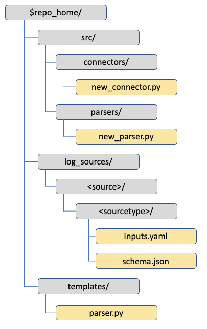

Test the newly created log source
---------------------------------

The *master_delta_full* notebook allows you to interactively test your
new log source input before you deploy it as a pipeline.

Run this notebook, entering the source and sourcetype as the input
widget to confirm everything works as expected.

Example log source parser module
--------------------------------

.. code-block:: python

   from pyspark.sql.functions import explode, col
   from pyspark.sql import DataFrame

   from databricks.sirens.utils.base_utils import BaseUtils
   from databricks.sirens.utils.config_opts import ConfigOpts
   from databricks.sirens.exceptions import SirensParsingError
   from databricks.sirens.logging import get_logger
   from databricks.sirens import plugins

   logger = get_logger(__name__)

   @plugins.register
   class Parse():
      """Datasource specific. Responsible for event timestamp extraction to _raw_time, and providing
      a flattened DataFrame.
      """
      def __init__(self, spark):
         self.spark = spark
         # -------- CHANGE ME TO RELEVANT DATASOURCE NAME ---------- #
         self.name = "<Name of parser>"
         # --------------------------------------------------------- #

      def _timestamp_recognition(self, df: DataFrame) -> DataFrame:
         """extract the event timestamp

         :param df: raw dataframe
         :type df: DataFrame
         """
         try:
            df = df.select("*", col(self.timestamp_column).alias("_raw_time"))
            timestamp_column = "_raw_time"
            return df, timestamp_column

         except Exception as exc:
            raise SirensParsingError(f"{exc}") from exc

      @plugins.register
      def toBronze(self, df: DataFrame, dataSourceObj: object) -> DataFrame:
         """extract an event timestamp and augment raw data with the required metadata

         :param df: Incoming DataFrame
         :type df: DataFrame
         :param dataSourceObj: the datasource config object
         :type dataSourceObj: object
         :return: dataframe with event_timestamp, metadata and a partition column (_event_date)
         :rtype: DataFrame
         """
         # ########################################################################################################
         # This is the most important function of the ingest process. Failure here likely results in dropped data.#
         # ########################################################################################################
         self.df = df
         self.dataSourceObj = dataSourceObj

         self.source, self.sourcetype = ConfigOpts._get_source_sourcetype_info(self.dataSourceObj)
         self.timestamp_format, self.timestamp_column, self.timestamp_regex = ConfigOpts._get_timestamp_info(self.dataSourceObj)

         #################################################################################################
         # * * * * * * * * * * * * * * * * * * * * * * * * * * * * * * * * * * * * * * * * * * * * * * * #
         #                                                                                               #
         # MAKE ANY MODIFICATIONS HERE TO ENSURE A SINGLE ROW PER EVENT                                  #
         # FOR EXAMPLE AS BELOW - CLOUDTRAIL Records BLOB MUST BE EXPANDED                               #
         # EITHER CHANGE THE BLOCK AS REQUIRED OR REMOVE IT IF YOUR DATASOURCE IS ALREADY ONE ROW/EVENT  #
         #                                                                                               #
         # * * * * * * * * * * * * * * * * * * * * * * * * * * * * * * * * * * * * * * * * * * * * * * * #
         #################################################################################################
         # cloud trail arrives as a single array record, which needs to be expanded into one row per event.
         # We need to explode the Record ARRAY into rows.

         # ---------- CHANGE ME OR DELETE ME ------------------------------ #
         try:
            self.df = self.df.select(explode("Records").alias("record"))
         except Exception as exc:
            raise SirensParsingError(f"{exc}") from exc

         # ----------------------------------------------------------------- #

         # Extract Timestamp column
         if self.timestamp_regex:
            self.df, self.timestamp_column = self._timestamp_recognition(self.df)

         # Get the default hostname
         self.default_host = BaseUtils._get_default_host(self.dataSourceObj)

         # We must have a valid timestamp to partition the table.
         # Check for validity, and default to current_timestamp() as a safety net to raw ingest.
         # A failure to parse the event timestamp adds _invalid_timestamp column set to current time.
         # This should make detection and recovery possible.
         self.df = BaseUtils.check_event_timestamp(self.df, self.timestamp_format)
         if '_invalid_timestamp' in self.df.columns:
            logger.warn("Invalid timestamp extraction. Setting to current time. please correct.")
            self.timestamp_column = '_invalid_timestamp'

         try:
            # Add metadata to dataframe, including _event_date (the partition column) needed to write to delta.
            self.df = BaseUtils.add_metadata(df=self.df, host=self.default_host, source=self.source, sourcetype=self.sourcetype,
                                          timestamp_col=self.timestamp_column, timestamp_format=self.timestamp_format)
            return self.df
         except Exception as exc:
            logger.error(f"{exc}")
            raise SirensParsingError(f"{exc}") from exc

      @plugins.register
      def toSilver(self, df: DataFrame, dataSourceObj: object) -> DataFrame:
         """Use specific domain knowledge to create columns that can be transformed using sql expressions downstream

         :param df: Dataframe already processed for metadata (toBronze).
         :type df: DataFrame
         :param dataSourceObj: the datasource object
         :type dataSourceObj: object
         :return: flattened DataFrame ready for normalization transformations
         :rtype: DataFrame
         """
         self.df = df
         self.dataSourceObj = dataSourceObj

         ###################################################################################
         # * * * * * * * * * * * * * * * * * * * * * * * * * * * * * * * * * * * * * * * * #
         #                                                                                 #
         # MAKE ANY MODIFICATIONS HERE TO ENSURE EITHER A FLATTENED DATAFRAME OR ONE       #
         # ACCESSIBLE USING DOT NOTATION                                                   #
         # EXAMPLE BELOW: EXPANDS STRUCTTYPE COLUMNS record and record.userIdentity        #
         #                                                                                 #
         # OTHER EXAMPLES INCLUDE EXTRACTING COLUMNS FROM SYSLOG RECORDS USING REGEXP      #
         # AN EXAMPLE OF THIS CAN BE FOUND IN THE APACHE ACCESS_COMBINED PARSER            #
         #                                                                                 #
         # * * * * * * * * * * * * * * * * * * * * * * * * * * * * * * * * * * * * * * * * #
         ###################################################################################

         # Flatten the record, and userIdentity structs into individual columns
         try:
            # -------------- CHANGE ME OR DELETE ME ----------------------------- #
            self.df = self.df.select("*", "record.*", "record.userIdentity.*")
            # ------------------------------------------------------------------- #

            # attempt a generic frame flattening operation. - This will work in many cases.
            self.df = BaseUtils.flatten_frame(self.df)

            return self.df
         except Exception as exc:
            raise SirensParsingError(f"{exc}") from exc

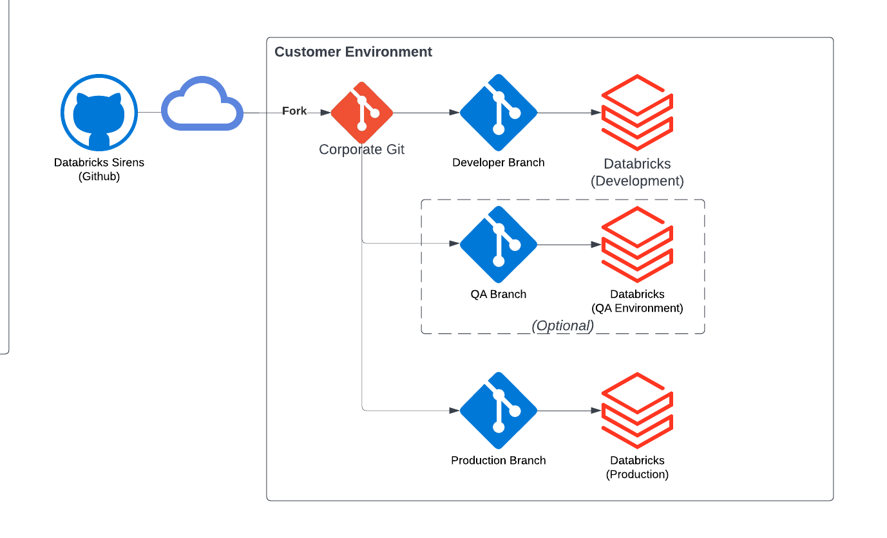

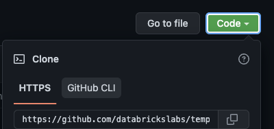

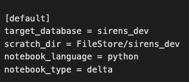
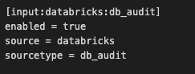
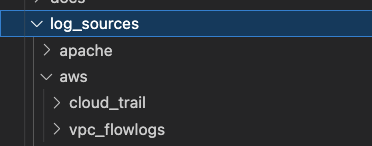

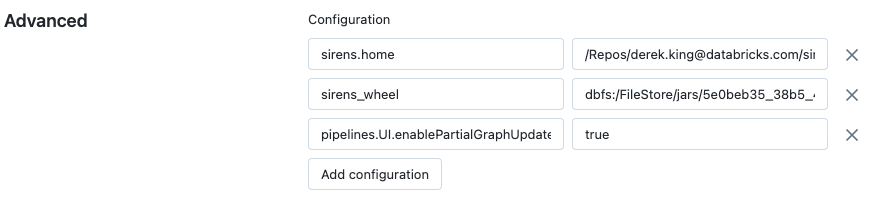
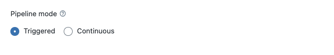
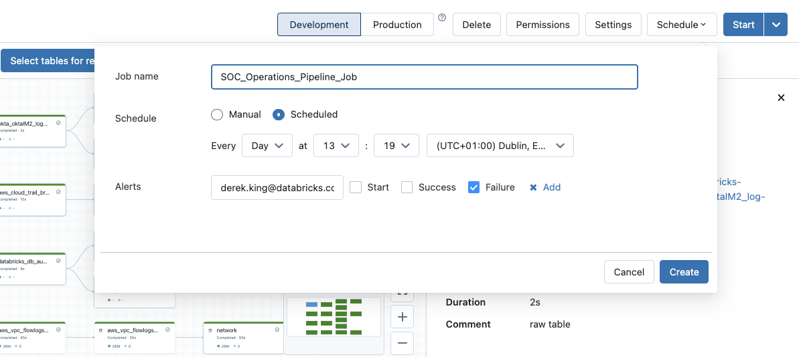

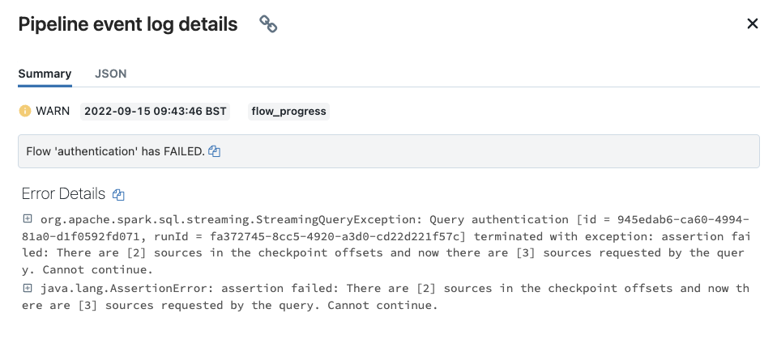
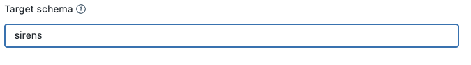
